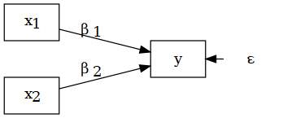

# The pRofessor

## The professor

\begincols
  \begincol{.3\textwidth}
  
```{r , echo = FALSE, out.width = "70px",fig.align="center"}
knitr::include_graphics("img/me.PNG")
```
  
  \endcol
\begincol{.7\textwidth}

  \fontsize{10pt}{12}\selectfont
  
Luca Menghini Ph.D. \fontsize{7.5pt}{12}\selectfont

Work & organizational psychologist

Postdoctoral research fellow in Applied psychology \newline & Quantitative research methods @uniTN

Professor on contract @uniPD

  \endcol
\endcols

## My path

\fontsize{6.5pt}{12}\selectfont

-   2014: Bsc in Work & Social Psych Sciences @uniPD \newline \fontsize{5.5pt}{12}\selectfont _*Biofeedback training for work stress management*_ \fontsize{6.5pt}{12}\selectfont

-   2016: Msc in Social, Work, & Communication Psych @uniPD \newline \fontsize{5.5pt}{12}\selectfont _*Psychophysiological workplace stress assessment protocol*_\fontsize{6.5pt}{12}\selectfont

-   2017: Psychology consultance internship @InsidePerformance \newline \fontsize{5.5pt}{12}\selectfont _*Stress managament & biofedback training in professional sport drivers*_ \newline \fontsize{6.5pt}{12}\selectfont + Research internship @uniPD  \fontsize{5.5pt}{12}\selectfont _*Actigraphy in sleep research*_ \color{blue} &leftarrow; `r fontawesome::fa(name = "r-project",fill="blue", height = "1em")` `r fontawesome::fa(name = "face-smile-wink",fill="blue", height = "1em")` \color{black}  \fontsize{6.5pt}{12}\selectfont

-   2020: Ph.D. in Psychological Sciences @uniPD \newline \fontsize{5.5pt}{12}\selectfont _Ecological momentary assessment of workplace stress_ \fontsize{6.5pt}{12}\selectfont \color{red} &leftarrow; {width=0.1in} `r fontawesome::fa(name = "face-smile-wink",fill="red", height = "1em")` \color{black}  \fontsize{6.5pt}{12}\selectfont

-   2020: Visiting scholar @SRI International (CA, USA) \newline \fontsize{5.5pt}{12}\selectfont _*Wearable sleep trackers, sleep and stress in adolescent insomnia*_ \fontsize{6.5pt}{12}\selectfont

-   2021: Postdoc @uniBO \newline \fontsize{5.5pt}{12}\selectfont _*Workaholism and daily fluctuations in blood pressure, emotional exhaustion, and sleep quality*_ \fontsize{6.5pt}{12}\selectfont

-   2022: Postdoc @uniTN \fontsize{5.5pt}{12}\selectfont _*Youth between transitions, challenges, and opportunities*_

## Some of my studies related to the course content

\fontsize{6pt}{12}\selectfont
- **Multilevel**: Menghini, L., Yüksel D., Baker, F. C., King, C., de Zambotti, M. (2023). Wearable and mobile technology to characterize daily patterns of sleep, stress, pre-sleep worry, and mood in adolescent insomnia. *Sleep Health 9*(1), 108-116. https://doi.org/10.1016/j.sleh.2022.11.006 [\color{blue}[FULL-TEXT](https://www.sciencedirect.com/science/article/pii/S2352721822002285)\color{black}] [\color{blue}[R CODE](https://github.com/SRI-human-sleep/INSA-home)\color{black}]

- **Multivariate**: Menghini, L., Balducci, C., & Toderi, S. (2022). Italian adaptation of the Warr's Job-related Affective Wellbeing Scale: Factorial structure and relationships with the HSE Management Standards Indicator Tool. *TPM – Testing, Psychometrics, Methodology in Applied Psychology, 29*(3), 309-325. https://doi.org/10.4473/TPM29.3.3 [\color{blue}[FULL-TEXT](https://www.researchgate.net/profile/Luca-Menghini/publication/364132541_Italian_adaptation_of_Warr's_Job-related_Affective_Well-being_Scale_Factorial_structure_and_relationships_with_the_HSE_Management_Standards_Indicator_Tool/links/633c22f9769781354ebc4439/Italian-adaptation-of-Warrs-Job-related-Affective-Well-being-Scale-Factorial-structure-and-relationships-with-the-HSE-Management-Standards-Indicator-Tool.pdf?_sg%5B0%5D=started_experiment_milestone&origin=journalDetail&_rtd=e30%3D)\color{black}] [\color{blue}[R CODE](https://osf.io/jyzgf/)\color{black}]

- **Multilevel & Multivariate**: Menghini, L., Pastore, M., Balducci C. (2022). Workplace Stress in Real Time: Three Parsimonious Scales for the Experience Sampling Measurement of Stressors and Strain at Work. *European Journal of Psychological Assessment*. https://doi.org/10.1027/1015-5759/a000725 [[\color{blue}FULL-TEXT](https://www.researchgate.net/publication/362475778_Workplace_Stress_in_Real_Time_Three_Parsimonious_Scales_for_the_Experience_Sampling_Measurement_of_Stressors_and_Strain_at_Work)\color{black}] [[\color{blue}R CODE](https://osf.io/87a9p/)\color{black}]

## Intensive longitudinal designs

```{r , echo = FALSE, out.width = "150px",fig.align="center"}

```

## Warnings :)

\fontsize{7.5pt}{12}\selectfont

-   I'm not a statistician

-   I'm not a mathematical psychologist

-   I'm not a programmer \newline

I'm an Applied psychologist passionate about modeling and psychometrics.

Plus, this is my first time with this course: \color{red} suggestions and critiques are welcomed! \color{black} \newline \newline

\fontsize{5pt}{12}\selectfont
___ \newline
Ethical code for psychology research: Explicit aknowledgement of limitations

## Contact & office hours

\fontsize{8pt}{12}\selectfont
**Contact**: Moodle or mail to: \color{blue} luca.menghini@unipd.it \color{black}

**Office hours**: \color{red} TO DO \color{black} \newline __Where__: Psico 1 pink building, ground floor, between the computer rooms \newline We can also schedule Zoom meetings \newline

```{r , echo = FALSE, out.width = "120px",fig.align="center"}

```

# The couRse

## Advanced data analysis for psychological science: \newline Course overview

\fontsize{7pt}{12}\selectfont
This course aims at providing basic notions of **multi-level & multi-variate** linear regression modeling, focusing on applications in developmental, educational, and applied psychology. 

The course aims at transmitting **basic knowledge** on *linear mixed-effects regression* (LMER) and two common examples of multivariate techniques within the structural equation modeling (SEM) framework, namely *path analysis* & *confirmatory factor analysis* (CFA).

The course also aims at providing **practical competences** on advanced data analysis, with a particular emphasis on data preparation and pre-processing, model fit, evaluation, and selection criteria, coefficient interpretation, and data visualization. 

The course is characterized by an **applied approach** that prioritizes real case studies and includes practical exercises using R.

## Prerequisites

\fontsize{9pt}{12}\selectfont
Students should have good knowledge about basic concepts linked to probability theory and associated topics (e.g., random variables, probability distributions, hypothesis testing), including **linear regression modeling**.

## Course contents

\begincols
  \begincol{.5\textwidth}

\fontsize{7pt}{12}\selectfont

1. Intro and course info `r fontawesome::fa(name = "location-dot", fill="red", height = "1em")` \newline

**Multi-level**

2. Introduction: From `lm()` to `lmer()`

3. Data preparation `r fontawesome::fa(name = "r-project", height = "1em")`

4. Model fit & random effects `r fontawesome::fa(name = "r-project", height = "1em")`

5. Model evaluation & selection `r fontawesome::fa(name = "r-project", height = "1em")`

6. Coefficient interpretation `r fontawesome::fa(name = "r-project", height = "1em")`

7. \color{blue} Generalized models `glmer()`, Bayesian LMER, & power analysis `r fontawesome::fa(name = "microscope", fill = "blue", height = "1em")` \newline \newline
  
  \endcol
\begincol{.5\textwidth}

\fontsize{7pt}{12}\selectfont
**Multi-variate**

8. Introduction: From `lm()` to `sem()`

9. Observed variables & path analysis

10. Data preparation `r fontawesome::fa(name = "r-project", height = "1em")`

11. Model evaluation & selection `r fontawesome::fa(name = "r-project", height = "1em")`

12. Coefficient interpretation `r fontawesome::fa(name = "r-project", height = "1em")`

13. Latent variables & CFA

14. Full SEM pipeline `r fontawesome::fa(name = "r-project", height = "1em")`

15. \color{blue} Multilevel SEM, Mediation, \newline Bayesian SEM, power analysis `r fontawesome::fa(name = "microscope", fill = "blue", height = "1em")` \newline \newline

  \endcol
\endcols

___ \newline \fontsize{6pt}{12}\selectfont
`r fontawesome::fa(name = "r-project", height = "1em")` = Practical exercise sessions with R (bring your PC!) \newline `r fontawesome::fa(name = "microscope", fill = "blue", height = "1em")` \color{blue} = In-depth topics (not for the exam!)  &leftarrow; slides with blue boxes and the microscope icon

## When & where

\fontsize{7pt}{12}\selectfont
The course will last 42 hours (6 ECTS). \newline
All lectures will be delivered in the Psico 2 gray building, room 3F - via Venezia 12.

\begincols
  \begincol{.5\textwidth}

```{r , echo = FALSE, out.width = "0.1px",fig.align="center"}
knitr::include_graphics("img/white.PNG")
```
  
\fontsize{6pt}{12}\selectfont
```{r , echo = FALSE}
knitr::kable(data.frame(Day=1:11,
                        Date=paste0(c(paste0("10-",c(4,5,11,12,18,19,25,26)),
                                      paste0("11-",c(1,2,8))),c(rep(c(" (wed)"," (thu)"),5)," (wed)")),
                        Time=c(rep(c("12:30-14:30","08:30-10:30"),5),"12:30-14:30"),
                        Room=rep("3F",11)))
```
  
  \endcol
\begincol{.5\textwidth}

\fontsize{6pt}{12}\selectfont
```{r , echo = FALSE}
knitr::kable(data.frame(Day=12:21,
                        Date=paste0(c(paste0("11-",c(9,15,16,22,23,29,30)),
                                      paste0("12-",c(6,7,13))),c(rep(c(" (thu)"," (wed)"),5))),
                        Time=c(rep(c("08:30-10:30","12:30-14:30"),5)),
                        Room=rep("3F",10)))
```

  \endcol
\endcols

## Course materials {#slides}

\fontsize{7pt}{12}\selectfont
All course materials can be accessed from the Moodle page of the course \newline __*and*__ from \color{blue} https://github.com/Luca-Menghini/advancedDataAnalysis-course

\fontsize{7.5pt}{12}\selectfont
\color{red} The contents required by the exam are exhaustively covered in the **main course slides**: \newline 1. **Intro & course info** (the present slides) \newline 2. **Multilevel modeling** \newline 3. **Multivariate modeling** \newline \color{black}

\begincols
  \begincol{.65\textwidth}

\fontsize{6pt}{12}\selectfont
***Suggested*** **textbooks to deepen the topics of the course: **

\fontsize{6pt}{12}\selectfont
- Finch, W. H., Bolin, J. E., Kelley, K., Multilevel Modeling Using R (2nd edition). Boca Raton: CRC Press, 2014

>- Beaujean, A. A., Latent Variable Modeling Using R. A Step-by-Step Guide. New York: Routledge, 2014

  \endcol
\begincol{.35\textwidth}

```{r , echo = FALSE, out.width = "120px"}

```

  \endcol
\endcols

## Course slides

\fontsize{9pt}{12}\selectfont
The course slides are structured by intermixing theory, R code, plots, examples, and exercises.

The R code used in any exercise/example is also provided.

Slides with \color{blue}blue boxes \color{black}and the \color{blue}microscope `r fontawesome::fa(name = "microscope", fill = "blue", height = "1em")` \color{black}icon cover in-depth but still useful topics that will be possibly presented but are not part of the core course topics and related exam!

All course materials can be accessed from Moodle \newline __*and*__ from \color{blue} https://github.com/Luca-Menghini/advancedDataAnalysis-course \color{black}

## Additional resources

\fontsize{9pt}{12}\selectfont
Additional resources that are not presented during classes will be also available from Moodle. These will include published papers and online resources, R code and exercises, extra slides, and other.

\fontsize{8pt}{12}\selectfont
For instance, you can already find the `R-intro.pdf` extra slides (introduction to R), and you can already give a look at the "Latent Variable Modeling using R" book website (e.g., "R syntax" section): \color{blue} https://blogs.baylor.edu/rlatentvariable/ \color{black}

\fontsize{9pt}{12}\selectfont
**PSICOSTAT meetings & workshops**:

\begincols
  \begincol{.01\textwidth}

  \endcol
\begincol{.79\textwidth}

\fontsize{8pt}{12}\selectfont
Interdisciplinary research group on quantitative psychology, psychometrics, psychological testing, & statistics - monthly online meetings + weekly in person workshops \color{blue}https://psicostat.dpss.psy.unipd.it/index.html
  
  \endcol
\begincol{.2\textwidth}

```{r , echo = FALSE, out.width = "40px"}

```

  \endcol
\endcols

## Teaching modalities

\fontsize{11pt}{12}\selectfont
`r fontawesome::fa(name = "chalkboard-user", height = "1em")` Frontal theoretical sessions on the rationale of the analytical techniques focused by the course \newline

`r fontawesome::fa(name = "laptop", height = "1em")` Practical sessions with individual and group exercises

\fontsize{8.5pt}{12}\selectfont
Practical sessions will be based on the freely-available `r fontawesome::fa(name = "r-project", height = "1em")` software. \newline Students are encouraged to bring their **laptops**, if possible.

The course will emphasize practical examples and **cases studies** \newline in developmental, educational, and applied psychology.

## Case studies: \newline What are your research and/or applied interests?

```{r , echo=FALSE, message=FALSE, warning=FALSE}
library(wordcloud)
wordcloud(c(rep("Adolescence",300),rep("Infancy",300),rep("Education",300),rep("Childhood",300),rep("Psychology",400),
            rep("Research",200),rep("Clinical",200),rep("Intervention",200),rep("Assessment",200),
            rep("Interactions",100),rep("Affect",100),rep("Behaviors",100),rep("Thoughts",100),rep("Physiology",100),
            rep("Parenting",150),rep("Teaching",150),rep("Caregiving",150),rep("Mentoring",150),
            rep("Cultures",120),rep("Societies",120),rep("Economy",120),
            rep("Experiment",170),rep("Survey",170),rep("Questionnaire",170),rep("Interview",170),rep("Tracking",170),
            rep("Longitudinal",170),rep("Cross-sectional",170),rep("Intensive",170),rep("Observational",170),
            rep("Schools",70),rep("Communities",70),rep("")),
          colors=brewer.pal(120, "Dark2"))
```

## Attending the course: "PACATE"

\fontsize{6pt}{12}\selectfont
**Participation**: You are expected to contribute to the class by participating in class discussion and working with each other during practical sessions. If you find something unclear or discordant with other information, please tell it to the professor. If you find it uncomfortable to speak up in class, feel free to contact the professor and work on this skill.

**Attendance**: Class attendance is not mandatory but encouraged. It is recommended to gradually but constantly familiarize with the content of the course.

**Collaboration**: Please, help each other, for instance, by working together on practical sessions and assignments, and/or by exchanging notes and useful materials for the exam.

**Assignments**: Over the course, several exercises/homework will be *suggested* to consolidate the course contents. While some of these will be discussed in class, feel free to contact the professor if you find any issue with the assignments.

**Timekeeping**: You are expected to be on time. You should be in your seat and ready to begin class when the class starts.

**Exe`r fontawesome::fa(name = "r-project", height = "1em")`cise!**

# useR!

## An inseparable companion

\begincols
  \begincol{.2\textwidth}

```{r , echo = FALSE, out.width = "70px",fig.align='right'}

```

  \endcol
\begincol{.75\textwidth}

\fontsize{8pt}{12}\selectfont
`R` is a programming language and a programming environment for **statistical computing** and **graphics**. \newline

It is based on the `S` language (Becker & Chambers, 1984), subsequently used to develop the `S-Plus` sofware and then `R`, originally created in 1996 by Ross Ihaka and Robert Gentleman. \newline

  \endcol
\endcols

\fontsize{7.5pt}{12}\selectfont
Today, it is supported by an international research group (R Core Team and R Foundation for Statistical Computing) that periodically update (each year) the base sofware (***Base R***).

Progressive and exponential inclusion of new **packages** that extend its capabilities.

\color{blue} https://www.r-project.org/

## A bottom-up resource

\begincols
  \begincol{.2\textwidth}

```{r , echo = FALSE, out.width = "70px",fig.align='right'}

```

  \endcol
\begincol{.75\textwidth}

\fontsize{8pt}{12}\selectfont
R provides a wide range of statistical and graphical techniques. It is designed to be **user-friendly** but at the same time to generate **high-quality outputs** (graphics, tables, and reports with equations, mathematical symbols, etc.). \newline

Optimized default functions \newline + dedicated packages \newline + possibility to fully control. \newline

  \endcol
\endcols

\fontsize{7pt}{12}\selectfont
Differently from other statistical software that implement multilevel and multivariate analyses (e.g., Mplus), R is a **free sofware** (GNU General Public Licence) that can be used anywhere worldwide, it is an **open-source software** (all functions are documented and can be inspected in detail), and **works on all main OS**: Windows, MacOS, and UNIX (e.g. Linux)

Moreover, there is a massive community of useRs:  For any issue, just Google it! `r fontawesome::fa(name = "face-smile-wink",fill="black", height = "1em")`

## Even better than googling

\fontsize{9pt}{12}\selectfont
Try \color{blue} https://chat.openai.com/ \color{black} or \color{blue} https://rtutor.ai/

```{r , echo = FALSE, out.width = "320px"}

```

## Introduction to `r fontawesome::fa(name = "r-project",fill="#3333B2", height = "1em")`: Additional materials

\fontsize{7pt}{12}\selectfont
**Extra slides on Moodle/GitHub**

- `extra/R-intro.pdf`: How to install and get started with `R` and `RStudio`, elementary commands, `R` objects, functions, and workspace, how to read and export datasets, `R` graphics, and linear models

- `extra/ggplot2-intro.pdf`: Introduction to the `ggplot2` package for advanced graphics

\fontsize{7pt}{12}\selectfont
**Free tutorials**

- Navarro, D. Learning statistics with R: A tutorial for psychology students and other beginners - \color{blue} https://learningstatisticswithr.com/ \color{black}

- `learnr`: an R package for learning how to use R \color{blue} https://rstudio.github.io/learnr/ \color{black}

- excellent STAT545: Data wrangling, exploration, and analysis with R \color{blue} https://stat545.com/ \color{black}

## Key `r fontawesome::fa(name = "r-project",fill="#3333B2", height = "1em")` packages used in the course

\fontsize{8pt}{12}\selectfont
The course uses several packages with customized and optimized functions. Here are the main packages used in the course (and the code to install all of them):\newline
```{r , eval=FALSE}
pckg <- c("lme4","lavaan",
          "plyr","reshape2","sjPlot")
install.packages(pckg)
```

\fontsize{5pt}{12}\selectfont
___ \newline Note: This course does not use `tidyverse` packages and syntax (see \color{blue} https://www.tidyverse.org/ \color{black} ), \newline but relies on R Base. 


## Some key `r fontawesome::fa(name = "r-project",fill="#3333B2", height = "1em")` functions used in the course

\begincols
  \begincol{.5\textwidth}
  
  \fontsize{6pt}{12}\selectfont
  
Aggregating scores by group
```{r, }
aggregate(x = sleep$extra, 
          by = list(sleep$group), FUN = mean)
```

Merging wide- and long-form datasets
```{r eval=FALSE}
new <- join(long, wide, by = "ID", type = "left")
```

Fitting LMER models and printing fixed effects
```{r echo=FALSE,message=FALSE,warning=FALSE}
library(lme4)
```
```{r }
fit <- lmer(extra ~ group + (1|ID), data = sleep)
fixef(fit)
```
  
  \endcol
\begincol{.5\textwidth}

  \fontsize{6pt}{12}\selectfont

Fitting SEM and printing coefficients
```{r echo=FALSE,message=FALSE,warning=FALSE}
library(lavaan)
```
```{r }
fit <- sem("visual =~ x1 + x2 + x3
            textual =~ x4 + x5 + x6
            visual ~ textual",
            data=HolzingerSwineford1939)
```
```{r eval=FALSE}
standardizedsolution(fit)[1:7,1:4]
```
```{r echo=FALSE}
knitr::kable(standardizedsolution(fit)[1:7,1:4],digits=2)
```

  \endcol
\endcols

# The exam

## When & where

\fontsize{9pt}{12}\selectfont
All exam sessions will take place in the Psico 2 gray building, room 3L \newline Via Venezia 12, Padova - 35131

```{r , echo = FALSE, out.width = "320px"}
knitr::include_graphics("img/white.PNG")
```
```{r , echo = FALSE}
knitr::kable(data.frame(Session=paste(1:5,c("Jan","Feb","Jun","Jul","Aug"),sep=". "),
                        Date=c("2024-01-17","2024-02-14","2024-06-10","2024-07-10","2024-08-10"),
                        Time=rep("14:30",5),
                        Room=rep("3L",5)))
```

## Exam structure & contents

\fontsize{8pt}{12}\selectfont
The final exam will be **written** and will last **40 minutes**. \newline The exam will consist of **31 closed-ended questions** on:

- theoretical topics covered by the course 

- data analysis exercises using R (analysis of case studies) based on the procedures learned during the course. \newline

The contents required by the exam are exhaustively covered in \color{red}the [main course slides](#slides)\color{black}.
The exam score will be computed as the sum of the scores obtained to the 31 questions.

More information about the final exam will be provided later, along with an exam simulation.

## Example questions

\fontsize{8pt}{12}\selectfont
- theoretical topics: \color{red}to do

- data analysis exercise: \color{red}to do

# IntRoduction

## Multi - LEVEL & Multi - VARIATE

\fontsize{7.5pt}{12}\selectfont
Advanced statistical techniques to deal with **large and complex data structures**

\begincols
  \begincol{.5\textwidth}

\fontsize{7pt}{12}\selectfont \color{red}
**Multilevel regression model** \fontsize{6.5pt}{12}\selectfont \color{black}

To be used with **hierarchical data structures** where lower-level observations (statistical units) are ***nested*** within higher-level variables (clusters).  \newline

_*Linear mixed-effects regression*_ (LMER) \newline allows to estimate **fixed effects** that are constant across all clusters + **random effects** varying from cluster to cluster.  \newline

LMER is widely applied in developmental and educational psychology:

- students &rightarrow; classes &rightarrow; schools

- experiences &rightarrow; days &rightarrow; individuals

>- trials &rightarrow; items & individuals

  \endcol
\begincol{.5\textwidth}

\fontsize{7pt}{12}\selectfont \color{red}
**Multivariate regression model** \fontsize{6.5pt}{12}\selectfont \color{black}

To be used to account for the multivariate reality of psychosocial phenomena, where **multiple variables interact** at the same time (e.g., multiple outcomes, mediation). \newline

_*Path model*_ = Pictorial representation (diagram) of a theory of variable relationships (*structural model*) \newline

_*Latent variable model*_ = representation of the relationships that form the ***latent variables*** used in a structural model \newline

_*Structural equation model*_ (SEM) = full model composed by the latent and structural part

  \endcol
\endcols

## Linear models as the common root

\fontsize{7pt}{12}\selectfont 
**Regression models** aim to establish whether two variables are in a asymmetric functional relationship, and particularly to quantify the extent to which one `X` variable (*independent* or *predictor*) influences the `Y` variable (*dependent* or *response*)

**Linear regression** allows to determinate the link between two variables as expressed by a linear function: \fontsize{10pt}{12}\selectfont \color{red} $Y_i = \beta_0 + \beta_1 X_i + \epsilon_i$ \fontsize{7pt}{12}\selectfont \color{black} \newline Such a function can be graphically represented as a **straight line** where \newline \color{red} $\beta_0$ \color{black} is the **intercept** (value assumed by `Y` when `X` = 0) \newline \color{red} $\beta_1$ \color{black} is the  **slope coefficient** (predicted change in `Y` when `X` increases by 1 unit) \newline \color{red} $\epsilon$ \color{black} is the **residual variance** (distance from the regression line)

```{r echo=FALSE,fig.width=4.5,fig.height=2.5,out.width="200px"}
par(mar=c(5, 4, 0, 2) + 0.1)
x <- rnorm(n = 100)
y <- x + rnorm(n = 100)
plot(y~x,pch=19,col="gray",cex=0.8)
abline(lm(y~x),col="red",lwd=2)
abline(v=0,lty=2,col="gray")
abline(h=summary(lm(y~x))$coefficients[1,1],lty=2,col="gray")
text(x=0.5,y=summary(lm(y~x))$coefficients[1,1],labels=paste("B0 =",round(summary(lm(y~x))$coefficients[1,1],2)))
text(x=min(x)+0.5,y=min(y)+0.5,labels=paste("B1 =",round(summary(lm(y~x))$coefficients[2,1],2)))
```

## The only three formulas to keep in mind

\begincols
  \begincol{.5\textwidth}

\fontsize{10pt}{12}\selectfont Linear model: \newline \newline \color{red} $Y_i = \beta_0 + \beta_1 X_i + \epsilon_i$ \fontsize{7pt}{12}\selectfont \color{black} \newline \newline

\fontsize{10pt}{12}\selectfont Mixed-effects model: \newline \newline  \color{red} $Y_{ij} = (\beta_0 + \lambda_{0j}) + (\beta_1 + \lambda_{1j})X_{ij} + \epsilon_{ij}$ \fontsize{7pt}{12}\selectfont \color{black}

For each observation $i$ and each cluster $j$, the intercept and the slope are decomposed into the **fixed** components \color{red} $\beta_0$ \color{black} and \color{red} $\beta_1$ \color{black} referred to the whole sample, and the **random** components \color{red} $\lambda_{0j}$ \color{black} and  \color{red}$\lambda_{1j}$ \color{black} randomly varying between clusters \color{black}

  \endcol
\begincol{.5\textwidth}

\fontsize{10pt}{12}\selectfont Structural equation model:\fontsize{9pt}{12}\selectfont \color{red} $$ \begin{cases} x_i = \Lambda_x\xi_i + \delta_{i} \ \color{black} (meas. \ x) \\\\ y_{i} = \Lambda_y\eta_i + \epsilon_i \ \color{black}  (meas. \ y) \\\\ \eta_{i} = \Gamma \xi_{i} + \zeta_i \ \color{black}  (struct.) \end{cases} $$ \fontsize{7pt}{12}\selectfont \color{black}

For each observation $i$, \newline the **measurement model** (first two lines) clarifies the relationships \color{red} $\Lambda$ \color{black} between \newline the *observed variables* \color{red} $x$ \color{black} and \color{red} $y$ \color{black} and the corresponding *latent variables* \color{red} $\xi$ \color{black} and \color{red} $\eta$\color{black}, \newline whereas the **structural model** (third line) clarifies the relationship \color{red} $\Gamma$ \color{black} between the two latent variables.

  \endcol
\endcols

## Multilevel models: Let's make the visuals talk

\fontsize{8pt}{12}\selectfont
**Visual introduction to multilevel modeling**: \color{blue} \fontsize{7pt}{12}\selectfont
http://mfviz.com/hierarchical-models \fontsize{8pt}{12}\selectfont \color{black} 

**Multilevel modeling in repeated measures & longitudinal designs** \newline \fontsize{7pt}{12}\selectfont
When a random variable is measured repeatedly over time from different individuals, observations are *nested* within individuals and multilevel modeling can be used to **partition the variance** into the ***within-subject*** (level 1) and ***between-subjects*** (level 2) components.
```{r , echo = FALSE, warning=FALSE,message=FALSE,fig.width=9,fig.height=2.6,fig.align='center'}
df <- data.frame(Subject = as.factor(c(rep("S01",6),rep("S02",6))),
                 time = rep(1:6,2),
                 Work.Stress = c(2,1,3,4,3,2,   6,6,3,7,6,6))
library(ggplot2)
ggplot(df,aes(x=time,y=Work.Stress,color=Subject)) + geom_smooth(lwd=1.2) + geom_point(cex=3) + ylim(0,8) +
  geom_line(aes(y=mean(df[df$Subject=="S01","Work.Stress"])),color="salmon",lty=2,lwd=0.9) + 
  geom_line(aes(y=mean(df[df$Subject=="S02","Work.Stress"])),lty=2,lwd=0.9) + labs(x="Time",y="Work stress level")
```

## Multilevel models: Fixed vs. Random effects

\fontsize{7pt}{12}\selectfont
In the literature, multilevel modeling is sometimes called with different terms, \newline \fontsize{6pt}{12}\selectfont e.g., *hierarchical linear modeling*, *random slope models*, *variance component models*, ...

\fontsize{7pt}{12}\selectfont
All these models are part of the broader \color{red} \fontsize{8pt}{12}\selectfont __*mixed-effects models*__ \color{black} \fontsize{7pt}{12}\selectfont family, \newline identifying models with both fixed and random effects:

- **Fixed effects**: effects that remains constant across all clusters, whose *levels* are exhaustively considered (e.g., gender, levels of a Likert scale) and generally controlled by the researcher (e.g., experimental conditions)

- **Random effects**: effects that vary from cluster to cluster, whose *levels* are randomly sampled from a population (e.g., schools, participants, days, experimental stimuli)

## Multivariate models: Let's make the visuals talk

\begincols
  \begincol{.5\textwidth}

\fontsize{7pt}{12}\selectfont
**Linear regression**: determining the link between a dependent and an independent variables through linear functions like: $y = \beta_1x_{1} + \beta_2X_{2} + \epsilon$ \newline
```{r echo=FALSE,warning=FALSE,message=FALSE}
library(DiagrammeR); library(DiagrammeRsvg); library(rsvg)

tmp <- grViz(
'digraph boxes_and_circles {
  graph [layout = neato]
  node [shape = box]
  x1 [label = <x<SUB>1</SUB>> pos="-2,0.5!"]
  x2 [label = <x<SUB>2</SUB>> pos="-2,-0.5!"]
  y [pos="0,0!"]
  node [shape = plaintext]
  e [label = <&epsilon;> pos="1,0!"]
  # edges
  x1->y [label = <&beta;<SUB>1</SUB>>]
  x2->y [label = <&beta;<SUB>2</SUB>>]
  e->y}')

# Convert to SVG, then save as png
tmp = export_svg(tmp)
tmp = charToRaw(tmp) # flatten
rsvg_png(tmp, "img/lm.png") # saved graph as png in current working directory
```
```{r , echo = FALSE, out.width = "130px",fig.align="center"}

```

As a limitation, linear models can only predict **one dependent variable at time** with a single equation. They can be *univariate* (without predictors) or *bivariate* (with predictors).

  \endcol
\begincol{.5\textwidth}

\fontsize{7pt}{12}\selectfont
**Structural equation models** (SEM) \newline are *multivariate* models that allow simultaneously modeling multiple ~~dependent~~ *endogenous* variables \newline with a **system of equations**:

$$ \begin{cases} y_2 = \beta_{21}x_{1} + \epsilon_2 \\\\ y_3 = \beta_{31}x_{1} + \beta_{32}Y_2 + \epsilon_3 \end{cases} $$ \newline

```{r echo=FALSE}
tmp <- grViz(
'digraph boxes_and_circles {
  graph [layout = neato]
  node [shape = box]
  x1 [label = <x<SUB>1</SUB>> pos="-2,0!"]
  y2 [label = <y<SUB>2</SUB>> pos="0,0.5!"]
  y3 [label = <y<SUB>3</SUB>> pos="0,-0.5!"]
  node [shape = plaintext]
  e2 [label = <&epsilon;<SUB>2</SUB>> pos="1,0.5!"]
  e3 [label = <&epsilon;<SUB>3</SUB>>pos="1,-0.5!"]
  # edges
  x1->y2 [label = <&beta;<SUB>21</SUB>>]
  x1->y3 [label = <&beta;<SUB>31</SUB>>]
  y2->y3 [label = <&beta;<SUB>32</SUB>>]
  e2->y2
  e3->y3}')

# Convert to SVG, then save as png
tmp = export_svg(tmp)
tmp = charToRaw(tmp) # flatten
rsvg_png(tmp, "img/sem.png") # saved graph as png in current working directory
```
```{r , echo = FALSE, out.width = "130px",fig.align="center"}
knitr::include_graphics("img/sem.png")
```

  \endcol
\endcols

## Multivariate models: exogenous vs. endogenous

\begincols
  \begincol{.4\textwidth}

\fontsize{7pt}{12}\selectfont
$$ \begin{cases} y_2 = \beta_{21}x_1 + \epsilon_2 \\\\ y_3 = \beta_{31}x_{1} + \beta_{32}y_2 + \epsilon_3 \end{cases} $$ \newline
```{r , echo = FALSE, out.width = "130px",fig.align="center"}
knitr::include_graphics("img/sem.png")
```
  \endcol
\begincol{.7\textwidth}

\fontsize{6.5pt}{12}\selectfont
In SEM, the classic independent vs. dependent classification is replaced with a more meaningful one: \fontsize{7pt}{12}\selectfont \newline

- **Exogenous variables** (\color{red}$X_1$\color{black}): without a direct 'cause' from inside the model (*predictors*), \newline without error estimate \newline 

>- **Endogenous variables** (\color{red}$Y_2$, $Y_3$\color{black}): directly 'caused' from inside the model (*predictors* & *outcomes*), \newline with error estimate \color{red}$\epsilon$

  \endcol
\endcols

## Multivariate models: observed vs. latent

\fontsize{7pt}{12}\selectfont
A further advantage of SEM is to distinguish between observed vs. latent variables

\begincols
  \begincol{.5\textwidth}

```{r , echo = FALSE, out.width = "130px"}
knitr::include_graphics("img/latobs.PNG")
```

\fontsize{6.5pt}{12}\selectfont
**Observed variables**: directly observable and measurable (e.g., heart rate), represented by *squares* and the *lowercase letters* \color{red}$x$ \color{black}(exogenous) and \color{red}$y$ \color{black}(endogenous) \newline

**Latent variables**: hypothetical and not directly measurable but **indexed** by one or multiple observed variables (e.g., happiness), represented by *circles* and the *greek letters* \color{red}$\xi$ \color{black}(exogenous) and \color{red}$\eta$ \color{black}(endogenous)

  \endcol
\begincol{.5\textwidth}

\fontsize{6.5pt}{12}\selectfont
When including **observed variables only**, SEM are called \color{red}**path analysis**\color{black}, which is widely used to model complex multivariate relationships (e.g., *mediation models*):
```{r , echo = FALSE, out.width = "130px",fig.align="center"}
knitr::include_graphics("img/sem.png")
```

When **both observed and latent** variables are included, we can talk of 'full SEM':
```{r echo=FALSE}
tmp <- grViz(
'digraph boxes_and_circles {
  graph [layout = neato]
  node [shape = oval]
  E1 [label = <&xi;> pos="-0.5,0!"]
  E2 [label = <&eta;> pos="0.5,0!"]
  node [shape = box]
  x1 [label = <x<SUB>1</SUB>> pos="-2,1!"]
  x2 [label = <x<SUB>2</SUB>> pos="-2,0!"]
  x3 [label = <x<SUB>3</SUB>> pos="-2,-1!"]
  x4 [label = <x<SUB>4</SUB>> pos="2,1!"]
  x5 [label = <x<SUB>5</SUB>> pos="2,0!"]
  x6 [label = <x<SUB>6</SUB>> pos="2,-1!"]
  node [shape = plaintext]
  e1 [label = <&epsilon;<SUB>1</SUB>> pos="-3,1!"]
  e2 [label = <&epsilon;<SUB>2</SUB>>pos="-3,0!"]
  e3 [label = <&epsilon;<SUB>2</SUB>>pos="-3,-1!"]
  e4 [label = <&epsilon;<SUB>1</SUB>> pos="3,1!"]
  e5 [label = <&epsilon;<SUB>2</SUB>>pos="3,0!"]
  e6 [label = <&epsilon;<SUB>2</SUB>>pos="3,-1!"]
  # edges
  E1->x1 
  E1->x2 
  E1->x3 
  E2->x4 
  E2->x5 
  E2->x6 
  E1->E2 
  e1->x1
  e2->x2
  e3->x3
  e4->x4
  e5->x5
  e6->x6}')
# Convert to SVG, then save as png
tmp = export_svg(tmp)
tmp = charToRaw(tmp) # flatten
rsvg_png(tmp, "img/seml.png") # saved graph as png in current working directory
```
```{r , echo = FALSE, out.width = "150px",fig.align="center"}
knitr::include_graphics("img/seml.png")
```

  \endcol
\endcols

## Multilevel & multivariate models: \newline It's a matter of theory!

\fontsize{7pt}{12}\selectfont
While *any model is a formal representation of a theory* (Bollen, 1989), the formulation of a multilevel and/or multivariate model is particularly dependent \newline on the underlying theoretical model.

\begincols
  \begincol{.5\textwidth}

\fontsize{7pt}{12}\selectfont
**Multilevel modeling**: \newline \fontsize{6.5pt}{12}\selectfont Theories determinate whether a clustering variable is meaningful or not, the number of levels (e.g., individuals, days, weeks, schools) to be considered, and whether a given construct can be meaningfully attributed to a given level (e.g., happy people, happy days, happy weeks, happy schools).

  \endcol
\begincol{.5\textwidth}

```{r , echo = FALSE, out.width = "5px"}
knitr::include_graphics("img/white.png")
```

\fontsize{7pt}{12}\selectfont
**SEM**: \newline \fontsize{6.5pt}{12}\selectfont Theories determinate both how a latent variable is reflected by a set of observed variables (**measurement model**) and what are the regression-like relationships among the variables (**structural model** ~ *path analysis*).

___ \newline \fontsize{5pt}{12}\selectfont
Note: when a SEM is analyzed without a structural model, it is usually called \newline __confirmatory factor analysis__ (CFA).

  \endcol
\endcols

## To be continued...

- Any question?

- Next lecture: LM recap or LMER?

- Recap on how to use R?

```{r , echo = FALSE, out.width = "270px",fig.align='right'}
knitr::include_graphics("img/white.PNG")
```
```{r , echo = FALSE, out.width = "270px",fig.align='right'}
knitr::include_graphics("img/hands.PNG")
```

# Resources

## Credits

\fontsize{8pt}{12}\selectfont
The present slides are partially based on: \fontsize{6pt}{12}\selectfont

- Altoè, G. (2023) Corso Modelli lineari generalizzati ad effetti misti - 2023. \color{blue} https://osf.io/b7tkp/ \color{black}

- Beaujean, A. A. (2014) Latent Variable Modeling Using R. A Step-by-Step Guide. New York: Routledge

- Finch, W. H., Bolin, J. E., Kelley, K. (2014). Multilevel Modeling Using R (2nd edition). Boca Raton: CRC Press

- Pastore, M. (2015). Analisi dei dati in psicologie (e applicazioni in R). Il Mulino.

## Useful resources: Multilevel

\fontsize{6pt}{12}\selectfont
- Baayen, R. H., Davidson, D. J., & Bates, D. M. (2008). Mixed-effects modeling with crossed random effects for subjects and items. *Journal of memory and language, 59*(4), 390-412.

- Bliese, P. (2022). Multilevel modeling in R (2.7). \color{blue}https://cran.r-project.org/doc/contrib/Bliese_Multilevel.pdf \color{black}

- McElreath, R. (2020). Statistical rethinking: A Bayesian course with examples in R and Stan. Chapman and Hall/CRC.

- Pinheiro, J., & Bates, D. (2006). Mixed-effects models in S and S-PLUS. Springer science & business media. \newline see also Bates, D. (2022). lme4: Mixed-effects modeling with R. \color{blue} https://stat.ethz.ch/~maechler/MEMo-pages/lMMwR.pdf \color{black}

## Useful resources: Multivariate

\fontsize{6pt}{12}\selectfont
- Kline, R.B. (2005). Principles and Practice of Structural Equation Modeling. Guilford Press, NY.

- Lin, J. Introduction to structural equation modeling (SEM) in R with lavaan. \color{blue} https://stats.oarc.ucla.edu/r/seminars/rsem/ \color{black}

- Rosseel, Y. (2012). lavaan: An R Package for Structural Equation Modeling. *Journal of Statistical Software, 48*, 1-36.