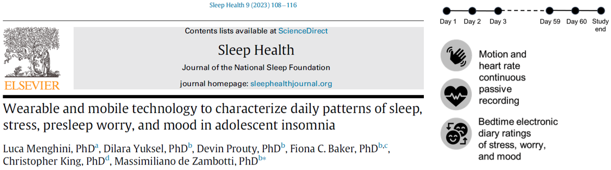

## Outline of Part 1

```{r echo=FALSE,fig.width=4.5,fig.height=2.5,out.width="200px"}
rm(list=ls())
```

\fontsize{8pt}{12}\selectfont
- **`lm()` recap**: Short recap of linear regression modeling `r fontawesome::fa(name = "r-project", height = "1em")`

- **`lmer()`**: Introduction to multilevel modeling (aka *linear mixed-effects regression*, LMER)

- **Data structure**: How to approach a multilevel data structure, how to manipulate and pre-process multilevel data `r fontawesome::fa(name = "r-project", height = "1em")`

- **Model fit**: How to fit a multilevel model in R, to evaluate model diagnostics, to interpret model results `r fontawesome::fa(name = "r-project", height = "1em")`

- **Model evaluation**: How to evaluate a model, compare multiple models, and select the best model `r fontawesome::fa(name = "r-project", height = "1em")`

- \color{blue} **Related topics**: In-depth topics related to multilevel modeling (e.g., generalized and Bayesian LMER, power analysis) `r fontawesome::fa(name = "microscope", fill = "blue", height = "1em")`

___ \newline \fontsize{5pt}{12}\selectfont \color{blue}
`r fontawesome::fa(name = "microscope", fill = "blue", height = "1em")` = not for the exam \color{black} \newline `r fontawesome::fa(name = "r-project", height = "1em")` = exercises with R (bring your laptop!)

# LM recap

## Linear regression models

\fontsize{7pt}{12}\selectfont 
**Linear regression models** allow to determinate the link between two variables as expressed by a linear function: \fontsize{10pt}{12}\selectfont \color{red} $y_i = \beta_0 + \beta_1 x_i + \epsilon_i$ \fontsize{7pt}{12}\selectfont \color{black} \newline Such a function can be graphically represented as a **straight line** where \newline \color{violet} $\beta_0$ \color{black} is the **intercept** (value assumed by `y` when `x` = 0) \newline \color{violet} $\beta_1$ \color{black} is the  **slope** (predicted change in `y` when `x` increases by 1 unit) \newline \color{violet} $\epsilon_i$ \color{black} is the **residual variance** (distance between the observation $i$ and the regression line)

```{r echo=FALSE,fig.width=4,fig.height=1.8,out.width="200px"}
par(mar=c(0, 4, 0, 2) + 0.1,mai = c(0.8, 0.7, 0, 0.7))
x <- rnorm(n = 100)
y <- x + rnorm(n = 100)
plot(y~x,pch=19,col="gray",cex=0.8)
abline(lm(y~x),col="red",lwd=2)
abline(v=0,lty=2,col="gray")
abline(h=summary(lm(y~x))$coefficients[1,1],lty=2,col="gray")
text(x=0.5,y=summary(lm(y~x))$coefficients[1,1],labels=paste("B0 =",round(summary(lm(y~x))$coefficients[1,1],2)))
text(x=min(x)+0.5,y=min(y)+0.5,labels=paste("B1 =",round(summary(lm(y~x))$coefficients[2,1],2)))
```

\fontsize{5pt}{12}\selectfont ____ \newline 
\color{violet}$x_i$ \color{black} and \color{violet}$y_i$ \color{black} are the values of individual *i* for the **casual variables** $x$ and $y$ \newline
\color{violet}$\beta_0$\color{black}, \color{violet}$\beta_1$\color{black}, and  \color{violet}$\epsilon_i$ \color{black}are called "**model parameters**" or "**coefficients**", applying to the whole population.

## Fitting linear models in R

\fontsize{7pt}{12}\selectfont
R uses the `lm()` function to fit linear models with the arguments `formula` \newline (`y ~ x1 + x2 + ...`) and `data` (identifying the dataframe with the model variables). \fontsize{6.5pt}{12}\selectfont
```{r }
data("children", package = "npregfast") # loading children dataset from npregfast pkg
```
```{r , echo = FALSE, out.width = "5px"}
knitr::include_graphics("img/white.png")
```

\begincols
  \begincol{.5\textwidth}

\fontsize{6.5pt}{12}\selectfont
**Null model** \newline \fontsize{6pt}{12}\selectfont Children' `height` is only predicted by the model \color{violet} **intercept** $\beta_0$ \color{black} = expected (i.e., mean) value of `height` in the sample.
```{r comment=NA}
m0 <- lm(formula = height ~ 1, 
         data = children)
coefficients(m0) # model parameters
```

  \endcol
\begincol{.5\textwidth}

\fontsize{6.5pt}{12}\selectfont
**Simple regression model** \fontsize{6pt}{12}\selectfont \newline `height` is now predicted by the \color{violet} **intercept** $\beta_0$ \color{black} \newline (mean value when `age` is 0) and the \color{violet} **slope** $\beta_1$ \color{black} (expected change for 1-unit increase in `age`) 
```{r comment=NA}
m1 <- lm(formula = height ~ age, 
         data = children)
coefficients(m1) # model parameters
```

  \endcol
\endcols

\fontsize{5pt}{12}\selectfont \color{white} space \color{black} \newline
____ \newline A further model parameter is the residual term $\epsilon$, indexed by the \color{violet} **variance of the residuals** $\sigma^2$ \color{black} \newline In R: \color{blue} `var(resid(model_name))`

## Multiple regression & interactions

\fontsize{7pt}{12}\selectfont
LM also allow to include **multiple predictors** and the **interactions** among them. This is done by estimating a separate slope (thus, a separate line) for each predictor \newline by *holding constant* the value of the other predictors, which are fixed to zero. \newline

\begincols
  \begincol{.5\textwidth}

\fontsize{7pt}{12}\selectfont
**Multiple regression model** \newline \fontsize{6pt}{12}\selectfont $b_0$ = expected value in girls with `age` = 0 \newline $\beta_1$ = `age` effect \color{blue}within the same `sex`\color{black} \newline $\beta_2$ = `sex` difference when `age` = 0 \fontsize{6pt}{12}\selectfont
```{r comment=NA}
m2 <- lm(formula = height ~ age + sex, 
         data = children)
coefficients(m2)
```

  \endcol
\begincol{.5\textwidth}

\fontsize{7pt}{12}\selectfont
**Interactive model**  \newline \fontsize{6pt}{12}\selectfont $b_1$ = `age` effect \color{blue}in girls\color{black} \newline $\beta_2$ = `sex` difference in `height` when `age` = 0 \newline $b_3$ = `sex` difference in `age` effect (**interaction**)
```{r comment=NA}
m3 <- lm(formula = height ~ age * sex, 
         data = children)
round(coefficients(m3),2)
```

  \endcol
\endcols

\fontsize{4pt}{12}\selectfont \color{white}p \newline \color{black} 
\fontsize{5pt}{12}\selectfont ____ \newline 
In this context, "effect" is used as a synonym of "relationship" (not a *causal* effect). \newline The **interaction** is computed as the **product of $x_1$ and $x_2$**.

## Model comparison & model selection {#lm-compar}

\begincols
  \begincol{.5\textwidth}

\fontsize{6.5pt}{12}\selectfont
**Likelihood ratio test** \newline Testing the ratio of the log-*likelihoods* of two *nested* models (i.e., sharing the same $y$ variable with one model including all predictors of the other model)
```{r fig.width=8,fig.height=3.5,warning=FALSE,message=FALSE,eval=FALSE,comment=NA}
library(lmtest)
lrtest(m0,m1,m2,m3) # returns Chisq statistic
```
\fontsize{6pt}{12}\selectfont
```{r fig.width=8,fig.height=3.5,warning=FALSE,message=FALSE,echo=FALSE,comment=NA}
library(lmtest)
p <- lrtest(m0,m1,m2,m3)
p[,2:4] <- round(p[,2:4],2)
as.data.frame(p)
```
  \endcol
\begincol{.5\textwidth}

\fontsize{6.5pt}{12}\selectfont
**Information criteria** \newline The Akaike (AIC) and the Bayesian Information Criterion (BIC) account for both likelihood and *parsimony* (the lower number of parameters the better)
```{r fig.width=5,fig.height=4,eval=FALSE,comment=NA}
AIC(m0,m1,m2,m3) # AIC: the lower the better
```
```{r fig.width=5,fig.height=4,echo=FALSE,comment=NA}
AIC(m0,m1,m2,m3)$AIC
```
```{r fig.width=5,fig.height=4,comment=NA}
# Akaike weights: from 0 (-) to 1 (+)
library(MuMIn)
Weights(AIC(m0,m1,m2,m3))
```

  \endcol
\endcols

```{r , echo = FALSE, out.width = "5px"}
knitr::include_graphics("img/white.png")
```

\fontsize{6pt}{12}\selectfont ____ \newline 
__Likelihood__ = probability of observing your data given your set of parameters, \newline sometimes referred as the *evidence* of a model.

## Parameter estimation in linear regression models {#estimation}

\fontsize{6.5pt}{12}\selectfont
\color{violet}$\beta_0$ \color{black}and \color{violet}$\beta_1$ \color{black} must be **estimated** using sample data taken from a population (\color{violet}$\hat\beta_0$ \color{black} = \color{violet}$b_0$\color{black}; \color{violet}$\hat\beta_1$ \color{black} = \color{violet} $b_1$\color{black}). There are several methods to estimate unknown parameters (called '**estimators**'), such as:

\fontsize{6.5pt}{12}\selectfont
- **Ordinary least squares (OLS)**: finds the *parameter values* that *minimize the sum of the squared residuals* (default LM estimator)

- **Maximum likelihood estimator (MLE)**: finds the *parameter values* that *maximize the model likelihood*, making the observed data the most probable under that model

- **Bayesian estimator**: finds the *parameter posterior distributions* based on prior knowledge/beliefs (*prior*) and observed data (*likelihood*)

In all of these methods, parameters values (or distributions) are always accompanied with a measure of the **uncertainty/precision** associated with their estimate: \newline \color{violet} **Standard errors (SE)** = predicted *variability* in the parameter estimate if the data were collected from different random samples from the same population.\color{black}

\fontsize{6pt}{12}\selectfont ____ \newline 
SE are used for computing *test statistics* \fontsize{5pt}{12}\selectfont ($Est/SE$) \fontsize{6pt}{12}\selectfont & *confidence intervals* \fontsize{5pt}{12}\selectfont ($Est\pm1.96SE$) \fontsize{6pt}{12}\selectfont \newline \color{blue}
`r fontawesome::fa(name = "microscope",fill="blue", height = "0.8em")` In LM, under the assumption of normally distributed residuals, OLS = MLE

## What are residuals? {#residuals}

\begincols
  \begincol{.40\textwidth}

\fontsize{8pt}{12}\selectfont
Linear model: \newline
$y_i = \beta_0 + \beta_1 x_i + \epsilon_i$ \newline

Predicted values: \newline
$\hat{y}_i = \beta_0 + \beta_1 x_i$ \newline 

Observed values: \newline
$y_i = \hat{y}_i + \epsilon_i$ \newline

\color{violet} Residuals = observed - predicted \newline $\epsilon_i = y_i - \hat{y}_i$

  \endcol
\begincol{.6\textwidth}

\fontsize{6.5pt}{12}\selectfont
```{r fig.width=8,fig.height=3, eval=FALSE}
head(data.frame(observed = children$height,
                predicted = fitted(m3),
                residuals = residuals(m3) 
                squared = residuals(m3)^2 ))
```
```{r fig.width=8,fig.height=3, echo=FALSE, comment=NA}
head(data.frame(observed = round(children$height,2),
                predicted = round(fitted(m3),2),
                residuals = round(residuals(m3),2),
                squared = round(residuals(m3)^2,2)
                ))
```
```{r fig.width=8,fig.height=3}
sum(residuals(m3)^2) # sum of squared residuals
var(residuals(m3)) # residual variance SIGMA2
```

  \endcol
\endcols

```{r , echo = FALSE, out.width = "5px"}
knitr::include_graphics("img/white.png")
```

\fontsize{5pt}{12}\selectfont ____ \newline 
Model parameters include (1) the intercept, (2) the slope(s), and (3) the **residual variance** $\sigma^2$ \newline &rightarrow; How many parameters in the previous models? (= No. predictors + 2)

## Statistical inference on regression coefficients

\begincols
\begincol{.6\textwidth}

\fontsize{6.5pt}{12}\selectfont
In the NHST approach, we can **test the statistical significance** of regression coefficients (*two-tail t-test*). This is automatically done by R in the model summary.
```{r eval=FALSE}
summary(m3) # model results
```
```{r echo=FALSE,comment=NA}
p <- summary(m3)$coefficients
p[,1:3] <- round(p[,1:3],2)
p
```

  \endcol
\begincol{.45\textwidth}

\fontsize{6pt}{12}\selectfont \color{white}space\color{black}\newline
- __`Estimate`__ = estimated parameter \newline - __`Std. Error`__ = parameter standard error \newline - __`t value`__ = test statistic computed as \color{white} spa \color{blue} $t = Estimate / Std.Error$ \color{black} \newline - __`p-value`__ = *p* corresponding to the *t*-value \color{white}spa \color{black} with \color{blue} *No. Obs. $-$ No. Coeff. $-$ 1* \newline \color{white}  \color{white}space \color{black} degrees of freedom

  \endcol
  \endcols

\begincols
  \begincol{.37\textwidth}

\fontsize{7pt}{12}\selectfont
**Effect size**: \newline Coefficient of determination \newline $R^2$ = 1 - SS residuals/SS total
```{r eval=FALSE}
summary(m3)$r.squared 
```
```{r echo=FALSE,comment=NA}
round(summary(m3)$r.squared,2)
```

\fontsize{7pt}{12}\selectfont The model explains 79% of the variance in height.

  \endcol
\begincol{.6\textwidth}

\fontsize{1pt}{12}\selectfont \color{white}p \color{black} \newline
\fontsize{7pt}{12}\selectfont
**Plotting effects**: \fontsize{6pt}{12}\selectfont
```{r out.width="150px",fig.width=4,fig.height=2}
sjPlot::plot_model(m3,type="pred",terms=c("age","sex"))
```

  \endcol
\endcols

## Hands on `r fontawesome::fa(name = "r-project", fill="#3333B2",height = "1em")`

\fontsize{6.5pt}{12}\selectfont
\color{blue}1.  \color{black}Download & read the dataset from the *Pregnancy during the COVID-19 pandemics* study \fontsize{6pt}{12}\selectfont \newline \color{blue}
`depr` = postnatal depression, `age` = mother's age, `NICU` = intensive care, `threat` = fear of COVID \color{black}
```{r out.width="150px",fig.width=4,fig.height=2,results=FALSE,message=FALSE,warning=FALSE}
library(osfr) # package to interact with the Open Science Framework platform
proj <- "https://osf.io/ha5dp/" # link to the OSF project (see protocol paper & data dictionary)
osf_download(osf_ls_files(osf_retrieve_node(proj))[2, ],conflicts="overwrite") # download
preg <- na.omit(read.csv("OSFData_Upload_2023_Mar30.csv",stringsAsFactors=TRUE)) # read dataset
colnames(preg)[c(2,5,12,14)] <- c("age","depr","NICU","threat") # shortening variable names
```

\begincols
  \begincol{.5\textwidth}

\fontsize{6pt}{12}\selectfont

2. Explore the the variables `depr`, `threat`, `NICU`, and `age` (descr., corr., & plots)

3. Fit a null model `m0` of `depr`

4. Fit a simple regression model `m1` with `depr` being predicted by `threat`

5. Fit a multiple regression model `m2` \newline also controlling for `NICU` and `age`

6. Fit an interactive model `m3` to check whether `age` moderates the relationship between `threat` and `depr`.

  \endcol
\begincol{.5\textwidth}

\fontsize{6.5pt}{12}\selectfont

7. Compare the models with AIC and likelihood ratio test: which is the best model?

8. Print & interpret the coefficients estimated by the selected model

9. Print & interpret the statistical significance of the estimated coefficients

10. Plot the effects of the selected model

11. Compute the determination coefficient of the selected model

  \endcol
\endcols

## One step back: Linear model assumptions {#lm-assumpt}

\fontsize{7.5pt}{12}\selectfont
Core assumptions: \newline
\fontsize{6.5pt}{12}\selectfont
**1. Linearity**: $x_i$ and $y_i$ are linearly associated &rightarrow; the expected (mean) value of $\epsilon_i$ is zero

**2. Normality**: residuals $\epsilon_i$ are normally distributed with $\epsilon_i \sim \mathcal{N}(0,\,\sigma^{2})$

**3. Homoscedasticity**: $\epsilon_i$ variance is constant over the levels of $x_i$ (homogeneity of variance)

**4. Independence of predictors & errors**: predictors $x_i$ are unrelated to residuals $\epsilon_i$

**5. Independence of observations**: for any two observations $i$ and $j$ with $i \neq j$, \newline the residual terms $\epsilon_i$ and $\epsilon_j$ are independent (no common disturbance factors) \newline

\fontsize{7.5pt}{12}\selectfont
Additional assumptions: \newline
\fontsize{6.5pt}{12}\selectfont
**6. Absence of influential observations** (multivariate outliers)

**7. Absence of collinearity (for multiple regression)**: \newline lack of linear relationship between $x_1$ and $x_2$

## Model diagnostics: Assessing LM assumptions

\begincols
  \begincol{.5\textwidth}
  
\fontsize{6.5pt}{12}\selectfont Normality & linearity `r fontawesome::fa(name = "face-smile",fill="green", height = "0.8em")`
```{r out.width="150px",fig.width=4,fig.height=2,eval=FALSE}
hist(residuals(m3))
qqnorm(residuals(m3)); qqline(residuals(m3))
```
```{r out.width="150px",fig.width=8,fig.height=3,echo=FALSE}
par(mfrow=c(1,2))
hist(residuals(m3),main="Histogram of res.")
qqnorm(residuals(m3),cex=0.5,pch=20)
qqline(residuals(m3),col="violet")
```

Homoscedasticity & independence $x,\epsilon$ `r fontawesome::fa(name = "face-smile",fill="green", height = "0.8em")`
```{r out.width="150px",fig.width=4,fig.height=2,eval=FALSE}
plot(residuals(m3) ~ children$sex)
plot(residuals(m3) ~ children$age)
```
```{r out.width="150px",fig.width=8,fig.height=3,echo=FALSE}
par(mfrow=c(1,2))
plot(residuals(m3) ~ children$sex,xlab="",main="Residuals by sex")
plot(residuals(m3) ~ children$age,pch=20,col="gray",main="Residuals by age")
abline(lm(residuals(m3) ~ children$age),
       col="violet")
```

  \endcol
\begincol{.5\textwidth}

\fontsize{6.5pt}{12}\selectfont Absence of influential cases `r fontawesome::fa(name = "face-smile",fill="green", height = "0.8em")`
```{r out.width="150px",fig.width=6,fig.height=3.2}
plot(m3,which=5)
```

Absence of collinearity (multiple regr.) `r fontawesome::fa(name = "face-frown",fill="orange", height = "0.8em")`
```{r out.width="150px",fig.width=4,fig.height=1.5,warning=FALSE,message=FALSE}
sjPlot::plot_model(m3,"diag")[[1]]
```

  \endcol
\endcols

\fontsize{6.5pt}{12}\selectfont
\color{violet} **Independence of observations** `r fontawesome::fa(name = "circle-question",fill="violet", height = "0.8em")` \newline _Are the unmeasured factors influencing `y` unrelated from one individual to another?_

## That's all for now!

\fontsize{8pt}{12}\selectfont 
__Questions?__ \newline

__Homework__ (optional):

- read the slides presented today \newline and write in the Moodle forum if you have any doubts

- refresh your familiarity with `r fontawesome::fa(name = "r-project", height = "1em")`: `R-intro.pdf`

- **exe`r fontawesome::fa(name = "r-project", fill="#3333B2",height = "1em")`cises 1-3** from `exeRcises.pdf` \newline \newline

\fontsize{6pt}{12}\selectfont ____ \newline 
For each exercise, the solution (or one of the possible solutions) can be found in dedicated chunk of commented code within the `exeRcises.Rmd` file

# LMER

## Cluster variables & nested data

\fontsize{8pt}{12}\selectfont
In many cases, the *sampling method* creates **clusters** of *individual observations*

\fontsize{6.5pt}{12}\selectfont
- students &rightarrow; schools

- children &rightarrow; families &rightarrow; neighborhoods &rightarrow; cities &rightarrow; regions &rightarrow; states &rightarrow; planets `r fontawesome::fa(name = "rocket", height = "0.8em")` 

\fontsize{8pt}{12}\selectfont
**Nested data structure** (= *multilevel* or *hierarchical* data structure)\newline = when data points at the **individual level** appear *in only one group* \newline of the **cluster level** variable

&rightarrow; \color{violet} individual observations are ***nested*** within clusters \color{blue}

\fontsize{7pt}{12}\selectfont
`r fontawesome::fa(name = "microscope",fill="blue", height = "0.8em")` vs. 'crossed data structure' = individuals can appear in multiple clusters \fontsize{6.5pt}{12}\selectfont \newline e.g., after-school activities: a student can be enrolled in multiple activities \newline \color{black}

\fontsize{8pt}{12}\selectfont
How do you imagine such a nested dataset? \newline

\fontsize{6pt}{12}\selectfont ____ \newline 
**Individual observation = statistical unit** = individual entity within a sample or population that is the subject of data collection & analysis (not necessarily a person)

## Case study: Innovative math teaching program 

\fontsize{7pt}{12}\selectfont 
`r fontawesome::fa(name = "school",fill="blue", height = "0.8em")`
\color{blue}We're hired by a school principal to assess whether an innovative teaching program can improve in first-year high-school students' achievement in math. \color{black}

\begincols
  \begincol{.5\textwidth}
  
\fontsize{7pt}{12}\selectfont 
```{r out.width="150px",fig.width=5,fig.height=3,warning=FALSE,message=FALSE,eval=FALSE}
table(itp[,c("classID","tp")]) 
```
```{r out.width="150px",fig.width=5,fig.height=2,warning=FALSE,message=FALSE,echo=FALSE}
itp <- read.csv("data/studentData.csv")
knitr::kable(table(itp[,c("classID","tp")]) )
```
```{r out.width="150px",fig.width=5,fig.height=3,warning=FALSE,message=FALSE,eval=FALSE}
boxplot(math_grade ~ tp, data=itp)
```
```{r out.width="150px",fig.width=5,fig.height=2,warning=FALSE,message=FALSE,echo=FALSE}
par(mai=c(1,1,0,1))
boxplot(math_grade ~ tp, data=itp)
```

  \endcol
\begincol{.5\textwidth}

The teaching program `tp` was delivered over the first semester to 2 out of 4 classes and we got the students' end-of-semester `math_grade` (1-10). \newline

\fontsize{6.5pt}{12}\selectfont 
**Nested dataset**: students are *nested* within classes, with each student only belonging to one class. 
```{r out.width="150px",fig.width=5,fig.height=2,warning=FALSE,message=FALSE,echo=FALSE}
knitr::kable(head(itp[,1:4],5))
```

  \endcol
\endcols

## Non-independence of observations with nested data

\begincols
  \begincol{.5\textwidth}
  
\fontsize{7pt}{12}\selectfont 
Let's try with a linear regression model:
```{r out.width="150px",fig.width=5,fig.height=3,warning=FALSE,message=FALSE,eval=FALSE}
m <- lm(math_grade ~ tp, data=itp)
summary(m)$coefficients[,1:3]
```
\fontsize{6.5pt}{12}\selectfont 
```{r out.width="150px",fig.width=5,fig.height=3,warning=FALSE,message=FALSE,echo=FALSE}
m <- lm(math_grade ~ tp, data = itp)
round(summary(m)$coefficients[,1:3],2)
```
\color{white} space \newline \color{black}
```{r out.width="150px",fig.width=5,fig.height=3,warning=FALSE,message=FALSE,eval=FALSE}
hist(residuals(m)); qqnorm(residuals(m))
boxplot(residuals(m)~itp$tp); plot(m,5)
```
```{r out.width="150px",fig.width=5,fig.height=3,warning=FALSE,message=FALSE,echo=FALSE}
par(mfrow=c(2,2),mai=c(1,1,1,1),mar=c(4,4,2,1))
hist(residuals(m))
qqnorm(residuals(m))
boxplot(residuals(m) ~ itp$tp)
plot(m,which=5)
```
  \endcol
\begincol{.5\textwidth}

\fontsize{9pt}{12}\selectfont
- Coefficient meaning?

- Linear model assumptions? \newline \color{violet}

- **Independent observations**? 

\fontsize{7pt}{12}\selectfont

 \color{violet} _Are_ $\epsilon_i$ _and_ $\epsilon_j$ _independent for any_ $i \neq j$? \newline _Are the unmeasured factors influencing `y` unrelated from one individual to another?_ \newline \color{black}

__NO__: students are nested within classes and such cluster variable is likely to explain differences in the \color{violet}*y* \color{black}variable as well as in the relationship between \color{violet}*x* \color{black} and \color{violet}*y* \color{black}\newline

Thus, **we cannot rely on linear models** to analyze these data.

  \endcol
\endcols

## Local dependencies

\fontsize{8pt}{12}\selectfont \color{violet} __Local dependencies__ = correlations that exist among observations within a specific cluster \color{black} (but the software doesn't know that!) \newline \fontsize{6pt}{12}\selectfont e.g., grades from the same class will be more correlated than they are between different classes \newline

\fontsize{8pt}{12}\selectfont __*Why* is this a problem?__
\newline \fontsize{7pt}{12}\selectfont 1) Can result in **biased estimates of the standard errors** &rightarrow; underestimated *p*-values (+false positive) \newline 2) Potentially important **variables at the cluster level** are neglected \newline \fontsize{6pt}{12}\selectfont e.g., teachers' characteristics, teaching CV, class social climate \newline

\fontsize{8pt}{12}\selectfont __*When* is this a problem?__
\newline \fontsize{7pt}{12}\selectfont Virtually, any time that a cluster variable is potentially related to \color{violet}*y*\color{black} \newline Pragmatically, we cannot account for all potential clusters \newline \fontsize{6pt}{12}\selectfont e.g., children &rightarrow; families &rightarrow; neighborhoods &rightarrow; cities &rightarrow; regions &rightarrow; states &rightarrow; planets `r fontawesome::fa(name = "rocket", height = "0.8em")` 

\fontsize{7pt}{12}\selectfont Based on theory & logic, we should focus on what we consider the most influential clustering factors for both  \color{violet}*y* \color{black} and \color{violet}*x*\color{black}

## Mixed-effects models

\fontsize{7.5pt}{12}\selectfont
Multilevel models are part of the largest **linear mixed-effects regression (LMER)** family that include **additional variance terms** for handling local dependencies. \newline

Why 'mixed-effects'? \newline \fontsize{7pt}{12}\selectfont Because such additional terms come from the distinction between:

- \color{violet} __Fixed effects__: effects that remain ***constant across clusters***\color{black}, whose levels are *exhaustively considered* (e.g., gender, levels of a Likert scale) and generally controlled by the researcher (e.g., experimental conditions)

- \color{violet}__Random effects__: effects that ***vary from cluster to cluster***\color{black}, whose levels are *randomly sampled* from a population (e.g., schools)

\fontsize{6pt}{12}\selectfont ____ \newline \color{blue}
`r fontawesome::fa(name = "microscope",fill="blue", height = "0.8em")` When individual observations can change cluster over time, it is still a mixed-effects model but not a multilevel model. \newline `r fontawesome::fa(name = "microscope",fill="blue", height = "0.8em")` Here, "levels" refers to the possible categories/classes of a categorical variable, but from now on we will use this term with a different meaning...

## From linear models to linear mixed-effects models

```{r echo=FALSE,fig.width=4.5,fig.height=2.5,out.width="200px"}
rm(list=ls())
itp <- read.csv("data/studentData.csv")
```

\begincols
  \begincol{.5\textwidth}

\fontsize{7pt}{12}\selectfont 
LM formula: $y_i = \beta_0 + \beta_1 x_i + \epsilon_i$ \color{black} \newline Intercept and slope are **constant across all individual observations** $i$ within the population; $x$, $y$, and the error term $\epsilon$ only variate across individual observations $i$ \newline

  \endcol
\begincol{.5\textwidth}

\fontsize{7pt}{12}\selectfont 
LMER formula: $y_{i\color{red}j} = \beta_{0\color{red}j} + \beta_{1\color{red}j} x_{i\color{red}j} + \epsilon_{i\color{red}j}$ \color{black} \newline Intercept and slope have both a **fixed** ($0$/$1$) and a **random** component ($j$); $y$, $x$, and $\epsilon$ variate across **individual observations $i$** as well as across \color{red}**clusters $j$** \newline

  \endcol
\endcols

```{=tex}
\begin{center} 
```

\fontsize{10pt}{12}\selectfont
$y_{ij} =$ \color{teal} $\beta_{0j}$ \color{black} + \color{violet} $\beta_{1j}$\color{black}$x_{ij} + \epsilon_{ij}$ = \color{teal} $(\beta_{00} + \lambda_{0j})$ \color{black} + \color{violet} $(\beta_{10} + \lambda_{1j})$\color{black}$x + \epsilon_{ij}$ \newline

```{=tex}
\end{center}
```

\fontsize{8pt}{12}\selectfont
LMER are an extension of LM where the \color{teal}intercept \color{black} and the \color{violet} slope \color{black} are decomposed into the **fixed components** \color{teal} $\beta_{00}$ \color{black} and \color{violet} $\beta_{10}$ \color{black} referred to the whole sample, and the **random components** \color{teal} $\lambda_{0j}$ \color{black} and  \color{violet}$\lambda_{1j}$ \color{black} randomly varying across clusters. \newline

\fontsize{6pt}{12}\selectfont ____ \newline 
In LMER, **$x$ variables (predictors) always variate across clusters $j$, but not necessarily across individual observations $i$** (e.g., school principals' age only variate across schools, whereas students' age variate across students within schools)

## Random intercept {#randint}

\fontsize{7.5pt}{12}\selectfont 
Let's start with an **intercept-only model** (i.e., ***unconditional*** or ***null model***), \newline where math grades ($y_{ij}$) are only predicted by the intercept $\beta_{00}$ and the residuals $\epsilon_{ij}$.

- *Linear model*: $y_{i} = \beta_0 + \epsilon_i$ \newline The intercept value $\beta_0$ is common to all individuals within the population.

- *Linear mixed-effects model*: $y_{ij} =$ \color{red} $\beta_{0j}$ \color{black} $+$ $\epsilon_{ij} =$ (\color{teal} $\beta_{00}$ \color{black} $+$ \color{red} $\lambda_{0j}$\color{black}) $+$ $\epsilon_{ij}$ \newline - \color{teal}$\beta_{00}$ is the **fixed intercept** \color{black} (also called 'average' or 'general intercept') that applies to the whole population. \newline - \color{red} $\lambda_{0j}$ is the **random intercept** \color{black} = *cluster-specific deviation from the fixed intercept* (i.e., mean class grade - fixed intercept).

```{r out.width="280px",fig.width=8,fig.height=3,warning=FALSE,message=FALSE,echo=FALSE}
# setting graphical parameters from the null model
library(lme4); library(ggplot2)
m0 <- lmer(math_grade ~ (1|classID), data = itp) # null lmer model
fixInt <- fixef(m0) # fixed intercept
randInt <- ranef(m0)[[1]] # class-specific deviations from the intercept
randInt$class <- rownames(randInt) # class ID
randInt$classGrade <- fixInt + randInt$`(Intercept)` # class-specific mean grade
randInt$y <- c(8.75,7.5,6.25,5) # this is just to set the Y coordinates in the plot
randInt$xlabel <- c(rep(fixInt,2),randInt$classGrade[3:4]) # labels' X coordinates in the plot
randInt$label <- paste("class",c("A","B","C","D"),"- expression(beta)") # labels

# plotting
ggplot(itp,aes(math_grade)) + geom_histogram(position="identity",alpha=0.6) + ylab("Frequency") +
  geom_vline(aes(xintercept=fixInt),color="#008080",lwd=1.5) +
  geom_vline(data=randInt,aes(xintercept=classGrade,lty=class)) +
  geom_label(aes(x=fixInt+0.31,y=10.5),label="Fixed~intercept~beta[0][0]",
             alpha=0.7,color="#008080",parse=TRUE)+
  geom_segment(data=randInt,aes(x=classGrade,xend=fixInt,y=y,yend=y),
               arrow=arrow(ends="both",length=unit(0.2,"cm")),color="red") +
  geom_label(data=randInt,aes(x=xlabel+0.28,y=y,
                              label=paste("lambda[0][",1:4,"]==class~",class,"~-~beta[0][0]")),
             parse=TRUE,size=3.5,color="red",alpha=0.7) + 
  ylim(0,11) + labs(lty="Mean\ngrade\nin class:")
```

## Random slope

```{=tex}
\begin{center} 
```

\fontsize{7pt}{12}\selectfont 
Let's now add a predictor: students' `anxiety` levels $x_{ij}$.

```{=tex}
\end{center} 
```

\begincols
  \begincol{.45\textwidth}
  
\fontsize{7pt}{12}\selectfont 
\color{teal} **Random intercept** \color{black} model \color{black} \newline 
$y_{ij} =$ \color{teal} $\beta_{0j}$ \color{black} $+$ $\beta_1x_{ij} + \epsilon_{ij}$ \newline $=(\beta_{00} +$ \color{teal} $\lambda_{0j}$\color{black}) $+$ $\beta_1x_{ij} + \epsilon_{ij}$ \newline

Math grades $y_{ij}$ are predicted by the overall mean grade $\beta_{00}$, their ***average relationship*** with anxiety $\beta_{10}$, the \color{teal} random variations among clusters $\lambda_{0j}$ (*random intercept*)\color{black}, and the random variations among individuals within clusters $\epsilon_{ij}$ (*residuals*).

```{r out.width="150px",fig.width=4,fig.height=2,warning=FALSE,message=FALSE,echo=FALSE}
# setting graphical parameters from the null model
itp$class <- itp$classID
m1 <- lmer(math_grade ~ anxiety + (1|class), data = itp) # fixed slope

# plotting
library(sjPlot)
plot_model(m1,type="pred",terms=c("anxiety","class"),ci.lvl=NA,
           pred.type = "re",title ="") +
  geom_point(data=cbind(itp,group_col=itp$class),aes(anxiety,math_grade)) + ylim(6.5,9.5)
```

  \endcol
\begincol{.55\textwidth}

\fontsize{7pt}{12}\selectfont 
\color{teal} **Random intercept** \color{black} & \color{red} **random slope** \color{black} model \newline
$y_{ij} =$ \color{teal} $\beta_{0j}$ \color{black} $+$ \color{red} $\beta_{1j}$\color{black}$x_{ij} + \epsilon_{ij}$ \newline 
$= (\beta_{00} +$ \color{teal} $\lambda_{0j}$\color{black}$)$ $+$ $(\beta_{10} +$ \color{red} $\lambda_{1j}$\color{black}$)$ \color{black} $x_{ij} + \epsilon_{ij}$ \newline

Since the effect of anxiety might not be the same across all classes, we partition $\beta_{1}$ into the overall ***average relationship*** between anxiety and grades $\beta_{10}$ (*fixed slope*) and the \color{red} cluster-specific variation in the relationship \newline $\lambda_{1j}$ (***random slope***) \color{black} - basically, an interaction between anxiety and class.

```{r out.width="150px",fig.width=4,fig.height=2,warning=FALSE,message=FALSE,echo=FALSE}
# setting graphical parameters from the null model
itp$class <- itp$classID
m2 <- lmer(math_grade ~ anxiety + (anxiety|class), data = itp) # random slope

# plotting
library(sjPlot)
plot_model(m2,type="pred",terms=c("anxiety","class"),ci.lvl=NA,
           pred.type = "re",title ="") +
  geom_point(data=cbind(itp,group_col=itp$class),aes(anxiety,math_grade)) + ylim(6.5,9.5)
```

  \endcol
\endcols

## LMER & multilevel modeling

\fontsize{9pt}{12}\selectfont 
LMER is often called *'multilevel modeling'* due to the underlying \newline __variance decomposition__ of the $y_{ij}$ variable into the *within-cluster* \newline and the *between-cluster* levels. \newline

\fontsize{7pt}{12}\selectfont 
That is, the LMER formula $y_{ij} = (\beta_{00} + \lambda_{0j}) + (\beta_{10} + \lambda_{1j}) + \epsilon_{ij}$ \newline can be expressed in two separate levels:

\fontsize{8.5pt}{12}\selectfont 
$$
\begin{aligned}
Level~1~(within): y_{ij} &= \beta_{0j} + \beta_{1j}x_{ij} + \epsilon_{ij} \\ 
Level~2~(between): \beta_{0j} &= \beta_{00} + \lambda_{0j} \\ 
 \beta_{1j} &= \beta_{10} + \lambda_{1j} 
 \end{aligned}
$$ 
\color{white} space \newline \color{black}

\fontsize{6pt}{12}\selectfont ____ \newline \color{blue} `r fontawesome::fa(name = "microscope", fill = "blue", height = "1em")` In some textbooks, the coefficients $\beta_{00}$ and $\beta_{01}$ are indicated with $\gamma_{00}$ and $\gamma_{01}$, \newline while $\lambda_{0j}$ and $\lambda_{1j}$ are sometimes indicated with $U_{0j}$ and $U_{1j}$, respectively.

## That's all for now!

\fontsize{8pt}{12}\selectfont 
__Questions?__ \newline

__Homework__ (optional):

- read the slides presented today \newline and write in the Moodle forum if you have any doubts

- **exe`r fontawesome::fa(name = "r-project", fill="#3333B2",height = "1em")`cises 4-6** from `exeRcises.pdf` \newline \newline

\fontsize{6pt}{12}\selectfont ____ \newline 
For each exercise, the solution (or one of the possible solutions) can be found in dedicated chunk of commented code within the `exeRcises.Rmd` file

# Data proc.

## In the last episode...

\begincols
  \begincol{.45\textwidth}
  
\fontsize{8.5pt}{12}\selectfont 
__The problem__ \fontsize{7pt}{12}\selectfont  \newline
Sometimes the sampling method creates *clusters* of individual observations: **nested data structure** where individuals observations are *nested within* clusters. \newline

&rightarrow; **Local dependencies** \newline = correlations among observations within a cluster, violating the LM assumption of independence. \newline 

&rightarrow; We cannot use ordinary LM

  \endcol
\begincol{.55\textwidth}

\fontsize{8.5pt}{12}\selectfont 
__The solution__ \fontsize{7pt}{12}\selectfont \newline
**Linear mixed-effects regression** (LMER) includes **additional variance terms*** \newline to handle local dependencies. \newline

$y_{ij} =$ \color{teal} $\beta_{0j}$ \color{black} $+$ \color{violet} $\beta_{1j}$\color{black}$x_{ij} + \epsilon_{ij}$ \newline 
$= (\beta_{00} +$ \color{teal} $\lambda_{0j}$\color{black}$)$ $+$ $(\beta_{10} +$ \color{violet} $\lambda_{1j}$\color{black}$)$ \color{black} $x_{ij} + \epsilon_{ij}$ \newline

These can be expressed in two separate levels:
$$
\begin{aligned}
Level~1~(within): y_{ij} &= \beta_{0j} + \beta_{1j}x_{ij} + \epsilon_{ij} \\ 
Level~2~(between): \beta_{0j} &= \beta_{00} + \lambda_{0j} \\ 
 \beta_{1j} &= \beta_{10} + \lambda_{1j} 
 \end{aligned}
$$ 

  \endcol
\endcols

\fontsize{6pt}{12}\selectfont \color{white} space \newline \color{black} ____ \newline 
*The **additional variance terms** are the variance $\tau^2_{00}$ of the random intercept $\lambda_{0j}$ and the variance $\tau^2_{10}$ of the random slope $\lambda_{1j}$. We will see this later...

## Multilevel modeling in longitudinal designs

\fontsize{7pt}{12}\selectfont
Longitudinal assessments (or repeated-measure designs) involve the collection of **multiple data from the same subjects at multiple time points**. \newline &rightarrow; Observations from the same subject are not independent (*local dependencies*).

- Individual observations = time points (*level 1*: ***within-subject***)

- Clusters = subjects (*level 2*: ***between-subjects***)

```{r , echo = FALSE, warning=FALSE,message=FALSE,fig.width=9,fig.height=2.6}
df <- data.frame(Subject = as.factor(c(rep("S01",6),rep("S02",6))),
                 Time = rep(1:6,2),
                 Math_grades = c(2,1,3,4,3,2,   6,6,3,7,6,6))
library(ggplot2)
ggplot(df,aes(x=Time,y=Math_grades,color=Subject)) + geom_smooth(lwd=1.2,se=FALSE) + geom_point(cex=3) + ylim(0,8) +
  geom_line(aes(y=mean(df[df$Subject=="S01","Math_grades"])),color="salmon",lty=2,lwd=0.9) + 
  geom_line(aes(y=mean(df[df$Subject=="S02","Math_grades"])),lty=2,lwd=0.9)
```
\fontsize{6pt}{12}\selectfont ____ \newline \color{blue} `r fontawesome::fa(name = "microscope", fill = "blue", height = "1em")` If individuals are further nested within higher-level clusters, we can specify a *3-level model* \newline (time points &rightarrow; students &rightarrow; classes)

## Case study: Adolescent insomnia

```{r , echo = FALSE, out.width = "300px",fig.align='center'}

```

\fontsize{6.5pt}{12}\selectfont 
`r fontawesome::fa(name = "bed",fill="blue", height = "0.8em")`
\color{blue}A sample of 93 US adolescents undertook a semi-structured clinical interview for \newline __DSM-5 insomnia__ symptomatology (*insomnia* vs. *healthy sleepers*). 

Then, they were provided with a Fitbit wristband (recording **sleep** data) for 2 months. \newline Over the same period, every evening they responded short questionnaires on their **stress** levels at bedtime. \newline

We want to understand whether **daily stress predicts lower sleep time** (HP1); \newline whether the stress impact on sleep is **moderated by insomnia symptomatology** (HP2).

## Hands on `r fontawesome::fa(name = "r-project", fill="#3333B2",height = "1em")`

\fontsize{6.5pt}{12}\selectfont
\color{blue}1.  \color{black}Download & read the datasets from \color{blue} https://github.com/SRI-human-sleep/INSA-home \newline \fontsize{6pt}{12}\selectfont \color{black}
`ID` = subject ID, `dayNr` = day, `stress` = daily stress rating (1-5), `TST` = total sleep time (min), `insomnia` = subject's group (insomnia vs. healthy)
```{r out.width="150px",fig.width=4,fig.height=2,results=FALSE,message=FALSE,warning=FALSE}
repo <- "https://github.com/SRI-human-sleep/INSA-home" # loading datasets from GitHub
load(url(paste0(repo,"/raw/main/Appendix%20D%20-%20Data/emaFINAL.RData")))
load(url(paste0(repo,"/raw/main/Appendix%20D%20-%20Data/demosFINAL.RData")))
# selecting columns
ema <- ema[,c("ID","dayNr","stress","TST")] # ema = time-varying variables
demos <- demos[,c("ID","insomnia")] # demos = time-invariant variables
```

\begincols
  \begincol{.5\textwidth}

\fontsize{6pt}{12}\selectfont

2. Print the first rows of the datasets: \newline How many rows per subject?

3. Which variable includes individual observations, which is the cluster variable, which is the predictor?

4. Which variable(s) at the *within-cluster* level (Level 1)? Which variable(s) at the *between-cluster* level (Level 2)

  \endcol
\begincol{.55\textwidth}

\fontsize{6.5pt}{12}\selectfont

5. Explore (descript., correlations, plots)

6. Compute the ***cluster mean*** for each level-1 variable using \color{blue} `aggregate()` \color{black}

7. Join the cluster means to the `demos` dataset using \color{blue} `cbind()` \color{black}

8. Join the cluster means to the `ema` dataset using \color{blue} `plyr::join()` \color{black}

9. Subtract individual obs. from cluster means

  \endcol
\endcols

## Wide & Long data structure

\begincols
  \begincol{.5\textwidth}

\fontsize{7.5pt}{12}\selectfont
__Wide-form dataset__ \newline \fontsize{6.5pt}{12}\selectfont one row per cluster
```{r out.width="150px",fig.width=4,fig.height=2,message=FALSE,warning=FALSE,comment=NA}
clustMeans <- # computing cluster means
  aggregate(x = ema[,c("TST","stress")],
   by = list(ema$ID), FUN = mean, na.rm = T)
# join cluster means to the wide-form dataset
demos <- cbind(demos, clustMeans[,2:3])
colnames(demos)[3:4] <- c("TST.m","stress.m")
head(demos)
```

\color{violet} Level-2 (*between*) variables\color{black}: \newline `ID`, `insomnia`, `TST.m`, `stress.m`

  \endcol
\begincol{.5\textwidth}

\fontsize{7.5pt}{12}\selectfont
__Long-form dataset__ \fontsize{6.5pt}{12}\selectfont \newline one row per individual observation

\fontsize{6.5pt}{12}\selectfont
```{r out.width="150px",fig.width=4,fig.height=2,message=FALSE,warning=FALSE,comment=NA,eval=FALSE}
library(plyr)
ema <- # join lv-2 variables to long-form
  join(x = ema, # long-form dataset
       y = demos, # wide-form dataset
       by = "ID", # joining variable
       type = "left") # keep all x rows
head(ema)
```
```{r out.width="150px",fig.width=4,fig.height=2,message=FALSE,warning=FALSE,comment=NA,echo=FALSE}
library(plyr)
ema <- # join lv-2 variables to long-form
  join(x = ema, y = demos, by = "ID", type = "left")
ema[,6:7] <- round(ema[,6:7],1)
head(ema)
```

\color{violet} Level-1 (*within*) variables\color{black}: \newline `dayNr`, `stress`, `TST`

  \endcol
\endcols

\fontsize{5pt}{12}\selectfont \color{white} space \color{black} \newline ____ \newline In R, \color{blue} `NA` \color{black} values indicate **missing data**: time points where a level-1 variable was missing

## Missing data

\fontsize{7.5pt}{12}\selectfont
Any data collection (especially with humans) can imply a **rate of missing data** 
\fontsize{6pt}{12}\selectfont \newline e.g., missing subject's response, technical failure, etc. \newline

\fontsize{7.5pt}{12}\selectfont
With LM, this simply implies to discard missing observations (*listwise deletion*), which are not considered by the model &rightarrow; **reduction of the sample size** (- *statistical power*).

When applying LM to between-subject designs, missing data are quite a problem since they imply an **unbalanced sample** (i.e., less observations for one group). \newline

In contrast, when LMER models are applied to within-subject designs, they **optimize the available information** \color{red} QUESTO DEVO CAPIRLO MEGLIO \color{black} \newline 

&rightarrow; **LMER is suitable for unbalanced samples and designs**

\fontsize{5pt}{12}\selectfont ____ \newline \color{blue} `r fontawesome::fa(name = "microscope", fill = "blue", height = "1em")` An important assumption is that missing data are unrelated to the model predictors: \newline they should be *missing at random*.

## Between & within cluster

\begincols
  \begincol{.45\textwidth}

\fontsize{9pt}{12}\selectfont
__Long-form dataset__ \fontsize{6.5pt}{12}\selectfont \newline one row per individual observation

```{r out.width="150px",fig.width=4,fig.height=2,message=FALSE,warning=FALSE,comment=NA}
head(ema[,-6], 20)
```

  \endcol
\begincol{.5\textwidth}

\fontsize{9pt}{12}\selectfont
Long-form data structures are needed to fit multilevel models. \newline

Here, **level-1 variables** \color{violet} $x_{ij}$ \color{black} (`stress`) and \color{violet} $y_{ij}$  \color{black} (`TST`) \color{black} change both between and within cluster. \newline

In contrast, **level-2 variables** \color{violet} $x_j$ \color{black} (`insomnia`, `stress.m`)  only change between clusters, whereas they keep identical values across all the rows associated with the same cluster.

  \endcol
\endcols

## Data centering

\fontsize{7.5pt}{12}\selectfont \color{violet}
__Data centering__ = subtracting the mean of a variable from each variable value. \color{black}

- The mean of a centered variables is always 0.

- Its variance and covariances are equivalent to those of the original variable.

- Centered scores represent *deviations from the mean*. \newline

\fontsize{7pt}{12}\selectfont
In both LM and LMER, \color{violet} **centering the predictors** \color{black} is useful to *reduce collinearity* (linear relationship between predictors) and for *better interpreting a model intercept* \newline (= value of $y$ ***when $x$ is at its mean***); but it *does not affect the slopes*.

\begincols
  \begincol{.5\textwidth}

\fontsize{6pt}{12}\selectfont
```{r out.width="150px",fig.width=4,fig.height=2,message=FALSE,warning=FALSE,comment=NA}
demos$stress.gmc <- # grand-mean centering
  demos$stress.m - mean(demos$stress.m)
```
```{r out.width="150px",fig.width=6,fig.height=3,message=FALSE,warning=FALSE,comment=NA,echo=FALSE}
par(mfrow=c(1,2)) # 2 plots in 1 panel
hist(demos$stress.m,main="Non-centered") # non-centered
abline(v=mean(demos$stress.m),col="red",lwd=3,lty=2)
text(x=mean(demos$stress.m)+1.2,y=25,
     labels=paste("mean =",round(mean(demos$stress.m),2)),col="red")
hist(demos$stress.gmc,main="Centered") # centered
abline(v=mean(demos$stress.gmc),col="red",lwd=3,lty=2)
text(x=mean(demos$stress.gmc)+0.9,y=22,
     labels=paste("mean =",round(mean(demos$stress.gmc),2)),col="red")
```

  \endcol
\begincol{.5\textwidth}

\fontsize{6pt}{12}\selectfont
```{r comment=NA}
# non-centered x: b0 = predicted y when x = 0
coefficients(lm(TST.m ~ stress.m,data=demos))
```

```{r comment=NA}
# centered x: b0 = predicted y when x = mean x
coefficients(lm(TST.m ~ stress.gmc,data=demos))
```

\color{white} space

  \endcol
\endcols

## Grand mean vs. Cluster mean centering {#cmc}

\fontsize{7.5pt}{12}\selectfont
With LMER, there are two ways to center the data:

__1) Grand mean centering__ = subtracting the mean of the whole sample (*grand-mean* or *grand-average*) from each cluster's mean (i.e., the same used with LM).
```{r out.width="150px",fig.width=4,fig.height=2,results=FALSE,message=FALSE,warning=FALSE}
# gmc stress = mean cluster's stress - grand mean
demos$stress.gmc <- demos$stress.m  -  mean(demos$stress.m)
```

__2) Cluster mean centering__ (or '*group mean centering*') = subtracting the mean of the cluster (*group mean*) from each individual observation nested within that cluster.
```{r out.width="150px",fig.width=4,fig.height=2,results=FALSE,message=FALSE,warning=FALSE}
# cmc stress = individual obs. - mean of the corresponding cluster
ema$stress.cmc <- ema$stress  -   ema$stress.m
```
```{r out.width="250px",fig.width=7.5,fig.height=1.8,results=FALSE,message=FALSE,warning=FALSE,echo=FALSE}
par(mfrow=c(1,3))
hist(ema$stress,main="Raw stress scores")
hist(demos$stress.gmc,main="Grand-mean-centered means")
hist(ema$stress.cmc,main="Cluster-mean-centered scores")
```

\color{blue}
Hands on `r fontawesome::fa(name = "r-project", fill="#3333B2",height = "1em")`: Compute the grand-mean-centered & the cluster-mean-centered values of `stress` and `TST`. Then, compute their Pearson's correlation with the `cor()` function

## That's all for now!

\fontsize{8pt}{12}\selectfont 
__Questions?__ \newline

__Homework__ (optional):

- read the slides presented today \newline and write in the Moodle forum if you have any doubts

- **exe`r fontawesome::fa(name = "r-project", fill="#3333B2",height = "1em")`cises 7-9** from `exeRcises.pdf` \newline \newline

\fontsize{6pt}{12}\selectfont ____ \newline 
For each exercise, the solution (or one of the possible solutions) can be found in dedicated chunk of commented code within the `exeRcises.Rmd` file

# Descriptives

## In the last episodes...

\begincols
  \begincol{.5\textwidth}
  
\fontsize{8.5pt}{12}\selectfont 
__Problem & solution__ \fontsize{7pt}{12}\selectfont  \newline
The sampling method can create *clusters* of individual observations = *nested data* leading to *local dependencies* \newline 
&rightarrow; **Multilevel modeling** (or LMER) includes \color{violet} *additional variance terms* \newline \color{black} to handle local dependencies. 
$$
\begin{aligned}
Level~1~(within): y_{ij} &= \beta_{0j} + \beta_{1j}x_{ij} + \epsilon_{ij} \\ 
Level~2~(between): \beta_{0j} &= \beta_{00} + \lambda_{0j} \\ 
 \beta_{1j} &= \beta_{10} + \lambda_{1j} 
 \end{aligned}
$$ 

\fontsize{8.5pt}{12}\selectfont 
__Wide and long datasets__ \fontsize{7pt}{12}\selectfont  \newline
LMER require **long-form datasets**, with one row per each individual observation (level 1) and multiple rows for each \newline cluster (level 2) \newline

  \endcol
\begincol{.5\textwidth}

\fontsize{8.5pt}{12}\selectfont 
__Between and within__ \fontsize{7pt}{12}\selectfont \newline
In such datasets, **within-cluster (level-1)** variables variate both between and within clusters, while **between-cluster (level-2)** variables only variate across clusters, keeping identical values across the rows belonging to the same cluster. \newline

\fontsize{8.5pt}{12}\selectfont 
__Data centering \newline & Variance decomposition__ \fontsize{7pt}{12}\selectfont \newline
Data centering (= subtracting the mean from each variable value) can be used to decompose the variance into:

- the between-cluster component \newline = **grand-mean-centered means**

>- the within-cluster component \newline = **cluster-mean-centered values**

  \endcol
\endcols

## The adolescent insomnia case study

```{r results=FALSE,message=FALSE,warning=FALSE,echo=FALSE}
# RECAP FROM PREVIOUS LECTURE
# __________________________________________________

# emptying environment
rm(list=ls())

# reading data
repo <- "https://github.com/SRI-human-sleep/INSA-home" # loading datasets from GitHub
load(url(paste0(repo,"/raw/main/Appendix%20D%20-%20Data/emaFINAL.RData")))
load(url(paste0(repo,"/raw/main/Appendix%20D%20-%20Data/demosFINAL.RData")))

# selecting columns
ema <- ema[,c("ID","dayNr","stress","TST")] # ema = time-varying variables
demos <- demos[,c("ID","insomnia")] # demos = time-invariant variables

# computing cluster means
clustMeans <- aggregate(x = ema[,c("TST","stress")], by = list(ema$ID), FUN = mean, na.rm = T)
demos <- cbind(demos, clustMeans[,2:3]) # join cluster means to the wide-form dataset
colnames(demos)[3:4] <- c("TST.m","stress.m") # renaming variables

# grand mean centering at level 2
demos$stress.gmc <- demos$stress.m - mean(demos$stress.m)
demos$TST.gmc <- demos$TST.m - mean(demos$TST.m)
ema <- plyr::join(x = ema, y = demos, by = "ID", type = "left") # join to ema

# cluster mean centering at level 1
ema$stress.cmc <- ema$stress  -   ema$stress.m
ema$TST.cmc <- ema$TST  -   ema$TST.m
```

\begincols
  \begincol{.5\textwidth}

\fontsize{6.5pt}{12}\selectfont 
`r fontawesome::fa(name = "bed",fill="blue", height = "0.8em")`
\color{blue}A sample of 93 US adolescents undertook a semi-structured clinical interview for \newline __DSM-5 insomnia__ symptomatology \newline (*insomnia* vs. *healthy sleepers*). 

Then, they were provided with a Fitbit wristband (recording **sleep** data) for 2 months. \newline Over the same period, every evening they rated their **stress** (1-5) at bedtime. \newline

We want to understand whether **daily `stress` predicts lower total sleep time (`TST`)** (HP1) \newline and whether the stress impact on `TST` is **moderated by `insomnia` symptomatology** (HP2).

  \endcol
\begincol{.4\textwidth}

\fontsize{6.5pt}{12}\selectfont
```{r echo=FALSE,comment=NA}
head(cbind(ID=ema$ID[ema$ID=="s002"],
           round(ema[ema$ID=="s002",c("TST","TST.m","TST.gmc","TST.cmc")],2)),10)
```

\color{white} space \color{black}

`TST` = raw total sleep time (minutes) \newline 

`TST.gmc` = grand-mean-centered cluster means of TST (**level-2 component**) \newline 

`TST.cmc` = cluster-mean-centered TST (**level-1 component**)

  \endcol
\endcols

## Descriptive statistics in multilevel modeling

\fontsize{7pt}{12}\selectfont 
The **first section of the results section** in any scientific report (including published papers) on a quantitative research include the **descriptive statistics** of the considered variables in the current sample. 
Descriptive statistics are also the main output of any quantitative report you might draft or read in your **professional practice**. \newline

\fontsize{8pt}{12}\selectfont 
With mutlilevel datasets, the descriptive statistics to be reported are the following:

1. **mean and SD** of any considered quantitative variable

2. **frequency (%)** of any considered categorical variable

3. **level-specific correlations** among quantitative variables

4. **intraclass correlation coefficient (ICC)** of any quantitative variable measured at the *within-cluster* level \newline

\color{blue} \fontsize{7pt}{12}\selectfont 
Hands on `r fontawesome::fa(name = "r-project", fill="#3333B2",height = "1em")`: Compute descriptive statistics 1-3, considering the variables `TST`, `stress`, and `insomnia` (*Note*: correlations can be computed with the `cor()` function; level-2 correlations should be computed on the cluster means in the `demos` dataset)

## Level-specific correlations

\begincols
  \begincol{.5\textwidth}

```{=tex}
\begin{center} 
```

\fontsize{8.5pt}{12}\selectfont
__*Between-cluster (level 2)*__ \fontsize{7pt}{12}\selectfont \newline Cluster mean *deviations* from the sample \newline \color{white} space \color{black}

```{=tex}
\end{center} 
```

\fontsize{8.5pt}{12}\selectfont
__Level-2 correlations__ \newline = linear relationship **across clusters** \newline \fontsize{7pt}{12}\selectfont \color{blue} _**Do stressed subjects sleep worse** than unstressed subjects?_ \color{black}
```{r message=FALSE,warning=FALSE,comment=NA,eval=FALSE}
cor(demos[,c("stress.m", "TST.m")])
```
```{r message=FALSE,warning=FALSE,comment=NA,echo=FALSE}
round(cor(demos[,c("stress.m","TST.m")]),2)
```

\color{white} space

  \endcol
\begincol{.55\textwidth}

```{=tex}
\begin{center} 
```

\fontsize{8.5pt}{12}\selectfont
__*Within-cluster (level 1)*__ \fontsize{7pt}{12}\selectfont \newline Individual *deviations* from cluster mean \newline

```{=tex}
\end{center} 
```

\fontsize{8.5pt}{12}\selectfont
__Level-1 correlations__ \newline = linear relationship **within cluster** \newline \fontsize{7pt}{12}\selectfont \color{blue} _Do subjects **sleep worse than usual** in those days where they are **more stressed than usual**?_ \color{black}
```{r message=FALSE,warning=FALSE,comment=NA,eval=FALSE}
cor(ema[,c("stress.cmc", "TST.cmc")],
    use = "complete.obs") # to ignore NA*
```
```{r message=FALSE,warning=FALSE,comment=NA,echo=FALSE}
round(cor(ema[,c("stress.cmc","TST.cmc")],use="complete.obs"),2)
```

  \endcol
\endcols

\fontsize{6pt}{12}\selectfont
\color{white} space \color{black} \newline
 ____ \newline *For computing level-1 correlations, the argument \color{blue} `use` \color{black} in the \color{blue} `cor()` \color{black} function should be set to \color{blue} `"complete.obs"` \color{black} to avoid a 'not available' result (\color{blue}`NA`\color{black}) due to the missing data in level-1 variables.

## Additional variance (& covariance) terms

\fontsize{8.5pt}{12}\selectfont \color{violet}
LMER includes **additional variance and covariance terms** \newline to handle local dependencies.
\color{blue} &rightarrow; _Variance and covariance what?!_ \color{black} \newline

\begincols
  \begincol{.45\textwidth}

\fontsize{6.5pt}{12}\selectfont
Rembember the LMER formula: \newline 
$y_{ij}=($\color{teal}$\beta_{00}$ \color{black} $+$ \color{violet} $\lambda_{0j}$\color{black}$)+($\color{teal}$\beta_{10}$ \color{black} $+$ \color{violet} $\lambda_{1j}$\color{black}$)x_{ij} + \epsilon_{ij}$ \newline

\color{violet} $\lambda_{0j}$ \color{black} are the \color{violet} random deviations \color{black} of *cluster intercepts* from the *fixed intercept* $\beta_{00}$ \newline

\color{violet} $\lambda_{1j}$ \color{black} are the \color{violet} random deviations \color{black} of *cluster slopes* from the *fixed slope* $\beta_{10}$  \newline

\color{violet} $\epsilon_{ij}$ \color{black} is the **residual term** indicating the \color{violet} random deviations \color{black} of *observed values* from *predicted values* (\color{blue}[see slide #8](#residuals)\color{black})

  \endcol
\begincol{.55\textwidth}

\fontsize{7pt}{12}\selectfont
In both LM and LMER, we don't report each single residual value $\epsilon_{ij}$, but we use \fontsize{8pt}{12}\selectfont \newline __$\sigma^2$ = variance of the residuals $\epsilon$__ \newline

\fontsize{7pt}{12}\selectfont
Similarly, in LMER we summarize the random effects by reporting their variances: \newline \fontsize{8pt}{12}\selectfont \color{violet} __$\tau^2_{00}$ = variance of random intercept $\lambda_0j$__ \newline  __$\tau^2_{11}$ = variance of random slope $\lambda_{1j}$__ \newline

\fontsize{7pt}{12}\selectfont \color{black}
Moreover, when both $\lambda_{0j}$ and $\lambda_{1j}$ are included, we need to also consider the covariance term: \newline \fontsize{8pt}{12}\selectfont \color{violet} __$\rho_{01}$  = covariance between $\lambda_{0j}$ and $\lambda_{1j}$__ \newline

  \endcol
\endcols

\fontsize{7pt}{12}\selectfont \color{white} space \newline \color{blue}
&rightarrow; *$\tau^2_{00}$, $\tau^2_{11}$, $\rho_{01}$ are the additional variance & covariance terms included in LMER*

## Null model & variance decomposition (1/2)

\fontsize{7pt}{12}\selectfont
A **null model** only includes the intercept and residual terms (\color{blue}[see slide #20](#randint)\color{black}). \newline

\fontsize{8.5pt}{12}\selectfont
In **LM null models** ($y_i = \beta_0 + \epsilon_i$) \newline \fontsize{7pt}{12}\selectfont the intercept $\beta_0$ is simply the mean of $y_i$, \newline and the variance of $\epsilon_i$ ($\sigma^2$) is simply the variance of $y_i$.
```{r comment=NA,eval=FALSE}
lm.fit <- lm(TST ~ 1, data = ema)
c(b0 = coefficients(lm.fit), mean_Y = mean(ema$TST, na.rm = TRUE))
```
```{r comment=NA,echo=FALSE}
lm.fit <- lm(TST ~ 1, data = ema)
c(b0 = as.numeric(coefficients(lm.fit)), mean_Y = mean(ema$TST, na.rm = TRUE))
```
```{r comment=NA,eval=FALSE}
c(sigma2 = var(residuals(lm.fit)), var_Y = var(ema$TST, na.rm = TRUE))
```
```{r comment=NA,echo=FALSE}
c(sigma2 = var(residuals(lm.fit)), var_Y = var(ema$TST, na.rm = TRUE))
```

\color{white} space \newline \color{black} \fontsize{8.5pt}{12}\selectfont
In **LMER null models** ($y_{ij} = \beta_{00} + \lambda_{0j} + \epsilon{ij}$) \newline \fontsize{7pt}{12}\selectfont the **$y$ variance is decomposed** into: 

- \color{violet} the within-cluster (level-1) residual variance $\sigma^2$ \color{black} = variance of the residuals $\epsilon_{ij}$

- \color{violet} the between-cluster (level-2) variance $\tau^2_{00}$ \color{black} = variance of the random intercept $\lambda_{0j}$


## Null model & variance decomposition (2/2)

\begincols
  \begincol{.5\textwidth}

\fontsize{7pt}{12}\selectfont
Spoiler alert: How to fit LMER in R
```{r comment=NA}
# fitting a null LMER model
library(lme4)
m0 <- lmer(TST ~ (1|ID), data = ema)
summary(m0)
```

  \endcol
\begincol{.5\textwidth}

\fontsize{7pt}{12}\selectfont
If we inspect the summary of a null LMER model, starting from the bottom, we can see that: \newline \newline
- **Fixed effects** only include the *fixed intercept* $\beta_{00}$ (here $\beta_{00}$ `r round(as.numeric(fixef(m0)),3)` minutes). \newline \newline
- **Random effects** include variance & SD of the *random intercept* $\lambda_{0j}$ (\color{violet}$\tau_{00}^2$ = `r round(summary(m0)$varcor$ID[[1]])`\color{black}) and of the *residuals* $\epsilon_{ij}$ (\color{violet}$\sigma^2$ = `r round(as.data.frame(summary(m0)$varcor)$vcov[2])`\color{black}). \newline

The sum $\sigma^2 + \tau_{00}^2$ of the residual (level-1) and the random intercept variance (level-2)  is the \color{violet} **model estimate of the population-level total variance in $y_{ij}$**

  \endcol
\endcols

## Variance decomposition & Data centering

\fontsize{7pt}{12}\selectfont
The **variance decomposition** implemented by LMER is basically equivalent to the **data centering procedures** shown in the last lecture (\color{blue}[see slide #32](#cmc)\color{black}).

\begincols
  \begincol{.5\textwidth}

\fontsize{6.5pt}{12}\selectfont
```{r comment=NA}
# random intercept LAMBDA_0j
round(head(  ranef(m0)$ID[[1]]  ),1)

# random intercept variance TAU^2
(tau2 <- round(summary(m0)$varcor$ID[[1]]))

# residual variance SIGMA^2
(sigma2 <- summary(m0)$sigma^2)

# estimated total variance in TST
tau2 + sigma2
```

  \endcol
\begincol{.4\textwidth}

\fontsize{6.5pt}{12}\selectfont
```{r comment=NA}
# grand-mean-centered TST cluster means
round(head(  demos$TST.gmc  ),1)

# variance of TST cluster means
var(demos$TST.m)

# variance of cluster-mean-centered TST
var(ema$TST.cmc, na.rm=TRUE)

# observed total variance in TST
var(ema$TST, na.rm=TRUE)
```

  \endcol
\endcols

\fontsize{6pt}{12}\selectfont \color{white} space \color{blue} \newline
`r fontawesome::fa(name = "microscope", fill = "blue", height = "1em")` The small differences between model-based (on the left) and observed values (on the right) are due to slight adjustments (e.g., accounting for the number of clusters) used by LMER models (for details, [see Finch & Bolin, 2014](#credits)) 

## Intraclass correlation coefficient (ICC)

\fontsize{7pt}{12}\selectfont
The last 'descriptive' statistics to be reported is the ICC

\color{violet}
= **Proportion of between-cluster variance over the total variance** \newline
Estimated from a null LMER model as $ICC = \tau_{00}^2 / (\tau_{00}^2 + \sigma^2)$ 

\fontsize{7pt}{12}\selectfont \color{black}
The ICC important in multilevel modeling, because it indicates the *degree to which \newline the nested data structure may impact a level-1 variable*:

- ICC = 0.50 &rightarrow; the variable *equally varies* across levels

- ICC = 0 &rightarrow; the variable *only varies across clusters* ('cluster-only variable')

- ICC = 1 &rightarrow; the variable *only varies within cluster* ('individual-only variable')

```{=tex}
\begin{center} 
```
\fontsize{6pt}{12}\selectfont 
We now got all the core descriptive statistisc! `r fontawesome::fa(name = "face-smile",height = "0.8em")`
\fontsize{5pt}{12}\selectfont 
```{r comment=NA,echo=FALSE}
# 1. mean and SD of quantitative variables
d1 <- data.frame(Variable = c("1. TST (minutes)","2. Stress (1 - 5)"), # variable names
                 MeanSD = c(paste0(round(mean(ema$TST,na.rm=TRUE),2)," (", # TST
                                   round(sd(ema$TST,na.rm=TRUE),2),")"),
                             paste0(round(mean(ema$stress,na.rm=TRUE),2)," (", # stress
                                    round(sd(ema$stress,na.rm=TRUE),2),")")))
                             
# 2. frequency & proportion of categorical variables
d2 <- data.frame(Variable = "3. Insomnia group",
                 MeanSD = paste0(nrow(demos[demos$insomnia==1,]), " (", # freq. = No. rows
                                 round(100*nrow(demos[demos$insomnia==1,]) /
                                         nrow(demos),2),"%)")) # perc. = No. rows / sample size

# 3. level-specific correlations among quantitative variables
d3.betw <- cor(demos[,c("TST.m", "stress.m")]) # level-2 corr. (between cluster means)
d3.with <- cor(ema[,c("TST.cmc", "stress.cmc")], # level-1 corr. (between cluster-mean-centered values)  
               use = "complete.obs")
d3.betw[upper.tri(d3.betw)] <- d3.with[upper.tri(d3.with)] # merging the two correlations
d3 <- as.data.frame(rbind(d3.betw,matrix(c(NA,NA),nrow=1))) # adding empty cells for insomnia

# 4. ICC
library(lme4)
m0.tst <- lmer(TST ~ (1|ID), data = ema) # null model predicting TST
sigma2.tst <- summary(m0.tst)$sigma^2 # SIGMA2 (variance of residuals -> level 1)
tau2.tst <- summary(m0.tst)$varcor$ID[1] # TAU2 (variance of random intercept -> level 2)
ICC.tst <- tau2.tst / (tau2.tst + sigma2.tst) # ICC = level-2 variance / total variance
# same thing for stress
m0.stress <- lmer(stress ~ (1|ID), data = ema) 
sigma2.stress <- summary(m0.stress)$sigma^2 
tau2.stress <- summary(m0.stress)$varcor$ID[1] 
ICC.stress <- tau2.stress / (tau2.stress + sigma2.stress)
# merging and adding empty cell for insomnia
d4 <- c(ICC.tst, ICC.stress, NA)

# merging and printing descriptive statistics
descTable <- cbind(rbind(d1,d2),d4,d3)

# printing the table in a cool fashion with the knitr package
library(knitr)
kable(descTable,
      col.names=c("Variable","Mean (SD)/Freq. (Prop.)","ICC","1.","2."), # column names
      row.names=FALSE, digits=2)  # hiding row names, rounding to 2 digits
```
```{=tex}
\end{center} 
```
\fontsize{5pt}{12}\selectfont
In this table, lv-1 and lv-2 correlations are shown below and above the main diagonal, respectively. \newline \color{blue}
`r fontawesome::fa(name = "microscope", fill = "blue", height = "1em")` The ICC is an estimate of the population param. $\rho_I$ but I think you're done with Greek letters :)

## That's all for now!

\fontsize{8pt}{12}\selectfont 
__Questions?__ \newline

__Homework__ (optional):

- read the slides presented today \newline and write in the Moodle forum if you have any doubts

- **exe`r fontawesome::fa(name = "r-project", fill="#3333B2",height = "1em")`cises 10-12** from `exeRcises.pdf` \newline \newline

\fontsize{6pt}{12}\selectfont ____ \newline 
For each exercise, the solution (or one of the possible solutions) can be found in dedicated chunk of commented code within the `exeRcises.Rmd` file

# Model fit

## In the last episodes...

\begincols
  \begincol{.5\textwidth}
  
\fontsize{8.5pt}{12}\selectfont 
__Problem & solution__ \fontsize{7pt}{12}\selectfont  \newline
The sampling method can create *clusters* of individual observations = *nested data* leading to *local dependencies* \newline 
&rightarrow; **Multilevel modeling** (or LMER) includes \color{violet} *additional variance (and covarariance) terms* \color{black} for local dependencies. 
$$
\begin{aligned}
Level~1~(within): y_{ij} &= \beta_{0j} + \beta_{1j}x_{ij} + \epsilon_{ij} \\ 
Level~2~(between): \beta_{0j} &= \beta_{00} + \lambda_{0j} \\ 
 \beta_{1j} &= \beta_{10} + \lambda_{1j} 
 \end{aligned}
$$ 

\fontsize{8.5pt}{12}\selectfont 
__Wide and long datasets__ \fontsize{7pt}{12}\selectfont  \newline
LMER require **long-form datasets**, with one row per each individual observation (level 1) and multiple rows for each \newline cluster (level 2) \newline

  \endcol
\begincol{.5\textwidth}

\fontsize{8.5pt}{12}\selectfont 
__Variance decomposition__ \fontsize{7pt}{12}\selectfont \newline
LMER automatically _decompose the $Y$ variance_ into its **within-cluster (lv1)** and **between-cluster (lv2)** components. \newline \newline
Similarly, we can use \color{violet} *data centering* \color{black} to better express *predictors* ($X$ variables) at level 1 (cluster mean centering) or at level 2 (cluster means). \newline

\fontsize{8.5pt}{12}\selectfont 
__Descriptive statistics__ \fontsize{7pt}{12}\selectfont \newline 
- Mean (SD) / Freq. of any variable \newline
- \color{violet} Level-specific correlations \color{black} \newline
- \color{violet} $ICC = \tau_{00}^2 / (\tau_{00}^2 + \sigma^2)$ \newline \color{black} indexing the ***proportion of level-2 variance***,  \newline where $\tau_{00}^2$ is the variance of the random intercept $\beta_{00}$ (lv2) and $\sigma^2$ is the variance of the residuals $\epsilon_{ij}$ (lv1) from a *null model*

  \endcol
\endcols

## The adolescent insomnia case study (again! `r fontawesome::fa(name = "face-laugh-squint", fill="blue", height = "0.8em")`)

```{r results=FALSE,message=FALSE,warning=FALSE,echo=FALSE}
# RECAP FROM PREVIOUS LECTURE
# __________________________________________________

# emptying environment
rm(list=ls())

# reading data
repo <- "https://github.com/SRI-human-sleep/INSA-home" # loading datasets from GitHub
load(url(paste0(repo,"/raw/main/Appendix%20D%20-%20Data/emaFINAL.RData")))
load(url(paste0(repo,"/raw/main/Appendix%20D%20-%20Data/demosFINAL.RData")))

# selecting columns
ema <- ema[,c("ID","dayNr","stress","TST")] # ema = time-varying variables
demos <- demos[,c("ID","insomnia")] # demos = time-invariant variables

# computing cluster means
clustMeans <- aggregate(x = ema[,c("TST","stress")], by = list(ema$ID), FUN = mean, na.rm = T)
demos <- cbind(demos, clustMeans[,2:3]) # join cluster means to the wide-form dataset
colnames(demos)[3:4] <- c("TST.m","stress.m") # renaming variables

# grand mean centering at level 2
demos$stress.gmc <- demos$stress.m - mean(demos$stress.m)
demos$TST.gmc <- demos$TST.m - mean(demos$TST.m)
ema <- plyr::join(x = ema, y = demos, by = "ID", type = "left") # join to ema

# cluster mean centering at level 1
ema$stress.cmc <- ema$stress  -   ema$stress.m
ema$TST.cmc <- ema$TST  -   ema$TST.m

insa <- ema
save(insa,file="insa.RData")
```

\begincols
  \begincol{.4\textwidth}

\fontsize{6.5pt}{12}\selectfont 
`r fontawesome::fa(name = "bed",fill="blue", height = "0.8em")`
\color{blue}A sample of 93 US adolescents undertook a semi-structured clinical interview for __DSM-5 insomnia__ symptomatology (*insomnia* vs. *healthy sleepers*). \newline

Then, they were provided with a Fitbit wristband (recording **sleep** data) for 2 months. \newline Over the same period, every evening they rated their **stress** (1-5) at bedtime.

  \endcol
\begincol{.6\textwidth}

\fontsize{6pt}{12}\selectfont
```{r comment=NA,echo=FALSE}
# 1. mean and SD of quantitative variables
d1 <- data.frame(Variable = c("1. TST","2. stress"), # variable names
                 MeanSD = c(paste0(round(mean(ema$TST,na.rm=TRUE),2)," (", # TST
                                   round(sd(ema$TST,na.rm=TRUE),2),")"),
                             paste0(round(mean(ema$stress,na.rm=TRUE),2)," (", # stress
                                    round(sd(ema$stress,na.rm=TRUE),2),")")))
                             
# 2. frequency & proportion of categorical variables
d2 <- data.frame(Variable = "3. insomnia",
                 MeanSD = paste0(nrow(demos[demos$insomnia==1,]), " (", # freq. = No. rows
                                 round(100*nrow(demos[demos$insomnia==1,]) /
                                         nrow(demos),2),"%)")) # perc. = No. rows / sample size

# 3. level-specific correlations among quantitative variables
d3.betw <- cor(demos[,c("TST.m", "stress.m")]) # level-2 corr. (between cluster means)
d3.with <- cor(ema[,c("TST.cmc", "stress.cmc")], # level-1 corr. (between cluster-mean-centered values)  
               use = "complete.obs")
d3.betw[upper.tri(d3.betw)] <- d3.with[upper.tri(d3.with)] # merging the two correlations
d3 <- as.data.frame(rbind(d3.betw,matrix(c(NA,NA),nrow=1))) # adding empty cells for insomnia

# 4. ICC
library(lme4)
m0.tst <- lmer(TST ~ (1|ID), data = ema) # null model predicting TST
sigma2.tst <- summary(m0.tst)$sigma^2 # SIGMA2 (variance of residuals -> level 1)
tau2.tst <- summary(m0.tst)$varcor$ID[1] # TAU2 (variance of random intercept -> level 2)
ICC.tst <- tau2.tst / (tau2.tst + sigma2.tst) # ICC = level-2 variance / total variance
# same thing for stress
m0.stress <- lmer(stress ~ (1|ID), data = ema) 
sigma2.stress <- summary(m0.stress)$sigma^2 
tau2.stress <- summary(m0.stress)$varcor$ID[1] 
ICC.stress <- tau2.stress / (tau2.stress + sigma2.stress)
# merging and adding empty cell for insomnia
d4 <- c(ICC.tst, ICC.stress, NA)

# merging and printing descriptive statistics
descTable <- cbind(rbind(d1,d2),d4,d3)

# printing the table in a cool fashion with the knitr package
library(knitr)
kable(descTable,
      col.names=c("Variable","Mean/Freq","ICC","1.","2."), # column names
      row.names=FALSE, digits=2, caption="Descriptives")  # hiding row names, rounding to 2 digits
```

\fontsize{6.5pt}{12}\selectfont

- `TST` = total sleep time (minutes)

- `stress` = bedtime stress ratings (1-5)

>- `insomnia` = factor indexing whether the participant is in the insomnia or the control group \newline \newline

  \endcol
\endcols

\fontsize{6.5pt}{12}\selectfont \color{blue}
We want to understand whether **daily `stress` predicts lower total sleep time (`TST`)** (HP1) \newline and whether the stress impact on `TST` is **moderated by `insomnia` symptomatology** (HP2).

## Fitting multilevel models in R: Null model

\fontsize{7pt}{12}\selectfont
We will use the \color{violet} **`lme4` package** \color{black} ([Bates et al 2014](https://arxiv.org/pdf/1406.5823.pdf)), which uses the \color{violet} `lmer()` function \color{black} to fit linear models the exact same way of `lm()` (i.e., `formula` & `data` arguments).
```{r comment=NA,warning=FALSE,message=FALSE}
library(lme4) # loading package
```

\begincols
  \begincol{.5\textwidth}

\fontsize{9pt}{12}\selectfont
Ordinary linear model (LM)

\fontsize{6.5pt}{12}\selectfont
`TST` is predicted by the **intercept** $\beta_0$ (expected value of `TST` in the sample = grand average) & the **residual variance** $\sigma^2$, without accounting for local dependencies and the multilevel data structure.
```{r comment=NA}
lm0 <- lm(formula = TST ~ 1, 
         data = ema)
coefficients(lm0) # intercept
summary(lm0)$sigma^2 # residual variance
```

  \endcol
\begincol{.5\textwidth}

\fontsize{9pt}{12}\selectfont
Multilevel model (LMER)

\fontsize{6.5pt}{12}\selectfont
`TST` is predicted by the **fixed intercept** $\beta_{00}$ (lv2), the variance of the **random intercept** $\tau_{00}^2$ (lv2), & the **residual variance** $\sigma^2$ (lv1).
```{r comment=NA}
lmer0 <- lmer(formula = TST ~ (1|ID), 
              data = ema)
fixef(lmer0) # fixed effects
summary(lmer0)$varcor$ID[[1]] # RI variance
summary(lmer0)$sigma^2 # residual variance
```

  \endcol
\endcols

\fontsize{5pt}{12}\selectfont \color{white} space \newline \color{blue} `r fontawesome::fa(name = "microscope", fill = "blue", height = "1em")` An alternative R package to fit LMER is the `nlme` package ([see Finch & Bolin, 2014](#credits)).

## Fitting multilevel models in R: \newline Random intercept (RI) model

\fontsize{7pt}{12}\selectfont \color{violet}
A **RI model** can include 1+ predictors, but their effect does not variate across clusters.

\begincols
  \begincol{.5\textwidth}

\fontsize{9pt}{12}\selectfont \color{black}
Ordinary linear model (LM)

\fontsize{6.5pt}{12}\selectfont
`TST` is predicted by the **intercept** $\beta_0$ (expected value \color{violet} when `stress.cmc` = 0\color{black}), \newline the **slope** $\beta_1$ (indexing the predicted change in `TST` for a 1-unit increase in `stress.cmc`), \newline and the **residual variance** $\sigma^2$.
```{r comment=NA}
lm1 <- lm(formula = TST ~ stress.cmc, 
         data = ema)
coefficients(lm1) # intercept & slope
summary(lm0)$sigma^2 # residual variance
```

\color{white} space \newline

  \endcol
\begincol{.5\textwidth}

\fontsize{9pt}{12}\selectfont \color{black}
Multilevel model (LMER)

\fontsize{6.5pt}{12}\selectfont
`TST` is predicted by the **fixed intercept** $\beta_{00}$ (lv2), the variance of the **RI** $\tau_{00}^2$ (lv2), the **slope** $\beta_1$ (\color{violet}same meaning than in LM\color{black}), & the **residual variance** $\sigma^2$ (lv1).
```{r comment=NA}
lmer1 <- 
  lmer(formula = TST ~ stress.cmc + (1|ID), 
       data = ema)
fixef(lmer1) # fixed effects
summary(lmer1)$varcor$ID[[1]] # RI variance
summary(lmer1)$sigma^2 # residual variance
```

  \endcol
\endcols

\fontsize{5pt}{12}\selectfont \color{black} ____ \newline Note that we are using the **cluster-mean-centered** predictor `stress.cmc` to focus on level 1!

## Fitting multilevel models in R: \newline Random slope (RS) model

\fontsize{7pt}{12}\selectfont \color{violet}
In a **RS model** the effect of 1+ level-1 predictors randomly varies across clusters.

\begincols
  \begincol{.5\textwidth}

\fontsize{9pt}{12}\selectfont \color{black}
Random intercept (RI) model

\fontsize{6.5pt}{12}\selectfont
The within-individual effect of `stress` on `TST` is **fixed across clusters**. The model only includes a **fixed slope** $\beta_1$ indexing the overall relationship between the two variables.
```{r comment=NA}
lmer1 <- 
  lmer(TST ~ stress.cmc + (1|ID), 
       data = ema)
fixef(lmer1) # fixed effects
summary(lmer1)$varcor$ID[[1]] # RI var
summary(lmer1)$sigma^2 # residual var
```

  \endcol
\begincol{.5\textwidth}

\fontsize{9pt}{12}\selectfont \color{black}
Random slope (RS) model

\fontsize{6.5pt}{12}\selectfont
The effect of `stress` **varies across clusters**. The model also includes the **RS variance** $\tau_{10}^2$ and the **covariance** $\rho_{01}$ between RI and RS.
```{r comment=NA}
lmer2 <- 
  lmer(TST ~ stress.cmc + (stress.cmc|ID), 
       data = ema)
fixef(lmer2) # fixed effects
# RI variance, RS variance, RI-RS covariance
matrix(summary(lmer2)$varcor$ID)[c(1,4,2),]
summary(lmer2)$sigma^2 # residual variance
```

  \endcol
\endcols

## lmer() synthax: Random intercept & random slope

\fontsize{7pt}{12}\selectfont
From the previous examples, we saw that `lmer()` includes an additional term \newline using the syntax \color{violet}`(1 | cluster_variable)`\color{black}, standing for the *random intercept*:

\fontsize{9.5pt}{12}\selectfont
`lmer(formula = TST ~ stress.cmc` \color{violet} `+ (1 | ID)`\color{black}`, data = ema)` \fontsize{7pt}{12}\selectfont \newline 

If we replace the value 1 in the first term between brackets with the name of \newline a level-1 predictor include in the model, we get \color{violet} `(predictor | cluster_variable)`\color{black}, \newline standing for *the random intercept* ***and*** *the random slope*: 

\fontsize{9pt}{12}\selectfont
`lmer(formula = TST ~ stress.cmc` \color{violet} `+ (stress.cmc | ID)`\color{black}`, data = ema)` \fontsize{7pt}{12}\selectfont \newline 

It is also possible to add further level-1 and level-2 predictors (*multiple regression*) 

\fontsize{7.5pt}{12}\selectfont
`lmer(TST ~ stress.cmc` \color{violet} `+ x2 + x3 + x4 + ...` \color{black} `+ (stress.cmc | ID), data = ema)` 

\fontsize{7pt}{12}\selectfont 
...and their *interactions*: 

\fontsize{7.5pt}{12}\selectfont 
`lmer(TST ~ stress.cmc + x2` \color{violet} `+ x2:stress.cmc ` \color{black} ` + (stress.cmc | ID), data = ema)` \color{black}

\fontsize{6pt}{12}\selectfont ____ \newline \color{blue}
`r fontawesome::fa(name = "microscope", fill = "blue", height = "1em")` `lmer()` also allows to include **multiple random intercepts** e.g., `(1 | i1) + (1 | i2/i3)` \newline and **multiple random slopes** e.g., `(s1 | i1) + (s2 | i2) + (s1 + s2 | i3)`.

## Hands on `r fontawesome::fa(name = "r-project", fill="#3333B2",height = "1em")`

\fontsize{6.5pt}{12}\selectfont

1.  \color{black}Download & read the pre-processed dataset \color{blue}`insa.RData`.

\color{blue} `TST` = total sleep time (min), `stress.cmc` = cluster-mean-centered stress (1-5), \newline `insomnia` = insomnia group, `ID` = participant identifier \color{black}
```{r out.width="150px",fig.width=4,fig.height=2,results=FALSE,message=FALSE,warning=FALSE}
getwd() # get where your working directory is, and save the data file in it
load("insa.RData") # read data
```

\begincols
  \begincol{.5\textwidth}

\fontsize{6pt}{12}\selectfont

2. Mean, SD, correlations & plots

3. Fit a null LMER model `m0` of `TST` and compute the ICC

4. Fit a model `m1` with `TST` being predicted by `stress.cmc`

5. Fit a model `m2` with a random slope for `stress.cmc`

6. Inspect the `summary()` of each model: \newline \color{blue} Is there a substantial within-individual relationship between `TST` and `stress` (***hypothesis 1***)

  \endcol
\begincol{.5\textwidth}

\fontsize{6.5pt}{12}\selectfont

7. Fit a model `m3` that also includes `insomnia` group differences: \newline Any group differences? \newline Does it change the effect of `stress`?

8. Fit a model `m4` that also includes **the interaction** between `insomnia` and `stress.cmc`

9. Inspect the `summary()` of of model `m4`: \newline \color{blue} Does `insomnia` moderate the within-individual relationship between `stress` and `TST`? (***hypothesis 2***) 

  \endcol
\endcols

## lmer() model summary

\fontsize{7pt}{12}\selectfont
Here we print and comment the summary of the interactive model `m4`.
```{r }
m4 <- lmer(TST ~ stress.cmc * insomnia + (stress.cmc|ID), data = insa)
```
```{r echo=FALSE}
m4 <- lmer(TST~stress.cmc*insomnia+(stress.cmc|ID), data = insa)
```

\begincols
  \begincol{.5\textwidth}

\fontsize{6.5pt}{12}\selectfont
```{r comment=NA, eval=FALSE}
summary(m4)
```
```{r comment=NA, echo=FALSE}
summary(m4,correlation=FALSE)
```

  \endcol
\begincol{.5\textwidth}

\fontsize{6.5pt}{12}\selectfont

- **First lines**: model formula, data, and parameter estimation method (here, REML), info on estimation convergence

- **Scaled residuals**: descriptives of the model residuals

- **Random effects**: estimated variance ($\tau_{00}^2,\tau_{10}^2$), SD ($\tau_{00}, \tau_{10}$), and correlation ($\rho_{10}$) of random intercept and random slope, residual variance ($\sigma^2$) and SD ($\sigma$) 

- Number of individual observations (lv1) and clusters (lv2) used by the model

>- **Fixed effects**: fixed intercept and fixed slope for `stress`, `insomnia`, and their interaction (i.e., product)

  \endcol
\endcols

## LMER coefficient interpretation

\fontsize{7pt}{12}\selectfont
Here, we interpret the fixed coefficients estimated by model `m4`.
\fontsize{6.5pt}{12}\selectfont
```{r comment=NA}
round( summary(m4)$coefficients, 1) # fixed effects part of the summary
```

- **Fixed intercept**: the predicted value of `TST` when `stress.cmc = 0` (\color{blue}*average stress level*\color{black}) and `insomnia = 0` (\color{blue}*controls = reference group*\color{black}) is `r round(fixef(m4)[1],1)` minutes.

- **Fixed `stress` slope**: when `insomnia = 0` (\color{blue}*controls*\color{black}), `TST` is predicted to decrease \newline by `r round(fixef(m4)[2],1)` minutes for each 1-point increase in `stress.cmc` (\color{blue} *more stressed than usual*\color{black}).

- **Fixed `insomnia` slope**: when `stress.cmc = 0` (\color{blue}*average stress*\color{black}), the `insomnia` is expected to show an average `TST` of `r round(fixef(m4)[3],1)` minutes higher  than the control group.

- **Interaction**: when `insomnia = 1`, the `stress`-related decrease in `TST` is predicted to be reduced by `r round(fixef(m4)[4],1)` minutes (i.e., `r round(fixef(m4)[2],1)` + `r round(fixef(m4)[4],1)` = `r round(fixef(m4)[2] + fixef(m4)[4],1)` minutes per 1-unit increase in `stress`).

- \color{violet} ***t*** **values** ($= Estimate / Std.Error$) \color{black} suggest that `stress.cmc` (\color{blue}*higher stress than usual*\color{black}) predicts lower `TST` (|*t*| > 1.96), but their relationship does not change across the insomnia and the control group (|*t*| < 1.96) &rightarrow; \color{blue} HP1 supported, HP2 not supported

## Visualizing fixed estimates & standard errors

\fontsize{6.5pt}{12}\selectfont
`r fontawesome::fa(name = "tree", fill = "teal", height = "1em")` \color{teal} Forest plot: \color{black} The `plot_model()` function of the `sjPlot` package allows visualizing **fixed estimates** (dots) with their \color{violet} **95% confidence intervals (CI)** = $Estimate \pm 1.96$ $Std.Err.$ \color{black} indexing the precision of the estimate value (line limits). \newline

\begincols
  \begincol{.6\textwidth}

```{r comment=NA,eval=FALSE}
sjPlot::plot_model(m4, show.values=TRUE)
```
```{r comment=NA,echo=FALSE,fig.width=5,fig.height=2.5,out.width="200px"}
library(sjPlot); library(ggplot2)
plot_model(m4, vline.color ="darkgray", show.values=TRUE, title="")
```

  \endcol
\begincol{.4\textwidth}

\color{blue} *Interpretation:* \newline - Consistently with the previous slide, the only **95% CI excluding zero** are those of `stress.cmc` (*in line with HP1 but not HP2*). \newline 
- The `insomnia` estimate (lv2) varies more than that of `stress` (lv1) - also due to the *lower sample size at the between-cluster level*

  \endcol
\endcols

\fontsize{7.5pt}{12}\selectfont
\color{white} s \newline \color{black} Both 95% CI and the *t*-value are derived from the \color{violet} **standard error (SE)** = predicted variability in the estimate if the data were collected from different random samples. 

## `r fontawesome::fa(name = "microscope", fill = "blue", height = "1em")` Parameter estimation in LMER

\fontsize{6.5pt}{12}\selectfont
LMER coefficients and SE can be estimated with various methods (or algorithms), including the Bayesian estimator (\color{blue}[see slide #7](#estimation)\color{black}), but the most used are MLE and REML.

\begincols
  \begincol{.5\textwidth}

\fontsize{8pt}{12}\selectfont
Maximum Likelihood Estimation (MLE)

\fontsize{6.5pt}{12}\selectfont
Finds the *combination of parameter values* that *maximize the likelihood function* \newline (= probability of observing our data given the model) using an iterative approach (the model is repeatedly fitted with different parameter values until the maximum is identified). \newline

```{r comment=NA,message=FALSE,warning=FALSE,fig.width=6,fig.height=2.8,echo=FALSE}
library(ggplot2)
ggplot(insa,aes(TST)) + geom_histogram(aes(y = ..density..),fill="gray") +
  stat_function(fun = dnorm, n = 101, args = list(mean = 440, sd = 50),col="violet", lwd=0.7) +
  stat_function(fun = dnorm, n = 101, args = list(mean = 420, sd = 50),col="red", lwd=1) +
  stat_function(fun = dnorm, n = 101, args = list(mean = 250, sd = 50),col="violet") +
  stat_function(fun = dnorm, n = 101, args = list(mean = 480, sd = 50),col="violet", lwd=0.7) +
  stat_function(fun = dnorm, n = 101, args = list(mean = 540, sd = 50),col="violet") +
  geom_label(data=data.frame(x=c(440,420,250,480,540),y=c(0.002,0,0.004,0.003,0.004),
                             label=paste0("mu==",c(440,420,250,480,540)),col=c("black","red",rep("black",3))),
             aes(x=x,y=y,label=label),label.size = NA,parse=TRUE)
```

  \endcol
\begincol{.5\textwidth}

\fontsize{8pt}{12}\selectfont
Restricted Maximum Likelihood (REML)

\fontsize{6.5pt}{12}\selectfont
Similar to MLE, but estimates the *variance components* in a different way:
\newline
- **MLE** firstly estimates the mean $\mu$ and then the variance (as the distance from $\mu$), but this was found to **underestimate the variance** 
\newline
- **REML** applies a correction based on the number of fixed coefficients to get \newline __less biased variance estimates__ \newline

Since variance components are  critical in LMER (random effects), REML is generally preferred (default in R), but with large sample they are basically the same.

  \endcol
\endcols

\fontsize{5pt}{12}\selectfont \color{white} s \newline \color{black}
Extra resources: \color{blue} <[MLE funny video](https://youtu.be/XepXtl9YKwc?si=c9NW1CC7Namz8pwr)>\color{black}; \color{blue} <[MLE interctive tutorial](https://rpsychologist.com/likelihood/)>\color{black}; \color{blue} <[REML video](https://youtu.be/UJ1NPvcT_dY?si=wyEH6JcFwCUhEoeD)>

## Visualizing fixed and random effects

\fontsize{6.5pt}{12}\selectfont
The `plot_model()` function also allows to visualize fixed and random effects.

\begincols
  \begincol{.5\textwidth}

\fontsize{8.5pt}{12}\selectfont
Fixed effects \fontsize{6.5pt}{12}\selectfont \newline `r fontawesome::fa(name = "chart-line", fill = "blue", height = "1em")` \color{blue} **Effect plots**: regression line & 95% CI
```{r comment=NA,fig.width=5,fig.height=5,eval=FALSE}
plot_model(m4,type="pred") # main effects
```
```{r comment=NA,fig.width=5,fig.height=2,echo=FALSE}
library(gridExtra)
p1 <- plot_model(m4,type="pred",terms="stress.cmc")
p2 <- plot_model(m4,type="pred",terms="insomnia")
grid.arrange(p1,p2,nrow=1)
```
```{r comment=NA,fig.width=5,fig.height=2}
plot_model(m4,type="int") # interaction
```

  \endcol
\begincol{.5\textwidth}

\fontsize{8.5pt}{12}\selectfont
Random effects \fontsize{6.5pt}{12}\selectfont \newline `r fontawesome::fa(name = "tree", fill = "teal", height = "1em")` \color{teal} **Forest plots**: estimate & 95% CI

\fontsize{6.5pt}{12}\selectfont
```{r comment=NA,fig.width=5,fig.height=5,eval=FALSE}
plot_model(m4,type="re")
```
```{r comment=NA,fig.width=5,fig.height=4.65,echo=FALSE}
plot_model(update(m4,data=insa[insa$ID%in%levels(insa$ID)[5:32],]),type="re",vline.color = "gray")
```

  \endcol
\endcols

## LMER results in a scientific paper/report

```{r  , echo = FALSE, warning=FALSE, message=FALSE, comment=NA, results=FALSE}
library(sjPlot); library(html2latex)

# model summary from sjPlot
tab_model(m4, show.se=TRUE, collapse.se=TRUE,string.est="b (SE)",show.r2=FALSE,dv.labels="",show.icc=FALSE,
          pred.labels=c("(Intercept","Stress","Group [Insomnia]","Stress × Group [Insomnia]"),
          file = "temp.html")

# from html to latex
html2pdf(filename = "temp.html",table_width = 13, 
         silent = TRUE, style = TRUE, build_pdf = TRUE, clean = TRUE, name_table = "table1")

# from latex to Rmarkdown
tex2Rmd("temp.tex")
```

\fontsize{6.5pt}{12}\selectfont
While the output of `summary()` is quite exhaustive, it slightly differs from what typically reported in scientific papers/reports. The `tab_model()` from `sjPlot` provides such a format. \newline You should now be able to understand the meaning of any reported value \newline (Note: `sjPlot` calls random effect variances $\tau$ rather than $\tau^2$).
```{r, warning=FALSE, message=FALSE, comment=NA, eval=FALSE}
tab_model(m4, show.se=TRUE, collapse.se=TRUE, string.est="b (SE)")
```

\fontsize{6pt}{12}\selectfont
`r readr::read_file("table.txt")`

## That's all for now!

\fontsize{8pt}{12}\selectfont 
__Questions?__ \newline

__Homework__ (optional):

- read the slides presented today \newline and write in the Moodle forum if you have any doubts

- **exe`r fontawesome::fa(name = "r-project", fill="#3333B2",height = "1em")`cises 13-15** from `exeRcises.pdf` \newline \newline

\fontsize{6pt}{12}\selectfont ____ \newline 
For each exercise, the solution (or one of the possible solutions) can be found in dedicated chunk of commented code within the `exeRcises.Rmd` file

# Evaluation

## In the last episodes...

\begincols
  \begincol{.5\textwidth}
  
\fontsize{8.5pt}{12}\selectfont 
__Problem & solution__ \fontsize{7pt}{12}\selectfont  \newline
The sampling method can create *nested data structures* (obs. within clusters). \newline
**LMER** includes *additional (co)variance terms* to handle local dependencies. 
$$
\begin{aligned}
Level~1~(within): y_{ij} &= \beta_{0j} + \beta_{1j}x_{ij} + \epsilon_{ij} \\ 
Level~2~(between): \beta_{0j} &= \beta_{00} + \lambda_{0j} \\ 
 \beta_{1j} &= \beta_{10} + \lambda_{1j} 
 \end{aligned}
$$ 

\fontsize{8.5pt}{12}\selectfont 
__Variance decomposition__ \fontsize{7pt}{12}\selectfont \newline
Based on *long-form datasets*, LMER decompose the $Y$ variance into *within-cluster* (random intercept) & *between-cluster* (fixed intercept). \newline 
The same can be done by *cluster-mean-centering* the predictors $X$.

  \endcol
\begincol{.5\textwidth}

\fontsize{8.5pt}{12}\selectfont 
__LMER descriptives__ \fontsize{7pt}{12}\selectfont \newline
Mean (SD) / Freq. of any variable; Level-specific correlations; $ICC = \tau_{00}^2 / (\tau_{00}^2 + \sigma^2)$ \newline

\fontsize{8.5pt}{12}\selectfont 
__LMER model fit & output__ \fontsize{6.5pt}{12}\selectfont
```{r eval=FALSE}
lmer(Yij ~ (1|cluster), data) # null RI model
lmer(Yij ~ Xij + (1|cluster), data) # RI
lmer(Yij ~ Xij + (Xij|cluster), data) # RS
```
```{r comment=NA,eval=FALSE}
summary(fit)$coefficients # fixed effects
```
```{r comment=NA,echo=FALSE}
round(summary(m4)$coefficients,2)
```
Random effect variances ($\tau_{00}^2,\tau_{10}^2,\sigma^2$):
```{r comment=NA,eval=FALSE}
summary(fit)$varcor[[1]][c(1,4,2)]
```
```{r comment=NA,echo=FALSE}
round(summary(m4)$varcor[[1]][c(1,4,2)],2)
```


  \endcol
\endcols

## Reading the Results section of a paper (pt1)

\fontsize{7.5pt}{12}\selectfont 
Based on what we saw in the previous lectures, you should now be able to understand the results of scientific papers/reports reporting on multilevel analyses.

\color{blue}
Try answering the following questions by looking at the results of the linked papers. \newline
_Note:_ ***Similar questions will be included in the final exam.***

\begincols
  \begincol{.5\textwidth}

1. Which variable identifies individual observations and which is the cluster variable?

2. Which predictors are at level 1 (within-cluster)? Which at level 2 (between-cluster)?

3. Do the authors report the random effects? Which ones?

4. Does the model include 1+ random slopes? For which predictor(s)?

5. Do the authors report estimate SE, *t*-value, 95% CI?

  \endcol
\begincol{.6\textwidth}

\fontsize{6.5pt}{12}\selectfont 

- `r fontawesome::fa(name = "bed", fill = "blue", height = "1em")` Graham et al (2020): Neighborhood disadvantage & children's sleep health (**Table 3**) \color{blue} [DOI: 10.1016/j.sleh.2020.05.002](https://doi.org/10.1016/j.sleh.2020.05.002) \color{black}

- `r fontawesome::fa(name = "calculator", fill = "blue", height = "1em")` Ersan & Rodriguez (2020): Socioeconomic status & math achievement (**Table 5**) \color{blue} [DOI: 10.1186/s40536-020-00093-y](https://doi.org/10.1186/s40536-020-00093-y) \color{black}

>- `r fontawesome::fa(name = "baby", fill = "blue", height = "1em")` Juvrud et al (2021): Infants’ attention, maternal affect, & emotional context (**Supplementary Table 1**) \color{blue} [DOI: 10.3389/fpsyg.2021.700272](https://doi.org/10.3389/fpsyg.2021.700272)

  \endcol
\endcols

## Multilevel model evaluation

\fontsize{7.5pt}{12}\selectfont 
With 'model evaluation' we refer to two main procedures:

- **Model diagnostics**: Evaluating whether the model fits the data consistently with the underlying ***model assumptions*** (e.g., \color{blue}[see LM assumptions in slide #11](#lm-assumpt)\color{black})


- **Model comparison**: Evaluating whether the model fits substantially better or worse than alternative models (e.g., \color{blue}[see LM model comparison in slide #6](#lm-compar)\color{black}) \newline &rightarrow; ***model selection*** (choosing the best model) \newline

### Data analysis pipeline

1. Data exploration & descriptives

2. Model fit

3. Model diagnostics

4. Model comparison

5. Model selection & coefficient interpretation

6. Result visualization

## LMER assumptions

\fontsize{7.5pt}{12}\selectfont 
Similar to LM, LMER models require that some **assumptions about the data** hold true. Otherwise, we cannot trust the estimated parameters or any other result.


## LMER diagnostics

pacchetti performance e sjPlot

## Case study

## Hands on:

## Statistical inference on LMER coefficients

## Multilevel model comparison

AIC e BIC, weights

likelihood ratio test

## Multilevel modeling in experimental research

**Multilevel models in experimental laboratory desings**
Experimental laboratory designs usually involves the administration of a set of tasks, each including **multiple trials** (statistical unit) grouped into multiple **conditions** \newline ~ intensive longitudinal design

While experimental conditions are the **fixed effects** manipulated by researchers, most psychological tasks include a set of **stimuli** (e.g., geometrical shapes, colors, sentences, human faces) that are sampled from a population of stimuli.

Thus, it is possible to consider the **random effects** due to the stimuli, considering them as a cluster variable that includes multiple trials.

## Case study: Infants' pupil dilation

https://osf.io/p8nfh/

\fontsize{7pt}{12}\selectfont 
`r fontawesome::fa(name = "eye",fill="blue", height = "0.8em")`
\color{blue}A sample of XX X-month-old infants ...

## Hands on `r fontawesome::fa(name = "r-project", fill="#3333B2",height = "1em")`

## That's all for now!

\fontsize{8pt}{12}\selectfont 
__Questions?__ \newline

__Homework__ (optional):

- read the slides presented today \newline and write in the Moodle forum if you have any doubts

- **exe`r fontawesome::fa(name = "r-project", fill="#3333B2",height = "1em")`cises 16-18** from `exeRcises.pdf` \newline \newline

\fontsize{6pt}{12}\selectfont ____ \newline 
For each exercise, the solution (or one of the possible solutions) can be found in dedicated chunk of commented code within the `exeRcises.Rmd` file

# Related

## Some in-depth topics related to multilevel modeling

\fontsize{8pt}{12}\selectfont
- *Power analysis* of multilevel models

- *Generalized* linear mixed-effects regression (GLMER)

- *Bayesian* linear mixed-effects regression (BLMER)

## Power analysis of multilevel models

### Prova: aggiunge una slide senza pulsante?

### Un'altra prova

## glmer(): Generalized multilevel modeling (1/3) \newline Rationale

\fontsize{9pt}{12}\selectfont
Generalized linear mixed-effects models (GLMER) are a **generalization** of LMER:

\fontsize{7pt}{12}\selectfont
In addition to modeling normally distributed quantitative dependent variables (like classic LMER), they can also manage **non-normally distributed variables** such as:

- quantitative variables that only take positive values &leftarrow; **Gamma**

- count variables &leftarrow; **Poisson**

- binary/dichotomic variables &leftarrow; **Binomial**

\fontsize{9pt}{12}\selectfont
How is that possible?

## glmer(): Generalized multilevel modeling (2/3) \newline Components of a GLMER model

\fontsize{9pt}{12}\selectfont
GLMER models allow to model multiple types of dependent variables thanks to their three components:

\fontsize{7pt}{12}\selectfont
- A **probability distribution** for the expected value of the y variable (e.g., normal, Gamma, Poisson, binomial)

- A **linear model** of the model predictors, including both *fixed* and *random* effects (LMER)

- A **link function** that translates the expected values of the y variable into the values predicted by the linear model

## glmer(): Generalized multilevel modeling (3/3) \newline Example with Logistic regression

\fontsize{9pt}{12}\selectfont
Logistic regression ...

## stan_glmer(): Bayesian multilevel modeling

Dire solo che esiste, fare un esempio con il pacchetto rstanarm,

Dire che convergono meglio xk lmer ha problemi di convergenza

Van de Schoot, R., Kaplan, D., Denissen, J., Asendorpf, J. B., Neyer, F. J., & Van Aken, M. A. (2014). A gentle introduction to Bayesian analysis: Applications to developmental research. Child development, 85(3), 842-860.

# Resources

## Credits {#credits}

\fontsize{8pt}{12}\selectfont
The present slides are partially based on: \fontsize{6pt}{12}\selectfont

- Altoè, G. (2023) Corso Modelli lineari generalizzati ad effetti misti - 2023. \color{blue} https://osf.io/b7tkp/ \color{black}

- Beaujean, A. A. (2014) Latent Variable Modeling Using R. A Step-by-Step Guide. New york: Routledge

- Finch, W. H., Bolin, J. E., Kelley, K. (2014). Multilevel Modeling Using R (2nd edition). Boca Raton: CRC Press

- Pastore, M. (2015). Analisi dei dati in psicologie (e applicazioni in R). Il Mulino.

## Useful resources (papers)

\fontsize{6pt}{12}\selectfont
- Bates, D. (2022). lme4: Mixed-effects modeling with R. \color{blue} https://stat.ethz.ch/~maechler/MEMo-pages/lMMwR.pdf \color{black}

- Baayen, R. H., Davidson, D. J., & Bates, D. M. (2008). Mixed-effects modeling with crossed random effects for subjects and items. *Journal of memory and language, 59*(4), 390-412.

- Bliese, P. (2022). Multilevel modeling in R (2.7). \color{blue}https://cran.r-project.org/doc/contrib/Bliese_Multilevel.pdf \color{black}

- McElreath, R. (2020). Statistical rethinking: A Bayesian course with examples in R and Stan. Chapman and Hall/CRC.

- Pinheiro, J., & Bates, D. (2006). Mixed-effects models in S and S-PLUS. Springer science & business media.

## Useful online resources

\fontsize{6pt}{12}\selectfont
- Kristoffer Magnusson's website about R, statistics, psychotherapy, open science, and data visualization: \color{blue https://rpsychologist.com/viz \color{black}

## Achronyms

- CI = confidence intervals

- MLE = maximum likelihood estimator

- LMER = linear mixed-effects model

- REML = restricted maximum likelihood

- RI = random intercept

- RS = random slope

- SE = standard error