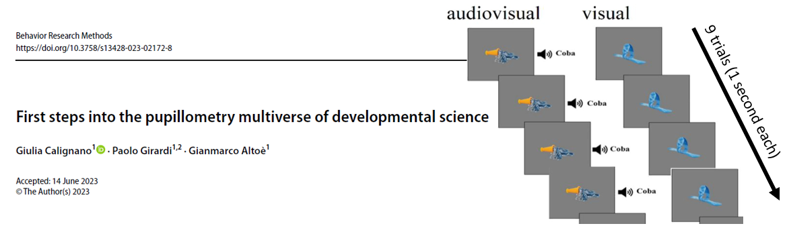
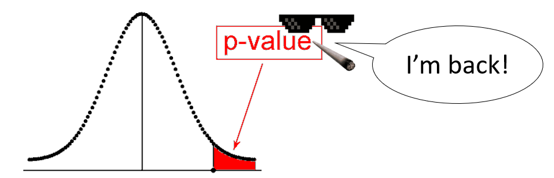

## Outline of Part 1

```{r echo=FALSE,fig.width=4.5,fig.height=2.5,out.width="200px"}
rm(list=ls())
```

\fontsize{7.5pt}{12}\selectfont

- \color{blue} **LM recap**: Short recap of linear regression modeling `r fontawesome::fa(name = "microscope", fill = "blue", height = "1em")` `r fontawesome::fa(name = "r-project", height = "1em")` \color{black}

- **LMER**: Introduction to multilevel modeling (*linear mixed-effects regression*)

- **Data processing**: How to approach a multilevel data structure? \newline How to manipulate and pre-process multilevel data? `r fontawesome::fa(name = "r-project", height = "1em")`

- **Descriptives**: Which descriptive stats should be reported from a multilevel dataset? How to compute and interpret them? 

- **Model fit**: How to fit a multilevel model in R? How to inspect, report, visualize, and interpret the results of a multilevel model? `r fontawesome::fa(name = "r-project", height = "1em")`

- **Model evaluation**: Which are the assumptions of multilevel models? How to evaluate them? How to compare multiple models and select the best model? `r fontawesome::fa(name = "r-project", height = "1em")`

___ \newline \fontsize{5pt}{12}\selectfont \color{blue}
`r fontawesome::fa(name = "r-project", height = "1em")` = exercises with R (bring your laptop!)

## Linear regression models

\fontsize{7.5pt}{12}\selectfont 
**Linear models (LM)** allow to determinate the link between two variables \newline as expressed by a linear function: \fontsize{10pt}{12}\selectfont \color{red} $y_i = \beta_0 + \beta_1 x_i + \epsilon_i$ \fontsize{7pt}{12}\selectfont \color{black} \newline Such a function can be graphically represented as a **straight line**, where:  \fontsize{7pt}{12}\selectfont 

- \color{violet} $\beta_0$ \color{black} is the **intercept** (value assumed by `y` when `x` = 0) 

- \color{violet} $\beta_1$ \color{black} is the  **slope** (predicted change in `y` when `x` increases by 1 unit) 

- \color{violet} $\epsilon_i$ \color{black} are the **errors** (distance between observation $i$ and the regression line)

\begincols
  \begincol{.45\textwidth}

\color{white} _

```{r echo=FALSE,fig.width=4.5,fig.height=3,out.width="150px"}
par(mar=c(0, 4, 0, 2) + 0.1,mai = c(0.8, 0.7, 0, 0.7))
x <- rnorm(n = 100)
y <- x + rnorm(n = 100)
plot(y~x,pch=19,col="gray",cex=0.8)
abline(lm(y~x),col="red",lwd=2)
abline(v=0,lty=2,col="gray")
abline(h=summary(lm(y~x))$coefficients[1,1],lty=2,col="gray")
text(x=0.5,y=summary(lm(y~x))$coefficients[1,1],labels=paste("B0 =",round(summary(lm(y~x))$coefficients[1,1],2)))
text(x=min(x)+0.5,y=min(y)+0.5,labels=paste("B1 =",round(summary(lm(y~x))$coefficients[2,1],2)))
```

  \endcol
\begincol{.6\textwidth}

\fontsize{7pt}{12}\selectfont 
\color{violet}$x_i$ \color{black} and \color{violet}$y_i$ \color{black} are the values of observation *i* for the **casual variables** $x$ and $y$ \newline

\color{violet}$\beta_0$\color{black}, \color{violet}$\beta_1$\color{black}, and  \color{violet}$\epsilon_i$ \color{black}are called "**parameters**", \newline or "**coefficients**".
They are *estimated* from the sampled data and *generalized* to the whole population.

  \endcol
\endcols

## Fitting linear models in R

\fontsize{6.5pt}{12}\selectfont
```{r }
data("children", package = "npregfast") # loading children dataset from npregfast pkg
```
\fontsize{7pt}{12}\selectfont
R uses the `lm()` function to fit linear models with the arguments `formula` \newline (`y ~ x1 + x2 + ...`) and `data` (identifying the dataframe with the model variables).

\color{white}_\color{black}

\begincols
  \begincol{.5\textwidth}

\fontsize{6.5pt}{12}\selectfont
**Null model** \newline \fontsize{6pt}{12}\selectfont Children' `height` is only predicted by the model \color{violet} **intercept** $\beta_0$ \color{black} = expected (i.e., mean) value of `height` in the sample. \color{violet} $\sigma^2$ is the **variance of the residuals** $\epsilon_i$ \color{black} (deviations from the intercept).
```{r comment=NA}
m0 <- lm(formula = height ~ 1, 
         data = children)
coefficients(m0) # model parameters
summary(m0)$sigma^2 # residual variance
```

  \endcol
\begincol{.5\textwidth}

\fontsize{6.5pt}{12}\selectfont
**Simple regression model** \fontsize{6pt}{12}\selectfont \newline `height` is now predicted by the \color{violet} **intercept** $\beta_0$ \color{black} \newline (mean value when `age` is 0), the \color{violet} **slope** $\beta_1$ \color{black} (expected change for 1-unit increase in `age`), and the \color{violet}**residual variance** $\sigma^2$\color{black}.
```{r comment=NA}
m1 <- lm(formula = height ~ age, 
         data = children)
coefficients(m1) # model parameters
summary(m1)$sigma^2 # residual variance
```

  \endcol
\endcols

## Multiple regression & interactions

\fontsize{7pt}{12}\selectfont
LM also allow to include **multiple predictors** and the **interactions**$^1$ among them. This is done by estimating a separate slope (thus, a separate line) for each predictor \newline by *holding constant* the value of the other predictors, which are fixed to zero. \newline

\begincols
  \begincol{.5\textwidth}

\fontsize{7pt}{12}\selectfont
**Multiple regression model** \newline \fontsize{6pt}{12}\selectfont $\beta_0$ = expected value in girls with `age` = 0 \newline $\beta_1$ = `age` effect$^2$ \color{blue}within the same `sex`\color{black} \newline $\beta_2$ = `sex` difference when `age` = 0 \fontsize{6pt}{12}\selectfont
```{r comment=NA}
m2 <- lm(formula = height ~ age + sex, 
         data = children)
coefficients(m2)
```

  \endcol
\begincol{.5\textwidth}

\fontsize{7pt}{12}\selectfont
**Interactive model**  \newline \fontsize{6pt}{12}\selectfont $\beta_1$ = `age` effect \color{blue}in girls\color{black} \newline $\beta_2$ = `sex` difference in `height` when `age` = 0 \newline $\beta_3$ = `sex` difference in `age` effect (**interaction**)
```{r comment=NA}
m3 <- lm(formula = height ~ age * sex, 
         data = children)
round(coefficients(m3),2)
```

  \endcol
\endcols

\fontsize{4pt}{12}\selectfont \color{white}p \newline \color{black} 
\fontsize{5pt}{12}\selectfont ____ \newline 
$^1$The **interaction** between $x_1$ and $x_2$ is computed as the **product of $x_1$ and $x_2$**. \newline
$^2$In this context, "effect" is used as a synonym of "relationship" (not a *causal* effect).

## Model comparison & model selection {#lm-compar}

\begincols
  \begincol{.5\textwidth}

\fontsize{6.5pt}{12}\selectfont
**Likelihood ratio test** \newline Compares the \color{violet} *fit* \color{black} of two *nested* models \newline (i.e., predicting the same $y$ variable, with the more complex model including all predictors included in the simpler model).
```{r fig.width=8,fig.height=3.5,warning=FALSE,message=FALSE,eval=FALSE,comment=NA}
library(lmtest)
lrtest(m0,m1,m2,m3) # returns Chisq statistic
```
\fontsize{6pt}{12}\selectfont
```{r fig.width=8,fig.height=3.5,warning=FALSE,message=FALSE,echo=FALSE,comment=NA}
library(lmtest)
p <- lrtest(m0,m1,m2,m3)
p[,2:4] <- round(p[,2:4],2)
as.data.frame(p)
```
  \endcol
\begincol{.5\textwidth}

\fontsize{6.5pt}{12}\selectfont
**Information criteria** \newline The Akaike (AIC) and the Bayesian Information Criterion (BIC) compare multiple models in terms of \color{violet} *fit* & *parsimony* \color{black} (the lower number of parameters the better)
```{r fig.width=5,fig.height=4,eval=FALSE,comment=NA}
AIC(m0,m1,m2,m3) # AIC: the lower the better
```
```{r fig.width=5,fig.height=4,echo=FALSE,comment=NA}
AIC(m0,m1,m2,m3)$AIC
```
```{r fig.width=5,fig.height=4,comment=NA}
# Akaike weights: from 0 (-) to 1 (+)
MuMIn::Weights(AIC(m0,m1,m2,m3))
```

  \endcol
\endcols

```{r , echo = FALSE, out.width = "5px"}
knitr::include_graphics("img/white.png")
```

\fontsize{7pt}{12}\selectfont
Here, *model fit to the data* is expressed by its \color{violet} __likelihood__ = probability of observing the sampled data given the parameters estimated by the model\color{black}, sometimes referred as the *evidence* of a model, or its *ability to predict/forecast* new data that are similar to the sampled data (\color{blue}[see interactive visualization by Kristoffer Magnusson](https://rpsychologist.com/likelihood/)\color{black}).

## Parameter estimation in linear regression models {#estimation}

\fontsize{6.5pt}{12}\selectfont
\color{violet}$\beta_0$ \color{black}, \color{violet}$\beta_1$ \color{black}, and \color{violet}$\epsilon$ \color{black} must be **estimated** based on data sampled from a population: \newline \color{violet}$\hat\beta_0$ \color{black} = \color{violet}$b_0$\color{black}; \color{violet}$\hat\beta_1$ \color{black} = \color{violet} $b_1$\color{black}; \color{violet}$\hat\epsilon$ \color{black} = \color{violet} $e$\color{black}). 

`r fontawesome::fa(name = "microscope",fill="blue", height = "0.8em")` \color{blue}
There are several methods to estimate unknown parameters, such as:

\fontsize{6.5pt}{12}\selectfont 
- \color{blue} **Ordinary least squares (OLS)**: finds the *parameter values* that *minimize the sum of the squared residuals* (default LM estimator)

- \color{blue} **Maximum likelihood estimator (MLE)**: finds the *parameter values* that *maximize the model likelihood*, making the observed data the most probable under that model

- \color{blue} **Bayesian estimator**: finds the *parameter posterior distributions* based on prior knowledge/beliefs (*prior*) and observed data (*likelihood*) \color{black}

\color{black}
Regardless of the used method, parameters values (or distributions) are always accompanied with a measure of the **uncertainty/precision** associated with their estimate: \newline \color{violet} **Standard errors (SE)** = predicted *variability* in the parameter estimate if the data were collected from different random samples from the same population.\color{black} \newline SE are used for computing *test statistics* \fontsize{5pt}{12}\selectfont ($Est/SE$) \fontsize{6pt}{12}\selectfont & *confidence intervals* \fontsize{5pt}{12}\selectfont ($Est\pm1.96 \times SE$)

\fontsize{6pt}{12}\selectfont ____ \newline \color{blue}
`r fontawesome::fa(name = "microscope",fill="blue", height = "0.8em")` In LM, under the assumption of normally distributed residuals, OLS = MLE

## What are residuals? {#residuals}

\fontsize{7pt}{12}\selectfont
Residuals are the model-based estimates of the population errors.

\begincols
  \begincol{.40\textwidth}

\fontsize{8pt}{12}\selectfont
Linear model: \newline
$y_i = \beta_0 + \beta_1 x_i + \epsilon_i$ \newline

Predicted values: \newline
$\hat{y}_i = \beta_0 + \beta_1 x_i$ \newline 

Observed values: \newline
$y_i = \hat{y}_i + \hat{\epsilon}_i$ \newline

\color{violet} Residuals = observed - predicted \newline $\hat{\epsilon}_i = y_i - \hat{y}_i$

  \endcol
\begincol{.6\textwidth}

\fontsize{6.5pt}{12}\selectfont
```{r fig.width=8,fig.height=3, eval=FALSE}
head(data.frame(observed = children$height,
                predicted = fitted(m3),
                residuals = residuals(m3) 
                squared = residuals(m3)^2 ))
```
```{r fig.width=8,fig.height=3, echo=FALSE, comment=NA}
head(data.frame(observed = round(children$height,2),
                predicted = round(fitted(m3),2),
                residuals = round(residuals(m3),2),
                squared = round(residuals(m3)^2,2)
                ))
```
```{r fig.width=8,fig.height=3}
sum(residuals(m3)^2) # sum of squared (SS) residuals
var(residuals(m3)) # residual variance SIGMA2
```

  \endcol
\endcols

```{r , echo = FALSE, out.width = "5px"}
knitr::include_graphics("img/white.png")
```

\fontsize{7pt}{12}\selectfont
In LM, __model parameters__ include: \newline (1) intercept, (2) slope(s), and (3) **residual variance** $\sigma^2$ \newline &rightarrow; \color{blue} *How many parameters in the previous models? (__= No. predictors + 2__)*

## Statistical inference on regression coefficients {#inference}

\begincols
\begincol{.6\textwidth}

\fontsize{6.5pt}{12}\selectfont
In the NHST approach, we can **test the statistical significance** of regression coefficients (*two-tail t-test*). This is automatically done by R in the model summary.
```{r eval=FALSE}
summary(m3) # model results
```
```{r echo=FALSE,comment=NA}
p <- summary(m3)$coefficients
p[,1:3] <- round(p[,1:3],2)
p
```

  \endcol
\begincol{.45\textwidth}

\fontsize{6pt}{12}\selectfont \color{white}space\color{black}\newline
- __`Estimate`__ = estimated parameter \newline - __`Std. Error`__ = parameter standard error \newline - __`t value`__ = test statistic computed as \color{white} spa \color{blue} $t = Estimate / Std.Error$ \color{black} \newline - __`p-value`__ = *p* corresponding to the *t*-value \color{white}spa \color{black} with \color{blue} *No. Obs. $-$ No. Coeff. $-$ 1* \newline \color{white}  \color{white}space \color{black} degrees of freedom

  \endcol
  \endcols

\begincols
  \begincol{.37\textwidth}

\fontsize{7pt}{12}\selectfont
**Effect size**: \newline Coefficient of determination \newline $R^2 = 1 - SS_{residuals}/SS_{ total}$
```{r eval=FALSE}
summary(m3)$r.squared 
```
```{r echo=FALSE,comment=NA}
round(summary(m3)$r.squared,2)
```

\fontsize{7pt}{12}\selectfont The model explains 79% of the variance in height.

  \endcol
\begincol{.6\textwidth}

\fontsize{1pt}{12}\selectfont \color{white}p \color{black} \newline
\fontsize{7pt}{12}\selectfont
**Plotting effects**: \fontsize{6pt}{12}\selectfont
```{r out.width="150px",fig.width=4,fig.height=2}
sjPlot::plot_model(m3,type="pred",terms=c("age","sex"))
```

  \endcol
\endcols

## Hands on `r fontawesome::fa(name = "r-project", fill="#3333B2",height = "1em")`

\fontsize{6pt}{12}\selectfont

1.  \color{black}Download & read the dataset from \color{blue} the *"Pregnancy during pandemics"* study `r fontawesome::fa(name = "person-pregnant", fill="blue",height = "1em")`

 \color{blue} `depr` = postnatal depression, `age` = mother's age, `NICU` = intensive care, `threat` = fear of COVID \color{black}
```{r out.width="150px",fig.width=4,fig.height=2,results=FALSE,message=FALSE,warning=FALSE}
library(osfr) # package to interact with the Open Science Framework platform
proj <- "https://osf.io/ha5dp/" # link to the OSF project
osf_download(osf_ls_files(osf_retrieve_node(proj))[2, ],conflicts="overwrite") # download
preg <- na.omit(read.csv("OSFData_Upload_2023_Mar30.csv",stringsAsFactors=TRUE)) # read data
colnames(preg)[c(2,5,12,14)] <- c("age","depr","NICU","threat") # set variable names
```

\begincols
  \begincol{.5\textwidth}

\fontsize{6pt}{12}\selectfont

2. Explore the the variables `depr`, `threat`, `NICU`, and `age` (descr., corr., & plots)

3. Fit a null model `m0` of `depr`

4. Fit a simple regression model `m1` with `depr` being predicted by `threat`

5. Fit a multiple regression model `m2` \newline also controlling for `NICU` and `age`

6. Fit an interactive model `m3` to check whether `age` moderates the relationship between `threat` and `depr`.

  \endcol
\begincol{.5\textwidth}

\fontsize{6.5pt}{12}\selectfont

7. Compare the models with AIC and likelihood ratio test: which is the best model?

8. Print & interpret the coefficients estimated by the selected model

9. Print & interpret the statistical significance of the estimated coefficients

10. Plot the effects of the selected model

11. Compute the determination coefficient of the selected model

  \endcol
\endcols

## One step back: Linear model assumptions {#lm-assumpt}

\fontsize{7.5pt}{12}\selectfont
Core assumptions: \newline
\fontsize{6.5pt}{12}\selectfont
**1. Linearity**: $x_i$ and $y_i$ are linearly associated &rightarrow; the expected (mean) value of $\epsilon_i$ is zero

**2. Normality**: residuals $\epsilon_i$ are normally distributed with $\epsilon_i \sim \mathcal{N}(0,\,\sigma^{2})$

**3. Homoscedasticity**: $\epsilon_i$ variance is constant over the levels of $x_i$ (homogeneity of variance)

**4. Independence of predictors & errors**: predictors $x_i$ are unrelated to residuals $\epsilon_i$

**5. Independence of observations**: for any two observations $i$ and $j$ with $i \neq j$, \newline the residual terms $\epsilon_i$ and $\epsilon_j$ are independent (no common disturbance factors) \newline

\fontsize{7.5pt}{12}\selectfont
Additional assumptions: \newline
\fontsize{6.5pt}{12}\selectfont
**6. Absence of influential observations** (multivariate outliers)

**7. Absence of multicollinearity (for multiple regression)**: \newline lack of linear relationship between $x_1$ and $x_2$

## Model diagnostics: Assessing LM assumptions

\begincols
  \begincol{.5\textwidth}
  
\fontsize{6.5pt}{12}\selectfont Normality & linearity `r fontawesome::fa(name = "face-smile",fill="green", height = "0.8em")`
```{r out.width="150px",fig.width=4,fig.height=2,eval=FALSE}
hist(residuals(m3))
qqnorm(residuals(m3)); qqline(residuals(m3))
```
```{r out.width="150px",fig.width=8,fig.height=3,echo=FALSE}
par(mfrow=c(1,2))
hist(residuals(m3),main="Histogram of res.")
qqnorm(residuals(m3),cex=0.5,pch=20)
qqline(residuals(m3),col="violet")
```

Homoscedasticity & independence $x,\epsilon$ `r fontawesome::fa(name = "face-smile",fill="green", height = "0.8em")`
```{r out.width="150px",fig.width=4,fig.height=2,eval=FALSE}
plot(residuals(m3) ~ children$sex)
plot(residuals(m3) ~ children$age)
```
```{r out.width="150px",fig.width=8,fig.height=3,echo=FALSE}
par(mfrow=c(1,2))
plot(residuals(m3) ~ children$sex,xlab="",main="Residuals by sex")
plot(residuals(m3) ~ children$age,pch=20,col="gray",main="Residuals by age")
abline(lm(residuals(m3) ~ children$age),
       col="violet")
```

  \endcol
\begincol{.5\textwidth}

\fontsize{6.5pt}{12}\selectfont Absence of influential cases `r fontawesome::fa(name = "face-smile",fill="green", height = "0.8em")`
```{r out.width="150px",fig.width=6,fig.height=3.2}
plot(m3,which=5)
```

Absence of multicollinearity `r fontawesome::fa(name = "face-frown",fill="orange", height = "0.8em")`
```{r out.width="150px",fig.width=4,fig.height=1.5,warning=FALSE,message=FALSE}
sjPlot::plot_model(m3,"diag")[[1]]
```

  \endcol
\endcols

\fontsize{6.5pt}{12}\selectfont
\color{violet} **Independence of observations** `r fontawesome::fa(name = "circle-question",fill="violet", height = "0.8em")` \newline _Are the unmeasured factors influencing `y` unrelated from one individual to another?_

# LMER

## Cluster variables & nested data

\fontsize{8pt}{12}\selectfont
In many cases, the *sampling method* creates **clusters** of *individual observations*

\fontsize{6.5pt}{12}\selectfont
- students &rightarrow; schools

- children &rightarrow; families &rightarrow; neighborhoods &rightarrow; cities &rightarrow; regions &rightarrow; states &rightarrow; planets `r fontawesome::fa(name = "rocket", height = "0.8em")` 

\fontsize{8pt}{12}\selectfont
**Nested data structure** (= *multilevel* or *hierarchical* data structure)\newline = when data points at the **individual level** appear *in only one group* \newline of the **cluster level** variable

&rightarrow; \color{violet} individual observations are ***nested*** within clusters \color{black}

\fontsize{8pt}{12}\selectfont
How do you imagine such a nested dataset? \newline

\fontsize{6pt}{12}\selectfont ____ \newline 
**Individual observation = statistical unit** = individual entity within a sample or population that is the subject of data collection & analysis (not necessarily a person)

## Case study: Innovative math teaching program `r fontawesome::fa(name = "school",fill="#3333B2", height = "0.8em")`

\fontsize{7pt}{12}\selectfont 
\color{blue}We're hired by a school principal to assess whether an *innovative teaching program* can improve *math achievement* in first-year high-school students. \color{black}

\begincols
  \begincol{.5\textwidth}
  
\fontsize{7pt}{12}\selectfont 
```{r out.width="150px",fig.width=5,fig.height=3,warning=FALSE,message=FALSE,comment=NA}
# reading data
itp <- read.csv("data/studentData.csv")
# frequency table class by intervention
table(itp[,c("classID","tp")]) 
```
\color{white}_\color{black}

```{r out.width="150px",fig.width=5,fig.height=3,warning=FALSE,message=FALSE,eval=FALSE}
boxplot(math_grade ~ tp, data=itp)
```
```{r out.width="150px",fig.width=5,fig.height=2.5,warning=FALSE,message=FALSE,echo=FALSE}
itp$math_grade <- round(itp$math_grade,2)
par(mai=c(1,1,0,1)) # larger plot margins
boxplot(math_grade ~ tp, data=itp)
```

  \endcol
\begincol{.5\textwidth}

\color{blue}
The teaching program `tp` was delivered over the first semester to 2 out of 4 classes and we got the students' end-of-semester `math_grade` (1-10). \newline \color{black}

\fontsize{7.5pt}{12}\selectfont 
**Nested dataset**: students are *nested within* classes, with each student only belonging to one class. 
```{r comment=NA}
head(itp[,1:4],12)
```

  \endcol
\endcols

## Non-independence of observations with nested data

\begincols
  \begincol{.5\textwidth}
  
\fontsize{7pt}{12}\selectfont 
Let's try with a linear regression model:
```{r out.width="150px",fig.width=5,fig.height=3,warning=FALSE,message=FALSE,eval=FALSE}
m <- lm(math_grade ~ tp, data=itp)
summary(m)$coefficients[,1:3]
```
\fontsize{6.5pt}{12}\selectfont 
```{r out.width="150px",fig.width=5,fig.height=3,warning=FALSE,message=FALSE,echo=FALSE}
m <- lm(math_grade ~ tp, data = itp)
round(summary(m)$coefficients[,1:3],2)
```
\color{white} space \newline \color{black} Model diagnostics (\color{blue}[see slide #11](#lm-assumpt)\color{black}):
```{r out.width="150px",fig.width=5,fig.height=3,warning=FALSE,message=FALSE,eval=FALSE}
hist(residuals(m)); qqnorm(residuals(m))
boxplot(residuals(m)~itp$tp); plot(m,5)
```
```{r out.width="150px",fig.width=5,fig.height=3,warning=FALSE,message=FALSE,echo=FALSE}
par(mfrow=c(2,2),mai=c(1,1,1,1),mar=c(4,4,2,1))
hist(residuals(m))
qqnorm(residuals(m))
boxplot(residuals(m) ~ itp$tp)
plot(m,which=5)
```
  \endcol
\begincol{.5\textwidth}

\fontsize{9pt}{12}\selectfont
- Coefficient meaning?

- Linear model assumptions? \newline \color{violet}

- **Independent observations**? 

\fontsize{7pt}{12}\selectfont

 \color{violet} _Are_ $\epsilon_i$ _and_ $\epsilon_j$ _independent for any_ $i \neq j$? \newline _Are the unmeasured factors influencing `y` unrelated from one individual to another?_ \newline \color{black}

__NO__: students are nested within classes and such cluster variable is likely to explain differences in the \color{violet}*y* \color{black}variable (as well as in the relationship between \color{violet}*x* \color{black} and \color{violet}*y*\color{black}) \newline

Thus, **we cannot rely on linear models** to analyze these data.

  \endcol
\endcols

## Local dependencies

\fontsize{8pt}{12}\selectfont \color{violet} __Local dependencies__ = correlations that exist among observations within a specific cluster \color{black} (but the software doesn't know that!) \newline \fontsize{6pt}{12}\selectfont e.g., grades from the same class will be more correlated than they are between different classes \newline

\fontsize{8pt}{12}\selectfont __*Why* is this a problem?__
\newline \fontsize{7pt}{12}\selectfont 1) Can result in **biased estimates of the standard errors** &rightarrow; underestimated *p*-values (+false positive) \newline 2) Potentially important **variables at the cluster level** are neglected \newline \fontsize{6pt}{12}\selectfont e.g., teachers' characteristics, teaching CV, class social climate \newline

\fontsize{8pt}{12}\selectfont __*When* is this a problem?__
\newline \fontsize{7pt}{12}\selectfont Virtually, any time that a cluster variable is potentially related to \color{violet}*y*\color{black} \newline Pragmatically, we cannot account for all potential clusters \newline \fontsize{6pt}{12}\selectfont e.g., children &rightarrow; families &rightarrow; neighborhoods &rightarrow; cities &rightarrow; regions &rightarrow; states &rightarrow; planets `r fontawesome::fa(name = "rocket", height = "0.8em")` 

\fontsize{7pt}{12}\selectfont Based on theory & logic, we should focus on what we consider the most influential clustering factors for both  \color{violet}*y* \color{black} and \color{violet}*x*\color{black}

## Mixed-effects models

\fontsize{7.5pt}{12}\selectfont
Multilevel models are part of the largest **linear mixed-effects regression (LMER)** family that include **additional variance terms** for handling local dependencies. \newline

Why 'mixed-effects'? \newline \fontsize{7pt}{12}\selectfont Because such additional terms come from the distinction between:

- \color{violet} __Fixed effects__: effects that remain ***constant across clusters***\color{black}, whose levels are *exhaustively considered* (e.g., gender, levels of a Likert scale) and generally controlled by the researcher (e.g., experimental conditions)

- \color{violet}__Random effects__: effects that ***vary from cluster to cluster***\color{black}, whose levels are *randomly sampled* from a population (e.g., schools)

\fontsize{6pt}{12}\selectfont ____ \newline \color{blue}
`r fontawesome::fa(name = "microscope",fill="blue", height = "0.8em")` When individual observations can change cluster over time, it is still a mixed-effects model but not a multilevel model. \newline `r fontawesome::fa(name = "microscope",fill="blue", height = "0.8em")` Here, "levels" refers to the possible categories/classes of a categorical variable, but from now on we will use this term with a different meaning...

## From LM to LMER

\begincols
  \begincol{.5\textwidth}

\fontsize{7pt}{12}\selectfont 
LM formula: $y_i = \beta_0 + \beta_1 x_i + \epsilon_i$ \color{black} \newline Intercept and slope are **constant across all individual observations** $i$ within the population; $x$, $y$, and the error term $\epsilon$ only variate across individual observations $i$ \newline

  \endcol
\begincol{.5\textwidth}

\fontsize{7pt}{12}\selectfont 
LMER formula: $y_{i\color{red}j} = \beta_{0\color{red}j} + \beta_{1\color{red}j} x_{i\color{red}j} + \epsilon_{i\color{red}j}$ \color{black} \newline Intercept and slope have both a **fixed** ($_{0/1}$) and a **random** component (\color{red}$_j$\color{black}); $y$, $x$, and $\epsilon$ variate across **individual observations $i$** as well as across \color{red}**clusters $j$** \newline

  \endcol
\endcols

```{=tex}
\begin{center} 
```

\fontsize{10pt}{12}\selectfont
$y_{ij} =$ \color{teal} $\beta_{0j}$ \color{black} + \color{violet} $\beta_{1j}$\color{black}$x_{ij} + \epsilon_{ij}$ = \color{teal} $(\beta_{00} + \lambda_{0j})$ \color{black} + \color{violet} $(\beta_{10} + \lambda_{1j})$\color{black}$x + \epsilon_{ij}$ \newline

```{=tex}
\end{center}
```

\fontsize{8pt}{12}\selectfont
LMER are an extension of LM where the \color{teal}intercept \color{black} and the \color{violet} slope \color{black} are decomposed into the **fixed components** \color{teal} $\beta_{00}$ \color{black} and \color{violet} $\beta_{10}$ \color{black} referred to the whole sample, and the **random components** \color{teal} $\lambda_{0j}$ \color{black} and  \color{violet}$\lambda_{1j}$ \color{black} randomly varying across clusters. \newline

\fontsize{6pt}{12}\selectfont ____ \newline 
In LMER, **$x$ variables (predictors) always variate across clusters $j$, but not necessarily across individual observations $i$** (e.g., school principals' age only variate across schools, whereas students' age variate across students within schools)

## Random intercept {#randint}

\fontsize{7.5pt}{12}\selectfont 
Let's start with an **intercept-only model** (i.e., ***unconditional*** or ***null model***), \newline where math grades ($y_{ij}$) are only predicted by the intercept $\beta_{00}$ and the residuals $\epsilon_{ij}$

- *Linear model*: $y_{i} = \beta_0 + \epsilon_i$ \newline The intercept value $\beta_0$ is common to all individuals within the population

- *Linear mixed-effects model*: $y_{ij} =$ \color{red} $\beta_{0j}$ \color{black} $+$ $\epsilon_{ij} =$ (\color{teal} $\beta_{00}$ \color{black} $+$ \color{red} $\lambda_{0j}$\color{black}) $+$ $\epsilon_{ij}$ \newline - \color{teal}$\beta_{00}$ is the **fixed intercept** \color{black} (also called 'average' or 'general intercept') that applies to the whole population \newline - \color{red} $\lambda_{0j}$ is the **random intercept** \color{black} = *cluster-specific deviation from the fixed intercept* (i.e., mean class grade - fixed intercept)

```{r out.width="280px",fig.width=8,fig.height=3,warning=FALSE,message=FALSE,echo=FALSE}
# setting graphical parameters from the null model
library(lme4); library(ggplot2)
m0 <- lmer(math_grade ~ (1|classID), data = itp) # null lmer model
fixInt <- fixef(m0) # fixed intercept
randInt <- ranef(m0)[[1]] # class-specific deviations from the intercept
randInt$class <- rownames(randInt) # class ID
randInt$classGrade <- fixInt + randInt$`(Intercept)` # class-specific mean grade
randInt$y <- c(8.75,7.5,6.25,5) # this is just to set the Y coordinates in the plot
randInt$xlabel <- c(rep(fixInt,2),randInt$classGrade[3:4]) # labels' X coordinates in the plot
randInt$label <- paste("class",c("A","B","C","D"),"- expression(beta)") # labels

# plotting
ggplot(itp,aes(math_grade)) + geom_histogram(position="identity",alpha=0.6) + ylab("Frequency") +
  geom_vline(aes(xintercept=fixInt),color="#008080",lwd=1.5) +
  geom_vline(data=randInt,aes(xintercept=classGrade,lty=class)) +
  geom_label(aes(x=fixInt+0.31,y=10.5),label="Fixed~intercept~beta[0][0]",
             alpha=0.7,color="#008080",parse=TRUE)+
  geom_segment(data=randInt,aes(x=classGrade,xend=fixInt,y=y,yend=y),
               arrow=arrow(ends="both",length=unit(0.2,"cm")),color="red") +
  geom_label(data=randInt,aes(x=xlabel+0.28,y=y,
                              label=paste("lambda[0][",1:4,"]==class~",class,"~-~beta[0][0]")),
             parse=TRUE,size=3.5,color="red",alpha=0.7) + 
  ylim(0,11) + labs(lty="Mean\ngrade\nin class:")
```

## Random slope

```{=tex}
\begin{center} 
```

\fontsize{7pt}{12}\selectfont 
Let's now add a predictor: students' `anxiety` levels $x_{ij}$.

```{=tex}
\end{center} 
```

\begincols
  \begincol{.45\textwidth}
  
\fontsize{7pt}{12}\selectfont 
\color{teal} **Random intercept** \color{black} model \color{black} \newline 
$y_{ij} =$ \color{teal} $\beta_{0j}$ \color{black} $+$ $\beta_1x_{ij} + \epsilon_{ij}$ \newline $=(\beta_{00} +$ \color{teal} $\lambda_{0j}$\color{black}) $+$ $\beta_1x_{ij} + \epsilon_{ij}$ \newline

Math grades $y_{ij}$ are predicted by the overall mean grade $\beta_{00}$, their ***average relationship*** with anxiety $\beta_{10}$, the \color{teal} random variation among clusters $\lambda_{0j}$ (*random intercept*)\color{black}, and the random variation among individuals within clusters $\epsilon_{ij}$ (*residuals*).

```{r out.width="150px",fig.width=4,fig.height=2,warning=FALSE,message=FALSE,echo=FALSE}
# setting graphical parameters from the null model
itp$class <- itp$classID
m1 <- lmer(math_grade ~ anxiety + (1|class), data = itp) # fixed slope

# plotting
library(sjPlot)
plot_model(m1,type="pred",terms=c("anxiety","class"),ci.lvl=NA,
           pred.type = "re",title ="") +
  geom_point(data=cbind(itp,group_col=itp$class),aes(anxiety,math_grade)) + ylim(6.5,9.5)
```

  \endcol
\begincol{.55\textwidth}

\fontsize{7pt}{12}\selectfont 
\color{teal} **Random intercept** \color{black} & \color{red} **random slope** \color{black} model \newline
$y_{ij} =$ \color{teal} $\beta_{0j}$ \color{black} $+$ \color{red} $\beta_{1j}$\color{black}$x_{ij} + \epsilon_{ij}$ \newline 
$= (\beta_{00} +$ \color{teal} $\lambda_{0j}$\color{black}$)$ $+$ $(\beta_{10} +$ \color{red} $\lambda_{1j}$\color{black}$)$ \color{black} $x_{ij} + \epsilon_{ij}$ \newline

Since the effect of anxiety might not be the same across all classes, we partition $\beta_{1}$ into the overall ***average relationship*** between anxiety and grades $\beta_{10}$ (*fixed slope*) and the \color{red} cluster-specific variation in the relationship \newline $\lambda_{1j}$ (***random slope***) \color{black} - basically, an interaction between anxiety and class.

```{r out.width="150px",fig.width=4,fig.height=2,warning=FALSE,message=FALSE,echo=FALSE}
# setting graphical parameters from the null model
itp$class <- itp$classID
m2 <- lmer(math_grade ~ anxiety + (anxiety|class), data = itp) # random slope

# plotting
library(sjPlot)
plot_model(m2,type="pred",terms=c("anxiety","class"),ci.lvl=NA,
           pred.type = "re",title ="") +
  geom_point(data=cbind(itp,group_col=itp$class),aes(anxiety,math_grade)) + ylim(6.5,9.5)
```

  \endcol
\endcols

## From LMER to multilevel modeling

\fontsize{9pt}{12}\selectfont 
LMER is often called *'multilevel modeling'* due to the underlying \newline __variance decomposition__ of the $y_{ij}$ variable into the *within-cluster* \newline and the *between-cluster* levels. \newline

\fontsize{7pt}{12}\selectfont 
That is, the LMER formula $y_{ij} = (\beta_{00} + \lambda_{0j}) + (\beta_{10} + \lambda_{1j}) + \epsilon_{ij}$ \newline can be expressed in two separate levels:

\fontsize{8.5pt}{12}\selectfont \color{violet}
$$
\begin{aligned}
Level~1~(within): y_{ij} &= \beta_{0j} + \beta_{1j}x_{ij} + \epsilon_{ij} \\ 
Level~2~(between): \beta_{0j} &= \beta_{00} + \lambda_{0j} \\ 
 \beta_{1j} &= \beta_{10} + \lambda_{1j} 
 \end{aligned}
$$ 
\color{white} space \newline \color{black}

\fontsize{6pt}{12}\selectfont ____ \newline \color{blue} `r fontawesome::fa(name = "microscope", fill = "blue", height = "1em")` In some papers and textbooks, the coefficients $\beta_{00}$ and $\beta_{01}$ are indicated with $\gamma_{00}$ and $\gamma_{01}$, \newline while $\lambda_{0j}$ and $\lambda_{1j}$ are sometimes indicated with $U_{0j}$ and $U_{1j}$, respectively.

## That's all for now!

\fontsize{8pt}{12}\selectfont 
__Questions?__ \newline

__Homework__ (optional):

- read the slides presented today \newline and write in the Moodle forum if you have any doubts

- refresh your familiarity with `r fontawesome::fa(name = "r-project", height = "1em")`: `R-intro.pdf`

- **exe`r fontawesome::fa(name = "r-project", fill="#3333B2",height = "1em")`cises 1-3** from `exeRcises.pdf` \newline \newline

\fontsize{6pt}{12}\selectfont ____ \newline 
For each exercise, the solution (or one of the possible solutions) can be found in dedicated chunk of commented code within the `exeRcises.Rmd` file

# Data processing

## In the last episode...

\begincols
  \begincol{.45\textwidth}
  
\fontsize{8.5pt}{12}\selectfont 
__The problem__ \fontsize{7pt}{12}\selectfont  \newline
Sometimes the sampling method creates *clusters* of individual observations: **nested data structure** where individuals observations are *nested within* clusters. \newline

&rightarrow; **Local dependencies** \newline = correlations among observations within a cluster, violating the LM assumption of independence. \newline 

&rightarrow; We cannot use ordinary LM

  \endcol
\begincol{.55\textwidth}

\fontsize{8.5pt}{12}\selectfont 
__The solution__ \fontsize{7pt}{12}\selectfont \newline
**Linear mixed-effects regression** (LMER) includes **additional variance terms**$^1$ \newline to handle local dependencies. \newline

$y_{ij} =$ \color{teal} $\beta_{0j}$ \color{black} $+$ \color{violet} $\beta_{1j}$\color{black}$x_{ij} + \epsilon_{ij}$ \newline 
$= (\beta_{00} +$ \color{teal} $\lambda_{0j}$\color{black}$)$ $+$ $(\beta_{10} +$ \color{violet} $\lambda_{1j}$\color{black}$)$ \color{black} $x_{ij} + \epsilon_{ij}$ \newline

These can be expressed in two separate levels: \color{violet}
$$
\begin{aligned}
Level~1~(within): y_{ij} &= \beta_{0j} + \beta_{1j}x_{ij} + \epsilon_{ij} \\ 
Level~2~(between): \beta_{0j} &= \beta_{00} + \lambda_{0j} \\ 
 \beta_{1j} &= \beta_{10} + \lambda_{1j} 
 \end{aligned}
$$ 

  \endcol
\endcols

\fontsize{6pt}{12}\selectfont \color{white} space \newline \color{black} ____ \newline 
$^1$The **additional variance terms** are the variance $\tau^2_{00}$ of the random intercept $\lambda_{0j}$ and the variance $\tau^2_{10}$ of the random slope $\lambda_{1j}$. We will see this later...

## Multilevel modeling in longitudinal designs

\fontsize{7pt}{12}\selectfont
Longitudinal assessments (or repeated-measure designs) involve the collection of **multiple data from the same subjects at multiple time points**. \newline &rightarrow; Observations from the same subject are not independent (*local dependencies*). \color{violet}

- Individual observations = time points (*level 1*: ***within-subject***)

- Clusters = subjects (*level 2*: ***between-subjects***)

\color{black}
```{r , echo = FALSE, warning=FALSE,message=FALSE,fig.width=9,fig.height=2.6}
df <- data.frame(Subject = as.factor(c(rep("S01",6),rep("S02",6))),
                 Time = rep(1:6,2),
                 Math_grades = c(2,1,3,4,3,2,   6,6,3,7,6,6))
library(ggplot2)
ggplot(df,aes(x=Time,y=Math_grades,color=Subject)) + geom_smooth(lwd=1.2,se=FALSE) + geom_point(cex=3) + ylim(0,8) +
  geom_line(aes(y=mean(df[df$Subject=="S01","Math_grades"])),color="salmon",lty=2,lwd=0.9) + 
  geom_line(aes(y=mean(df[df$Subject=="S02","Math_grades"])),lty=2,lwd=0.9)
```
\fontsize{6pt}{12}\selectfont ____ \newline \color{blue} `r fontawesome::fa(name = "microscope", fill = "blue", height = "1em")` If individuals are further nested within higher-level clusters, we can specify a *3-level model* \newline (time points &rightarrow; students &rightarrow; classes)

## Case study: Adolescent insomnia `r fontawesome::fa(name = "bed",fill="#3333B2", height = "0.8em")`

```{r , echo = FALSE, out.width = "300px",fig.align='center'}
knitr::include_graphics("img/adolescentInsomnia.png")
```

\fontsize{6.5pt}{12}\selectfont 
\color{blue}A sample of 93 US adolescents undertook a semi-structured clinical interview for \newline __DSM-5 insomnia__ symptomatology (*insomnia* vs. *healthy sleepers*). 

Then, they were provided with a Fitbit wristband (recording **sleep** data) for 2 months. \newline Over the same period, every evening they responded short questionnaires on their **stress** levels at bedtime. \newline

We want to understand whether **daily stress predicts lower sleep time** (HP1); \newline whether the stress impact on sleep is **moderated by insomnia symptomatology** (HP2).

## Hands on `r fontawesome::fa(name = "r-project", fill="#3333B2",height = "1em")`

\fontsize{6.5pt}{12}\selectfont
\color{blue}1.  \color{black}Download & read the datasets from \color{blue} https://github.com/SRI-human-sleep/INSA-home \newline \fontsize{6pt}{12}\selectfont \color{black}
`ID` = subject ID, `dayNr` = day, `stress` = daily stress rating (1-5), `TST` = total sleep time (min), `insomnia` = subject's group (insomnia vs. healthy)
```{r out.width="150px",fig.width=4,fig.height=2,results=FALSE,message=FALSE,warning=FALSE}
repo <- "https://github.com/SRI-human-sleep/INSA-home" # loading datasets from GitHub
load(url(paste0(repo,"/raw/main/Appendix%20D%20-%20Data/emaFINAL.RData")))
load(url(paste0(repo,"/raw/main/Appendix%20D%20-%20Data/demosFINAL.RData")))
# selecting columns
ema <- ema[,c("ID","dayNr","stress","TST")] # ema = time-varying variables
demos <- demos[,c("ID","insomnia")] # demos = time-invariant variables
```

\begincols
  \begincol{.5\textwidth}

\fontsize{6pt}{12}\selectfont

2. Print the first rows of the datasets: \newline How many rows per subject?

3. Which variable includes individual observations, which is the cluster variable, which is the predictor?

4. Which variable(s) at the *within-cluster* level (Level 1)? Which variable(s) at the *between-cluster* level (Level 2)

  \endcol
\begincol{.55\textwidth}

\fontsize{6.5pt}{12}\selectfont

5. Explore (descript., correlations, plots)

6. Compute the ***cluster mean*** for each level-1 variable using \color{blue} `aggregate()` \color{black}

7. Join the cluster means to the `demos` dataset using \color{blue} `cbind()` \color{black}

8. Join the cluster means to the `ema` dataset using \color{blue} `plyr::join()` \color{black}

9. Subtract individual obs. from cluster means

  \endcol
\endcols

## Wide & Long data structure

\begincols
  \begincol{.5\textwidth}

\fontsize{7.5pt}{12}\selectfont
__Wide-form dataset__ \newline \fontsize{6.5pt}{12}\selectfont one row per cluster
```{r out.width="150px",fig.width=4,fig.height=2,message=FALSE,warning=FALSE,comment=NA}
clustMeans <- # computing cluster means
  aggregate(x = ema[,c("TST","stress")],
   by = list(ema$ID), FUN = mean, na.rm = T)
# join cluster means to the wide-form dataset
demos <- cbind(demos, clustMeans[,2:3])
colnames(demos)[3:4] <- c("TST.m","stress.m")
head(demos)
```

\color{violet} Level-2 (*between*) variables\color{black}: \newline `ID`, `insomnia`, `TST.m`, `stress.m`

  \endcol
\begincol{.5\textwidth}

\fontsize{7.5pt}{12}\selectfont
__Long-form dataset__ \fontsize{6.5pt}{12}\selectfont \newline one row per individual observation

\fontsize{6.5pt}{12}\selectfont
```{r out.width="150px",fig.width=4,fig.height=2,message=FALSE,warning=FALSE,comment=NA,eval=FALSE}
library(plyr)
ema <- # join lv-2 variables to long-form
  join(x = ema, # long-form dataset
       y = demos, # wide-form dataset
       by = "ID", # joining variable
       type = "left") # keep all x rows
head(ema)
```
```{r out.width="150px",fig.width=4,fig.height=2,message=FALSE,warning=FALSE,comment=NA,echo=FALSE}
library(plyr)
ema <- # join lv-2 variables to long-form
  join(x = ema, y = demos, by = "ID", type = "left")
ema[,6:7] <- round(ema[,6:7],1)
head(ema)
```

\color{violet} Level-1 (*within*) variables\color{black}: \newline `dayNr`, `stress`, `TST`

  \endcol
\endcols

\fontsize{5pt}{12}\selectfont \color{white} space \color{black} \newline ____ \newline In R, \color{blue} `NA` \color{black} values indicate **missing data**: time points where a level-1 variable was missing

## Between & within cluster

\begincols
  \begincol{.45\textwidth}

\fontsize{9pt}{12}\selectfont
__Long-form dataset__ \fontsize{6.5pt}{12}\selectfont \newline one row per individual observation

```{r out.width="150px",fig.width=4,fig.height=2,message=FALSE,warning=FALSE,comment=NA}
head(ema[,-6], 20)
```

  \endcol
\begincol{.5\textwidth}

\fontsize{9pt}{12}\selectfont
Long-form data structures are needed to fit multilevel models. \newline

Here, **level-1 variables** \color{violet} $x_{ij}$ \color{black} (`stress`) and \color{violet} $y_{ij}$  \color{black} (`TST`) \color{black} change both \color{violet} between and within cluster. \color{black} \newline

In contrast, **level-2 variables** \color{violet} $x_j$ \color{black} (`insomnia`, `stress.m`)  \color{violet}only change between clusters\color{black}, whereas they keep identical values across all the rows associated with the same cluster.

  \endcol
\endcols

## Data centering

\fontsize{7.5pt}{12}\selectfont \color{violet}
__Data centering__ = subtracting the mean of a variable from each variable value. \color{black}

- The mean of a centered variables is always 0.

- Its variance and covariances are equivalent to those of the original variable.

- Centered scores represent *deviations from the mean*. \newline

\fontsize{7pt}{12}\selectfont
In both LM and LMER, \color{violet} **centering the predictors** \color{black} is useful to *reduce collinearity* (linear relationship between predictors) and for *better interpreting a model intercept* \newline (= value of $y$ ***when $x$ is at its mean***); but it *does not affect the slopes*.

\begincols
  \begincol{.5\textwidth}

\fontsize{6pt}{12}\selectfont
```{r out.width="150px",fig.width=4,fig.height=2,message=FALSE,warning=FALSE,comment=NA}
demos$stress.gmc <- # grand-mean centering
  demos$stress.m - mean(demos$stress.m)
```
```{r out.width="150px",fig.width=6,fig.height=3,message=FALSE,warning=FALSE,comment=NA,echo=FALSE}
par(mfrow=c(1,2)) # 2 plots in 1 panel
hist(demos$stress.m,main="Non-centered") # non-centered
abline(v=mean(demos$stress.m),col="red",lwd=3,lty=2)
text(x=mean(demos$stress.m)+1.2,y=25,
     labels=paste("mean =",round(mean(demos$stress.m),2)),col="red")
hist(demos$stress.gmc,main="Centered") # centered
abline(v=mean(demos$stress.gmc),col="red",lwd=3,lty=2)
text(x=mean(demos$stress.gmc)+0.9,y=22,
     labels=paste("mean =",round(mean(demos$stress.gmc),2)),col="red")
```

  \endcol
\begincol{.5\textwidth}

\fontsize{6pt}{12}\selectfont
```{r comment=NA}
# non-centered x: b0 = predicted y when x = 0
coefficients(lm(TST.m ~ stress.m,data=demos))
```

```{r comment=NA}
# centered x: b0 = predicted y when x = mean x
coefficients(lm(TST.m ~ stress.gmc,data=demos))
```

\color{white} space

  \endcol
\endcols

## Grand mean vs. Cluster mean centering {#cmc}

\fontsize{7.5pt}{12}\selectfont
With LMER, we can distinguish two main ways to center the data:

__1) Grand mean centering__ = subtracting the mean of the whole sample (*grand-mean* or *grand-average*) from each cluster's mean.
```{r out.width="150px",fig.width=4,fig.height=2,results=FALSE,message=FALSE,warning=FALSE}
# gmc stress = mean cluster's stress - grand mean
demos$stress.gmc <- demos$stress.m  -  mean(demos$stress.m)
```

__2) Cluster mean centering__ (or '*group mean centering*') = subtracting the mean of the cluster (*group mean*) from each individual observation nested within that cluster.
```{r out.width="150px",fig.width=4,fig.height=2,results=FALSE,message=FALSE,warning=FALSE}
# cmc stress = individual obs. - mean of the corresponding cluster
ema$stress.cmc <- ema$stress  -   ema$stress.m
```
```{r out.width="250px",fig.width=7.5,fig.height=1.8,results=FALSE,message=FALSE,warning=FALSE,echo=FALSE}
par(mfrow=c(1,3))
hist(ema$stress,main="Raw stress scores")
hist(demos$stress.gmc,main="Grand-mean-centered means")
hist(ema$stress.cmc,main="Cluster-mean-centered scores")
```

\color{blue}
Hands on `r fontawesome::fa(name = "r-project", fill="#3333B2",height = "1em")`: Compute the grand-mean-centered & the cluster-mean-centered values of `stress` and `TST`. Then, compute their Pearson's correlation with the `cor()` function

## That's all for now!

\fontsize{8pt}{12}\selectfont 
__Questions?__ \newline

__Homework__ (optional):

- read the slides presented today \newline and write in the Moodle forum if you have any doubts

- **exe`r fontawesome::fa(name = "r-project", fill="#3333B2",height = "1em")`cises 4-5** from `exeRcises.pdf` \newline \newline

\fontsize{6pt}{12}\selectfont ____ \newline 
For each exercise, the solution (or one of the possible solutions) can be found in dedicated chunk of commented code within the `exeRcises.Rmd` file

# Descriptives

## In the last episodes...

\begincols
  \begincol{.5\textwidth}
  
\fontsize{8.5pt}{12}\selectfont 
__Problem & solution__ \fontsize{7pt}{12}\selectfont  \newline
The sampling method can create *clusters* of individual observations = *nested data* leading to *local dependencies* \newline 
&rightarrow; **Multilevel modeling** (or LMER) includes \color{violet} *additional variance terms* \newline \color{black} to handle local dependencies. 
$$
\begin{aligned}
Level~1~(within): y_{ij} &= \beta_{0j} + \beta_{1j}x_{ij} + \epsilon_{ij} \\ 
Level~2~(between): \beta_{0j} &= \beta_{00} + \lambda_{0j} \\ 
 \beta_{1j} &= \beta_{10} + \lambda_{1j} 
 \end{aligned}
$$ 

\fontsize{8.5pt}{12}\selectfont 
__Wide and long datasets__ \fontsize{7pt}{12}\selectfont  \newline
LMER require **long-form datasets**, with one row per each individual observation (level 1) and multiple rows for each \newline cluster (level 2) \newline

  \endcol
\begincol{.5\textwidth}

\fontsize{8.5pt}{12}\selectfont 
__Between and within__ \fontsize{7pt}{12}\selectfont \newline
In such datasets, **within-cluster (level-1)** variables variate both between and within clusters, while **between-cluster (level-2)** variables only variate across clusters, keeping identical values across the rows belonging to the same cluster. \newline

\fontsize{8.5pt}{12}\selectfont 
__Data centering \newline & Variance decomposition__ \fontsize{7pt}{12}\selectfont \newline
Data centering (= subtracting the mean from each variable value) can be used to decompose the variance into:

- the between-cluster component \newline = **grand-mean-centered means**

>- the within-cluster component \newline = **cluster-mean-centered values**

  \endcol
\endcols

## The adolescent insomnia case study `r fontawesome::fa(name = "bed",fill="#3333B2", height = "0.8em")`

```{r results=FALSE,message=FALSE,warning=FALSE,echo=FALSE}
# RECAP FROM PREVIOUS LECTURE
# __________________________________________________

# emptying environment
rm(list=ls())

# reading data
repo <- "https://github.com/SRI-human-sleep/INSA-home" # loading datasets from GitHub
load(url(paste0(repo,"/raw/main/Appendix%20D%20-%20Data/emaFINAL.RData")))
load(url(paste0(repo,"/raw/main/Appendix%20D%20-%20Data/demosFINAL.RData")))

# selecting columns
ema <- ema[,c("ID","dayNr","stress","TST")] # ema = time-varying variables
demos <- demos[,c("ID","insomnia")] # demos = time-invariant variables

# computing cluster means
clustMeans <- aggregate(x = ema[,c("TST","stress")], by = list(ema$ID), FUN = mean, na.rm = T)
demos <- cbind(demos, clustMeans[,2:3]) # join cluster means to the wide-form dataset
colnames(demos)[3:4] <- c("TST.m","stress.m") # renaming variables

# grand mean centering at level 2
demos$stress.gmc <- demos$stress.m - mean(demos$stress.m)
demos$TST.gmc <- demos$TST.m - mean(demos$TST.m)
ema <- plyr::join(x = ema, y = demos, by = "ID", type = "left") # join to ema

# cluster mean centering at level 1
ema$stress.cmc <- ema$stress  -   ema$stress.m
ema$TST.cmc <- ema$TST  -   ema$TST.m

# omitting NA (contrarily to the previous lecture, just for simplicity)
ema <- na.omit(ema)

# saving file
insa <- ema
save(insa,file="insa.RData")
```

\begincols
  \begincol{.4\textwidth}

\fontsize{6.5pt}{12}\selectfont 
\color{blue}A sample of 93 US adolescents undertook a semi-structured clinical interview for __DSM-5 insomnia__ symptomatology (*insomnia* vs. *healthy sleepers*). 

Then, they were provided with a Fitbit wristband (recording **sleep** data) for 2 months. Over the same period, every evening they rated their **stress** (1-5) at bedtime. \newline

We want to test whether **day-to-day fluctuations** in `stress` predict **lower total sleep time** `TST` (HP1), \newline and whether the stress impact on `TST` is **moderated by `insomnia` symptomatology** (HP2).

  \endcol
\begincol{.55\textwidth}

\fontsize{6.5pt}{12}\selectfont

```{r eval=FALSE}
load("insa.RData") # read processed data
insa[,c("ID","TST","TST.m","TST.gmc","TST.cmc")]
```
```{r echo=FALSE,comment=NA}
load("insa.RData") # read processed data
head(cbind(ID=insa$ID,
           round(insa[,c("TST","TST.m","TST.gmc","TST.cmc")],2)),10)
```

\color{white} space \color{black}

`TST` = raw total sleep time (minutes) \newline 

`TST.gmc` = grand-mean-centered cluster means \newline of TST (**level-2 component**) \newline 

`TST.cmc` = cluster-mean-centered TST \newline (**level-1 component**)

  \endcol
\endcols

## Descriptive statistics of multilevel data

\fontsize{7pt}{12}\selectfont 
The **first section of the results section** in any quantitative report (including published papers) includes the **descriptive statistics** of the considered variables in the examined sample. 
Descriptive statistics are also the main output of any quantitative report you might draft or read in your **professional practice**. \newline

\fontsize{8pt}{12}\selectfont 
With mutlilevel datasets, the descriptive statistics to be reported are the following:

1. **Mean and SD** of any considered quantitative variable

2. **Frequency (%)** of any considered categorical variable

3. **Level-specific correlations** among quantitative variables

4. **Intraclass correlation coefficient (ICC)** of any quantitative variable measured at the *within-cluster* level \newline

\color{blue} \fontsize{6.5pt}{12}\selectfont 
`r fontawesome::fa(name = "r-project", fill="#3333B2",height = "1em")` Compute descriptive statistics 1-3, considering the variables `TST`, `stress`, and `insomnia` (*Note*: correlations can be computed with the `cor()` function; level-2 correlations should be computed on the cluster means in the `demos` dataset) 

`r fontawesome::fa(name = "microscope", fill="#3333B2",height = "1em")` Response rate (or missing data) is a further important descriptive to report. Here, for simplicity, we omitted missing data points from the `insa` dataset.

## Level-specific correlations

\begincols
  \begincol{.5\textwidth}

\fontsize{8.5pt}{12}\selectfont
__*Between-cluster (level 2)*__ \fontsize{7pt}{12}\selectfont \newline Cluster means \newline \color{white} space \color{black}

\fontsize{8.5pt}{12}\selectfont
__Level-2 correlation__ \newline = linear relationship **across clusters** \newline \fontsize{7pt}{12}\selectfont \color{blue} _**Do stressed subjects sleep worse** than unstressed subjects?_ \color{black}
```{r message=FALSE,warning=FALSE,comment=NA,eval=FALSE}
wide <- insa[!duplicated(insa$ID),]
cor(wide[,c("stress.m", "TST.m")])
```
```{r message=FALSE,warning=FALSE,comment=NA,echo=FALSE}
wide <- insa[!duplicated(insa$ID),]
round(cor(wide[,c("stress.m","TST.m")]),3)
```

  \endcol
\begincol{.55\textwidth}

\fontsize{8.5pt}{12}\selectfont
__*Within-cluster (level 1)*__ \fontsize{7pt}{12}\selectfont \newline Individual *deviations* from cluster mean \newline = cluster-mean-centered values \newline

\fontsize{8.5pt}{12}\selectfont
__Level-1 correlation__ \newline = linear relationship **within cluster** \newline \fontsize{7pt}{12}\selectfont \color{blue} _Do subjects **sleep worse than usual** in those days where they are **more stressed than usual**?_ \color{black}
```{r message=FALSE,warning=FALSE,comment=NA,eval=FALSE}
cor(insa[,c("stress.cmc", "TST.cmc")])
```
```{r message=FALSE,warning=FALSE,comment=NA,echo=FALSE}
round(cor(insa[,c("stress.cmc","TST.cmc")]),2)
```

  \endcol
\endcols

## Additional variance (& covariance) terms

\fontsize{8.5pt}{12}\selectfont \color{violet}
LMER includes **additional variance and covariance terms** \newline to handle local dependencies.
\color{blue} &rightarrow; _Variance and covariance what?!_ \color{black} \newline

\begincols
  \begincol{.45\textwidth}

\fontsize{6.5pt}{12}\selectfont
Rembember the LMER formula: \newline 
$y_{ij}=($\color{teal}$\beta_{00}$ \color{black} $+$ \color{violet} $\lambda_{0j}$\color{black}$)+($\color{teal}$\beta_{10}$ \color{black} $+$ \color{violet} $\lambda_{1j}$\color{black}$)x_{ij} + \epsilon_{ij}$ \newline

\color{violet} $\lambda_{0j}$ \color{black} are the \color{violet} random deviations \color{black} of *cluster intercepts* from the *fixed intercept* $\beta_{00}$ \newline

\color{violet} $\lambda_{1j}$ \color{black} are the \color{violet} random deviations \color{black} of *cluster slopes* from the *fixed slope* $\beta_{10}$  \newline

\color{violet} $\epsilon_{ij}$ \color{black} is the **residual term** indicating the \color{violet} random deviations \color{black} of *observed values* from *predicted values* (\color{blue}[see slide #8](#residuals)\color{black})

  \endcol
\begincol{.55\textwidth}

\fontsize{7pt}{12}\selectfont
In both LM and LMER, we don't report each single residual value $\epsilon_{ij}$, but we use \fontsize{8pt}{12}\selectfont \newline __$\sigma^2$ = variance of the residuals $\epsilon$__ \newline

\fontsize{7pt}{12}\selectfont
Similarly, in LMER we summarize the random effects by reporting their variances: \newline \fontsize{8pt}{12}\selectfont \color{violet} __$\tau^2_{00}$ = variance of random intercept $\lambda_{0j}$__ \newline  __$\tau^2_{11}$ = variance of random slope $\lambda_{1j}$__ \newline

\fontsize{7pt}{12}\selectfont \color{black}
Moreover, when both $\lambda_{0j}$ and $\lambda_{1j}$ are included, we need to also consider the covariance term: \newline \fontsize{8pt}{12}\selectfont \color{violet} __$\rho_{01}$  = covariance between $\lambda_{0j}$ and $\lambda_{1j}$__ \newline

  \endcol
\endcols

\fontsize{7pt}{12}\selectfont \color{white} space \newline \color{blue}
&rightarrow; *$\tau^2_{00}$, $\tau^2_{11}$, $\rho_{01}$ are the additional variance & covariance terms included in LMER*

## Random intercept and random slope (1/2)

\begincols
  \begincol{.58\textwidth}

```{r out.width="200px",fig.width=5,fig.height=2.9,warning=FALSE,message=FALSE,echo=FALSE}
# setting graphical parameters from the null model
itp <- read.csv("data/studentData.csv")
itp$class <- as.factor(itp$classID)
itp <- plyr::join(itp,aggregate(anxiety ~ class, data=itp, FUN=mean),by="class") # computing cluster means
colnames(itp)[ncol(itp)] <- "anxiety_clusterMean"
itp$anxiety_cluster.mean.centered <- itp$anxiety - itp$anxiety_clusterMean # cluster mean centering anxiety
itp[itp$class=="A","math_grade"] <- itp[itp$class=="A","math_grade"] - 1
itp[itp$class=="B","math_grade"] <- itp[itp$class=="B","math_grade"] - 1
itp[itp$class=="C","math_grade"] <- itp[itp$class=="C","math_grade"] + 1
itp[itp$class=="D","math_grade"] <- itp[itp$class=="D","math_grade"] + 1
m1 <- lmer(math_grade ~ anxiety_cluster.mean.centered + (1|class), data = itp) # random intercept model
fixInt <- fixef(m1)[1] # fixed intercept
randInt <- fixef(m1)[1] + ranef(m1)$class$`(Intercept)` # random intercept
predVals <- predict(m1,newdata=data.frame(anxiety_cluster.mean.centered=c(0.2,0.22,0.24,0.26),
                                          class=levels(itp$class)))

# plotting
library(sjPlot)
plot_model(m1,type="pred",terms=c("anxiety_cluster.mean.centered","class"),ci.lvl=NA,
           pred.type = c("re"),title ="") +
  geom_point(data=cbind(itp,group_col=itp$class),aes(anxiety_cluster.mean.centered,math_grade)) +
  geom_abline(data=itp,aes(intercept=fixef(m1)[1],slope=fixef(m1)[2]),lwd=1.5) +
  geom_hline(yintercept=fixInt,lty=2,lwd=1) +
  geom_segment(aes(x=(0.2),xend=(0.2),y=7.6,yend=predVals[1],color="A"),
               arrow=arrow(ends="both",length=unit(0.2,"cm")))+
  geom_text(aes(x=0.18,y=7),label="lambda[0][1]",color="red",parse=TRUE,size=3.5) +
  geom_segment(aes(x=(0.22),xend=(0.22),y=7.62,yend=predVals[2],color="B"),
               arrow=arrow(ends="both",length=unit(0.2,"cm")))+
  geom_text(aes(x=0.245,y=7.11),label="lambda[0][2]",color="blue",parse=TRUE,size=3.5) +
  geom_segment(aes(x=(0.24),xend=(0.24),y=7.66,yend=predVals[3],color="C"),
               arrow=arrow(ends="both",length=unit(0.2,"cm")))+
  geom_text(aes(x=0.22,y=8.1),label="lambda[0][3]",color="darkgreen",parse=TRUE,size=3.5) +
  geom_segment(aes(x=(0.26),xend=(0.26),y=7.64,yend=predVals[4],color="D"),
               arrow=arrow(ends="both",length=unit(0.2,"cm")))+
  geom_text(aes(x=0.28,y=8.4),label="lambda[0][4]",color="purple",parse=TRUE,size=3.5)

m2 <- lmer(math_grade ~ anxiety_cluster.mean.centered + (anxiety_cluster.mean.centered|class), data = itp) # random intercept & random slope model
fixInt <- fixef(m2)[1] # fixed intercept
randInt <- fixef(m2)[1] + ranef(m2)$class$`(Intercept)` # random intercept
predVals <- predict(m2,newdata=data.frame(anxiety_cluster.mean.centered=c(0.2,0.22,0.24,0.26),
                                          class=levels(itp$class)))
library(sjPlot)
plot_model(m2,type="pred",terms=c("anxiety_cluster.mean.centered","class"),ci.lvl=NA,
           pred.type = c("re"),title ="") +
  geom_point(data=cbind(itp,group_col=itp$class),aes(anxiety_cluster.mean.centered,math_grade)) +
  geom_abline(data=itp,aes(intercept=fixef(m1)[1],slope=fixef(m1)[2]),lwd=1.5) +
  geom_hline(yintercept=fixInt,lty=2,lwd=1) +
  geom_text(aes(x=0.18,y=7),label="lambda[1][1]",color="red",parse=TRUE,size=3.5) +
  geom_text(aes(x=0.245,y=7.11),label="lambda[1][2]",color="blue",parse=TRUE,size=3.5) +
  geom_text(aes(x=0.22,y=8.1),label="lambda[1][3]",color="darkgreen",parse=TRUE,size=3.5) +
  geom_text(aes(x=0.28,y=8.4),label="lambda[1][4]",color="purple",parse=TRUE,size=3.5)+
  geom_text(aes(x=-.03,y=7.6),label="lambda[0][1]",color="red",parse=TRUE,size=3.5) +
  geom_text(aes(x=-.03,y=7.25),label="lambda[0][2]",color="blue",parse=TRUE,size=3.5) +
  geom_text(aes(x=-.03,y=9),label="lambda[0][3]",color="darkgreen",parse=TRUE,size=3.5) +
  geom_text(aes(x=-.03,y=9.3),label="lambda[0][4]",color="purple",parse=TRUE,size=3.5)+
  geom_segment(aes(x=0,xend=0,y=7,yend=9.5,color="A"),
               arrow=arrow(ends="both",length=unit(0.2,"cm")))

```


  \endcol
\begincol{.5\textwidth}

\fontsize{6.5pt}{12}\selectfont

- **Random intercept (RI)** \newline $y_{ij}=(\beta_{00}+\lambda_{0j})+\beta_1x_{ij} + \epsilon_{ij}$ \newline
RI = distances between each cluster's intercept and the **fixed intercept** \newline
Parallel lines: there is no random slope \newline
\color{violet}$\tau_{00}^2$\color{black} = variance of the RI (how much the RI differ among each other) \newline = var($\lambda_{01},\lambda_{02},\lambda_{03},\lambda_{04}$) = `r round(attributes(VarCorr(m1)$class)$stddev[1]^2,2)` \newline

>- **RI and random slope (RS)** \newline $y_{ij}=(\beta_{00}+\lambda_{0j})+(\beta_{10}+\lambda_{1j})x_{ij} + \epsilon_{ij}$ \newline
RS = distances between each cluster's slope and the **fixed slope** \newline 
\color{violet}$\tau_{00}^2$\color{black} = variance of the RI = `r round(attributes(VarCorr(m2)$class)$stddev[1]^2,2)` \newline
\color{violet}$\tau_{10}^2$\color{black} = variance of the RS \newline = var($\lambda_{11},\lambda_{12},\lambda_{13},\lambda_{14}$) = `r round(attributes(VarCorr(m2)$class)$stddev[2]^2,2)` \newline
\color{violet}$\rho_{01}$\color{black} = covariance between $\lambda_{0j}$ & $\lambda_{1j}$ 

  \endcol
\endcols

## Random intercept & random slope (2/2)

\begincols
  \begincol{.58\textwidth}

```{r out.width="200px",fig.width=5,fig.height=2.9,warning=FALSE,message=FALSE,echo=FALSE}
# setting graphical parameters from the null model
itp <- read.csv("data/studentData.csv")
itp <- itp[itp$classID%in%c("A","B"),]
itp$class <- as.factor(itp$classID)
itp <- plyr::join(itp,aggregate(anxiety ~ class, data=itp, FUN=mean),by="class") # computing cluster means
colnames(itp)[ncol(itp)] <- "anxiety_clusterMean"
itp$anxiety_cluster.mean.centered <- itp$anxiety - itp$anxiety_clusterMean # cluster mean centering anxiety
itp[itp$class=="A","math_grade"] <- itp[itp$class=="A","math_grade"] - 1
itp[itp$class=="B","math_grade"] <- itp[itp$class=="B","math_grade"] - 1
m1 <- lmer(math_grade ~ anxiety_cluster.mean.centered + (1|class), data = itp) # random intercept model
fixInt <- fixef(m1)[1] # fixed intercept
fixSlope <- fixef(m1)[2] # fixed slope
randInt <- fixef(m1)[1] + ranef(m1)$class$`(Intercept)` # random intercept
predVals <- predict(m1,newdata=data.frame(anxiety_cluster.mean.centered=c(0.24,0.26),
                                          class=levels(itp$class)))

# plotting
library(sjPlot)
plot_model(m1,type="pred",terms=c("anxiety_cluster.mean.centered","class"),ci.lvl=NA,
           pred.type = c("re"),title ="") +
  geom_point(data=cbind(itp,group_col=itp$class),aes(anxiety_cluster.mean.centered,math_grade)) + ylim(6,10) +
  geom_abline(data=itp,aes(intercept=fixInt,slope=fixSlope),lwd=1.5) +
  geom_hline(yintercept=fixInt,lty=2,lwd=1) +
  geom_text(aes(x=0.18,y=7),label="lambda[0][1]",color="red",parse=TRUE,size=3.5) +
  geom_abline(data=itp,aes(intercept=fixInt+0.1,slope=fixSlope),color="red") +
  geom_abline(data=itp,aes(intercept=fixInt-0.1,slope=fixSlope),color="blue") +
  geom_text(aes(x=0.18,y=6.3),label="lambda[0][2]",color="blue",parse=TRUE,size=3.5)

m2 <- lmer(math_grade ~ anxiety_cluster.mean.centered + (anxiety_cluster.mean.centered|class), data = itp) # random intercept & random slope model
fixInt <- fixef(m2)[1] # fixed intercept
randInt <- fixef(m2)[1] + ranef(m2)$class$`(Intercept)` # random intercept
randSlope <- fixef(m2)[2] + ranef(m2)$class$anxiety_cluster.mean.centered # random intercept
predVals <- predict(m2,newdata=data.frame(anxiety_cluster.mean.centered=c(0.2,0.22,0.24,0.26),
                                          class=levels(itp$class)))
library(sjPlot)
plot_model(m2,type="pred",terms=c("anxiety_cluster.mean.centered","class"),ci.lvl=NA,
           pred.type = c("re"),title ="") +
  geom_point(data=cbind(itp,group_col=itp$class),aes(anxiety_cluster.mean.centered,math_grade))  + ylim(6,10) +
  geom_abline(data=itp,aes(intercept=fixef(m1)[1],slope=fixef(m1)[2]),lwd=1.5) +
  geom_hline(yintercept=fixInt,lty=2,lwd=1) +
  geom_text(aes(x=0.18,y=7),label="lambda[1][1]",color="red",parse=TRUE,size=3.5) +
  geom_abline(data=itp,aes(intercept=fixInt+0.1,slope=randSlope[1]),color="red") +
  geom_abline(data=itp,aes(intercept=fixInt-0.1,slope=randSlope[2]),color="blue") +
  geom_text(aes(x=0.18,y=6.3),label="lambda[0][2]",color="blue",parse=TRUE,size=3.5)
```


  \endcol
\begincol{.5\textwidth}

\fontsize{7pt}{12}\selectfont

What happens if we remove class C and D? \newline
&rightarrow; Both random effects become smaller \newline &rightarrow; **lower variance $\tau_{00}$ and $\tau_{10}$**

\fontsize{6.5pt}{12}\selectfont

- **Random intercept (RI)** \newline $y_{ij}=(\beta_{00}+\lambda_{0j})+\beta_1x_{ij} + \epsilon_{ij}$ \newline Class A and class B's intercepts are very close, their distances from the **fixed intercept** are very small \newline $\lambda_{01}\sim\lambda_{02}$ &rightarrow; $\tau_{00}^2\sim0$

>- **RI and random slope (RS)** \newline $y_{ij}=(\beta_{00}+\lambda_{0j})+(\beta_{10}+\lambda_{1j})x_{ij} + \epsilon_{ij}$ \newline Class A and class B's slopes are very close &rightarrow; their distances from the **fixed slope** are very small  \newline $\lambda_{11}\sim\lambda_{12}$ &rightarrow; $\tau_{11}^2\sim0$

\fontsize{7pt}{12}\selectfont

Conclusions: It makes no sense to use LMER (better using LM!)

  \endcol
\endcols

## Null model & variance decomposition (1/2)

\fontsize{7pt}{12}\selectfont
A **null model** only includes the intercept and residual terms (\color{blue}[see slide #20](#randint)\color{black}). \newline

\fontsize{8.5pt}{12}\selectfont
In **LM null models** ($y_i = \beta_0 + \epsilon_i$) \newline \fontsize{7pt}{12}\selectfont the intercept $\beta_0$ is simply the mean of $y_i$, \newline and the variance of $\epsilon_i$ ($\sigma^2$) is simply the variance of $y_i$.
```{r comment=NA,eval=FALSE}
lm.fit <- lm(TST ~ 1, data = insa)
c(b0 = coefficients(lm.fit), mean_Y = mean(insa$TST, na.rm = TRUE))
```
```{r comment=NA,echo=FALSE}
lm.fit <- lm(TST ~ 1, data = insa)
c(b0 = as.numeric(coefficients(lm.fit)), mean_Y = mean(insa$TST, na.rm = TRUE))
```
```{r comment=NA,eval=FALSE}
c(sigma2 = var(residuals(lm.fit)), var_Y = var(insa$TST, na.rm = TRUE))
```
```{r comment=NA,echo=FALSE}
c(sigma2 = var(residuals(lm.fit)), var_Y = var(insa$TST, na.rm = TRUE))
```

\color{white} space \newline \color{black} \fontsize{8.5pt}{12}\selectfont
In **LMER null models** ($y_{ij} = \beta_{00} + \lambda_{0j} + \epsilon{ij}$) \newline \fontsize{7pt}{12}\selectfont the **$y$ variance is decomposed** into: 

- \color{violet} the variance $\sigma^2$ of the residuals $\epsilon_{ij}$ \color{black} across **both levels**\color{black}

- \color{violet} the between-cluster (level-2) variance $\tau^2_{00}$ \color{black} = variance of the random intercept $\lambda_{0j}$


## Null model & variance decomposition (2/2)

\begincols
  \begincol{.5\textwidth}

\fontsize{7pt}{12}\selectfont
Spoiler alert: How to fit LMER in R
```{r comment=NA}
# fitting a null LMER model
library(lme4)
m0 <- lmer(TST ~ (1|ID), data = insa)
summary(m0)
```

  \endcol
\begincol{.5\textwidth}

\fontsize{7pt}{12}\selectfont
If we inspect the summary of a null LMER model, starting from the bottom, we can see that: \newline \newline
- **Fixed effects** only include the *fixed intercept* $\beta_{00}$ (= `r round(as.numeric(fixef(m0)),3)` minutes). \newline \newline
- **Random effects** include variance & SD of the *random intercept* $\lambda_{0j}$ (\color{violet}$\tau_{00}^2$ = `r round(summary(m0)$varcor$ID[[1]])`\color{black}) and that of the *residuals* $\epsilon_{ij}$ (\color{violet}$\sigma^2$ = `r round(as.data.frame(summary(m0)$varcor)$vcov[2])`\color{black}). \newline

The sum $\sigma^2 + \tau_{00}^2$ of the residual (level-1) and the random intercept variance (level-2)  is the \color{violet} **model estimate of the population-level total variance in $y_{ij}$**

  \endcol
\endcols

## `r fontawesome::fa(name = "microscope", fill = "blue", height = "1em")` Variance decomposition & Data centering

\fontsize{7pt}{12}\selectfont \color{blue}
The **variance decomposition** implemented by LMER is basically equivalent to the **data centering procedures** shown in the last lecture ([see slide #32](#cmc)).\color{black}

\begincols
  \begincol{.5\textwidth}

\fontsize{6.5pt}{12}\selectfont
```{r comment=NA}
# random intercept LAMBDA_0j
round(head(  ranef(m0)$ID[[1]]  ),1)

# random intercept variance TAU^2
(tau2 <- round(summary(m0)$varcor$ID[[1]]))

# residual variance SIGMA^2
(sigma2 <- summary(m0)$sigma^2)

# estimated total variance in TST
tau2 + sigma2
```

  \endcol
\begincol{.4\textwidth}

\fontsize{6.5pt}{12}\selectfont
```{r comment=NA}
# grand-mean-centered TST cluster means
round(head(  wide$TST.gmc  ),1)

# variance of TST cluster means
var(wide$TST.m)

# variance of cluster-mean-centered TST
var(insa$TST.cmc, na.rm=TRUE)

# observed total variance in TST
var(insa$TST, na.rm=TRUE)
```

  \endcol
\endcols

\fontsize{6pt}{12}\selectfont \color{white} space \color{blue} \newline
`r fontawesome::fa(name = "microscope", fill = "blue", height = "1em")` The small differences between model-based (on the left) and observed values (on the right) are due to slight adjustments (e.g., accounting for the number of clusters) used by LMER models (for details, [see Finch & Bolin, 2014, chapter 2](#credits)) 

## Intraclass correlation coefficient (ICC)

\fontsize{7pt}{12}\selectfont
The last 'descriptive' statistics to be reported is the ICC

\color{violet}
= **Proportion of between-cluster variance over the total variance** \newline
The ICC is *estimated from the null model* as $ICC = \tau_{00}^2 / (\tau_{00}^2 + \sigma^2)$ \newline and can range between 0 and 1.

- __ICC = 1__: the variable *only* varies *across* clusters ('cluster-only variable')

- __0.50 < ICC < 1__: the variable *mainly* varies *across* clusters

- __ICC = 0.50__: the variable *equally* varies across & within clusters

- __0 < ICC < 0.50__: the variable *mainly* varies *within* clusters*

- __ICC = 0__: the variable *only* varies *within* cluster ('individual-only variable') \newline

\fontsize{7pt}{12}\selectfont \color{black}
The ICC is important in multilevel modeling, because it indicates the *degree to which \newline the nested data structure may impact a level-1 variable* &rightarrow; it **indexes of the local dependencies** implied by the nested data structure.

\fontsize{5pt}{12}\selectfont ____ \newline \color{blue}
`r fontawesome::fa(name = "microscope", fill = "blue", height = "1em")` The ICC is an estimate of the population param. $\rho_I$ but I think you're done with Greek letters :)

## Descriptive statistics of multilevel data

```{=tex}
\begin{center} 
```
\fontsize{8.5pt}{12}\selectfont 
Now we have all the core descriptive statistics! `r fontawesome::fa(name = "face-smile",height = "0.8em")`
\fontsize{8.5pt}{12}\selectfont 
```{r comment=NA,echo=FALSE}
# 1. mean and SD of quantitative variables
d1 <- data.frame(Variable = c("1. TST (minutes)","2. Stress (1 - 5)"), # variable names
                 MeanSD = c(paste0(round(mean(insa$TST,na.rm=TRUE),2)," (", # TST
                                   round(sd(insa$TST,na.rm=TRUE),2),")"),
                             paste0(round(mean(insa$stress,na.rm=TRUE),2)," (", # stress
                                    round(sd(insa$stress,na.rm=TRUE),2),")")))
                             
# 2. frequency & proportion of categorical variables
d2 <- data.frame(Variable = "3. Insomnia group",
                 MeanSD = paste0(nrow(wide[wide$insomnia==1,]), " (", # freq. = No. rows
                                 round(100*nrow(wide[wide$insomnia==1,]) /
                                         nrow(wide),2),"%)")) # perc. = No. rows / sample size

# 3. level-specific correlations among quantitative variables
d3.betw <- cor(wide[,c("TST.m", "stress.m")]) # level-2 corr. (between cluster means)
d3.with <- cor(insa[,c("TST.cmc", "stress.cmc")], # level-1 corr. (between cluster-mean-centered values)  
               use = "complete.obs")
d3.betw[upper.tri(d3.betw)] <- d3.with[upper.tri(d3.with)] # merging the two correlations
d3 <- as.data.frame(rbind(d3.betw,matrix(c(NA,NA),nrow=1))) # adding empty cells for insomnia

# 4. ICC
library(lme4)
m0.tst <- lmer(TST ~ (1|ID), data = insa) # null model predicting TST
sigma2.tst <- summary(m0.tst)$sigma^2 # SIGMA2 (variance of residuals -> level 1)
tau2.tst <- summary(m0.tst)$varcor$ID[1] # TAU2 (variance of random intercept -> level 2)
ICC.tst <- tau2.tst / (tau2.tst + sigma2.tst) # ICC = level-2 variance / total variance
# same thing for stress
m0.stress <- lmer(stress ~ (1|ID), data = insa) 
sigma2.stress <- summary(m0.stress)$sigma^2 
tau2.stress <- summary(m0.stress)$varcor$ID[1] 
ICC.stress <- tau2.stress / (tau2.stress + sigma2.stress)
# merging and adding empty cell for insomnia
d4 <- c(ICC.tst, ICC.stress, NA)

# merging and printing descriptive statistics
descTable <- cbind(rbind(d1,d2),d4,d3)

# printing the table in a cool fashion with the knitr package
library(knitr)
kable(descTable,
      col.names=c("Variable","Mean (SD)/Freq. (Prop.)","ICC","1.","2."), # column names
      row.names=FALSE, digits=2)  # hiding row names, rounding to 2 digits
```
```{=tex}
\end{center} 
```

\fontsize{7pt}{12}\selectfont
_Note:_ lv-1 and lv-2 correlations are shown below and above the main diagonal, respectively. In this case, the two variable are not so correlated at any level `r fontawesome::fa(name = "face-frown", height = "0.8em")`

## Hands on `r fontawesome::fa(name = "r-project", fill="#3333B2",height = "1em")`

\fontsize{6.5pt}{12}\selectfont

\begincols
  \begincol{.5\textwidth}

1. Download and read the file `studentData.csv`

2. DESC: Compute the mean and SD of `anxiety` and `math_grade`; compute the number of students per `classID`

3. Compute the **cluster mean** for `anxiety` using `aggregate()` &rightarrow; wide-form

4. Join the cluster means to the long-form: \newline `plyr::join(long,wide,by="cluster")`

5. Compute the **cluster-mean-centered** values of `anxiety`

6. Repeat points 4-5 for `math_grade`

  \endcol
\begincol{.5\textwidth}

7. DESC: Compute the **between-cluster (lv2) correlation** from the wide-form dataset (1 row per cluster)

8. DESC: Compute the **within-cluster (lv1) correlation** from the long-form dataset (1 row per individual obs.)

9. Fit a null multilevel model with the `lme4` package: \newline \color{blue} `m0 <- lmer(y ~ (1|cluster), data)` \color{black} \newline and get $\sigma^2$: \color{blue} `summary(m0)$sigma2` \color{black} \newline and $\tau_{00}^2$: \color{blue} `summary(m0)$varcor$ID[[1]]` \color{black}

10. DESC: Compute and interpret the ICC $=\tau_{00}^2/(\tau_{00}^2+\sigma^2)$

  \endcol
\endcols

## That's all for now!

\fontsize{8pt}{12}\selectfont 
__Questions?__ \newline

__Homework__ (optional):

- read the slides presented today \newline and write in the Moodle forum if you have any doubts

- **exe`r fontawesome::fa(name = "r-project", fill="#3333B2",height = "1em")`cises 6-7** from `exeRcises.pdf` \newline \newline

\fontsize{6pt}{12}\selectfont ____ \newline 
For each exercise, the solution (or one of the possible solutions) can be found in dedicated chunk of commented code within the `exeRcises.Rmd` file

# Model fit

## In the last episodes...

\begincols
  \begincol{.5\textwidth}
  
\fontsize{8.5pt}{12}\selectfont 
__Problem & solution__ \fontsize{7pt}{12}\selectfont  \newline
The sampling method can create *clusters* of individual observations = *nested data* leading to *local dependencies* \newline 
&rightarrow; **Multilevel modeling** (or LMER) includes \color{violet} *additional variance (and covarariance) terms* \color{black} for local dependencies. 
$$
\begin{aligned}
Level~1~(within): y_{ij} &= \beta_{0j} + \beta_{1j}x_{ij} + \epsilon_{ij} \\ 
Level~2~(between): \beta_{0j} &= \beta_{00} + \lambda_{0j} \\ 
 \beta_{1j} &= \beta_{10} + \lambda_{1j} 
 \end{aligned}
$$ 

\fontsize{8.5pt}{12}\selectfont 
__Wide and long datasets__ \fontsize{7pt}{12}\selectfont  \newline
LMER require **long-form datasets**, with one row per each individual observation (level 1) and multiple rows for each \newline cluster (level 2) \newline

  \endcol
\begincol{.5\textwidth}

\fontsize{8.5pt}{12}\selectfont 
__Variance decomposition__ \fontsize{7pt}{12}\selectfont \newline
LMER automatically _decompose the $Y$ variance_ into its **within-cluster (lv1)** and **between-cluster (lv2)** components. \newline \newline
Similarly, we can use \color{violet} *data centering* \color{black} to better express *predictors* ($X$ variables) at level 1 (cluster mean centering) or at level 2 (cluster means). \newline

\fontsize{8.5pt}{12}\selectfont 
__Descriptive statistics__ \fontsize{7pt}{12}\selectfont \newline 
- Mean (SD) / Freq. of any variable \newline
- \color{violet} Level-specific correlations \color{black} \newline
- \color{violet} $ICC = \tau_{00}^2 / (\tau_{00}^2 + \sigma^2)$ \newline \color{black} indexing the ***proportion of level-2 variance***,  \newline where $\tau_{00}^2$ is the variance of the random intercept $\beta_{00}$ (lv2) and $\sigma^2$ is the variance of the residuals $\epsilon_{ij}$ (lv1) from a *null model*

  \endcol
\endcols

## Fitting multilevel models (in R): Null model

\fontsize{6.5pt}{12}\selectfont
We will use the \color{violet} **`lme4` package** \color{black} (\color{blue}[Bates et al 2014](https://arxiv.org/pdf/1406.5823.pdf)\color{black}), which uses the \color{violet} `lmer()` function \color{black} to fit linear models the exact same way of `lm()` (i.e., `formula` & `data` arguments).
```{r comment=NA,warning=FALSE,message=FALSE}
library(lme4) # loading package
```

\begincols
  \begincol{.5\textwidth}

\fontsize{9pt}{12}\selectfont
Ordinary linear model (LM)

\fontsize{6.5pt}{12}\selectfont
`TST` is predicted by the **intercept** $\beta_0$ (expected value of `TST` in the sample = grand average) & the **residual variance** $\sigma^2$, without accounting for local dependencies and the multilevel data structure.
```{r comment=NA}
lm0 <- lm(formula = TST ~ 1, 
         data = insa)
coefficients(lm0) # intercept
summary(lm0)$sigma^2 # residual variance
```

  \endcol
\begincol{.5\textwidth}

\fontsize{9pt}{12}\selectfont
Multilevel model (LMER)

\fontsize{6.5pt}{12}\selectfont
`TST` is predicted by the **fixed intercept** $\beta_{00}$ (lv2), the variance of the **random intercept** $\tau_{00}^2$ (lv2), & the **residual variance** $\sigma^2$ (lv1).
```{r comment=NA}
lmer0 <- lmer(formula = TST ~ (1|ID), 
              data = insa)
fixef(lmer0) # fixed effects
summary(lmer0)$varcor$ID[[1]] # RI variance
summary(lmer0)$sigma^2 # residual variance
```

  \endcol
\endcols

\fontsize{5pt}{12}\selectfont \color{white} space \newline \color{blue} `r fontawesome::fa(name = "microscope", fill = "blue", height = "1em")` An alternative R package to fit LMER is the `nlme` package ([see Finch & Bolin, 2014](#credits)).

## Random intercept (RI) model

\fontsize{7pt}{12}\selectfont \color{violet}
A **RI model** can include 1+ predictors, but their effect does not variate across clusters.

\begincols
  \begincol{.5\textwidth}

\fontsize{9pt}{12}\selectfont \color{black}
Ordinary linear model (LM)

\fontsize{6.5pt}{12}\selectfont
`TST` is predicted by the **intercept** $\beta_0$ (expected value \color{violet} when `stress.cmc` = 0\color{black}), \newline the **slope** $\beta_1$ (indexing the predicted change in `TST` for a 1-unit increase in `stress.cmc`), \newline and the **residual variance** $\sigma^2$.
```{r comment=NA}
lm1 <- lm(formula = TST ~ stress.cmc, 
         data = insa)
coefficients(lm1) # intercept & slope
summary(lm0)$sigma^2 # residual variance
```

\color{white} space \newline

  \endcol
\begincol{.5\textwidth}

\fontsize{9pt}{12}\selectfont \color{black}
Multilevel model (LMER)

\fontsize{6.5pt}{12}\selectfont
`TST` is predicted by the **fixed intercept** $\beta_{00}$ (lv2), the variance of the **RI** $\tau_{00}^2$ (lv2), the **slope** $\beta_1$ (\color{violet}same meaning than in LM\color{black}), & the **residual variance** $\sigma^2$ (lv1).
```{r comment=NA}
lmer1 <- 
  lmer(formula = TST ~ stress.cmc + (1|ID), 
       data = insa)
fixef(lmer1) # fixed effects
summary(lmer1)$varcor$ID[[1]] # RI variance
summary(lmer1)$sigma^2 # residual variance
```

  \endcol
\endcols

\fontsize{5pt}{12}\selectfont \color{black} ____ \newline Note that we are using the **cluster-mean-centered** predictor `stress.cmc` to focus on level 1!

## Random slope (RS) model

\fontsize{7pt}{12}\selectfont \color{violet}
In a **RS model** the effect of 1+ level-1 predictors randomly varies across clusters.

\begincols
  \begincol{.5\textwidth}

\fontsize{9pt}{12}\selectfont \color{black}
Random intercept (RI) model

\fontsize{6.5pt}{12}\selectfont
The within-individual effect of `stress` on `TST` is **fixed across clusters**. The model only includes a **fixed slope** $\beta_1$ indexing the overall relationship between the two variables.
```{r comment=NA}
lmer1 <- 
  lmer(TST ~ stress.cmc + (1|ID), 
       data = insa)
fixef(lmer1) # fixed effects
summary(lmer1)$varcor$ID[[1]] # RI var
summary(lmer1)$sigma^2 # residual var
```

  \endcol
\begincol{.5\textwidth}

\fontsize{9pt}{12}\selectfont \color{black}
Random slope (RS) model

\fontsize{6.5pt}{12}\selectfont
The effect of `stress` **varies across clusters**. The model also includes the **RS variance** $\tau_{10}^2$ and the **covariance** $\rho_{01}$ between RI and RS.
```{r comment=NA}
lmer2 <- 
  lmer(TST ~ stress.cmc + (stress.cmc|ID), 
       data = insa)
fixef(lmer2) # fixed effects
# RI variance, RS variance, RI-RS covariance
matrix(summary(lmer2)$varcor$ID)[c(1,4,2),]
summary(lmer2)$sigma^2 # residual variance
```

  \endcol
\endcols

## lmer() synthax: Random intercept & random slope

\fontsize{7pt}{12}\selectfont
From the previous examples, we saw that `lmer()` includes an additional term \newline using the syntax \color{violet}`(1 | cluster_variable)`\color{black}, standing for the *random intercept*:

\fontsize{9.5pt}{12}\selectfont
`lmer(formula = TST ~ stress.cmc` \color{violet} `+ (1 | ID)`\color{black}`, data = insa)` \fontsize{7pt}{12}\selectfont \newline 

If we replace the value 1 in the first term between brackets with the name of \newline a level-1 predictor included in the model, we get \color{violet} `(predictor | cluster_variable)`\color{black}, \newline standing for *the random intercept* ***and*** *the random slope*: 

\fontsize{9pt}{12}\selectfont
`lmer(formula = TST ~ stress.cmc` \color{violet} `+ (stress.cmc | ID)`\color{black}`, data = insa)` \fontsize{7pt}{12}\selectfont \newline 

It is also possible to add further level-1 and level-2 predictors (*multiple regression*) 

\fontsize{7.5pt}{12}\selectfont
`lmer(TST ~ stress.cmc` \color{violet} `+ x2 + x3 + x4 + ...` \color{black} `+ (stress.cmc | ID), data = insa)` 

\fontsize{7pt}{12}\selectfont 
...and their *interactions*: 

\fontsize{7.5pt}{12}\selectfont 
`lmer(TST ~ stress.cmc + x2` \color{violet} `+ x2:stress.cmc ` \color{black} ` + (stress.cmc | ID), data = insa)` \color{black}

\fontsize{6pt}{12}\selectfont ____ \newline \color{blue}
`r fontawesome::fa(name = "microscope", fill = "blue", height = "1em")` `lmer()` also allows to include **multiple random intercepts** e.g., `(1 | j1) + (1 | j2/j3)` \newline and **multiple random slopes** e.g., `(s1 | j1) + (s2 | j1) + (s1 + s2 | j2)`.

## Hands on `r fontawesome::fa(name = "r-project", fill="#3333B2",height = "1em")` (adolescent insomnia, again! `r fontawesome::fa(name = "face-laugh-squint", fill="#3333B2",height = "1em")`)

\fontsize{6.5pt}{12}\selectfont

1.  \color{black}Download & read the pre-processed dataset \color{blue}`insa.RData` \color{black} (omitting missing data)

\color{blue} `TST` = total sleep time (min), `stress.cmc` = cluster-mean-centered stress (1-5), \newline `insomnia` = insomnia group, `ID` = participant identifier \color{black}
```{r out.width="150px",fig.width=4,fig.height=2,results=FALSE,message=FALSE,warning=FALSE}
getwd() # get where your working directory is, and save the data file in it
load("insa.RData") # read data
```

\begincols
  \begincol{.5\textwidth}

\fontsize{6pt}{12}\selectfont

2. Mean, SD, correlations & plots

3. Fit a null LMER model `m0` of `TST` and compute the ICC

4. Fit a model `m1` with `TST` being predicted by `stress.cmc`

5. Fit a model `m2` with a random slope for `stress.cmc`

6. Inspect the `summary()` of each model: \newline \color{blue} Is there a substantial within-individual relationship between `TST` and `stress` (***hypothesis 1***)

  \endcol
\begincol{.5\textwidth}

\fontsize{6.5pt}{12}\selectfont

7. Fit a model `m3` that also includes `insomnia` group differences: \newline Any group differences? \newline Does it change the effect of `stress`?

8. Fit a model `m4` that also includes **the interaction** between `insomnia` and `stress.cmc`

9. Inspect the `summary()` of of model `m4`: \newline \color{blue} Does `insomnia` moderate the within-individual relationship between `stress` and `TST`? (***hypothesis 2***) 

  \endcol
\endcols

## lmer() model summary {#se}

\fontsize{7pt}{12}\selectfont
Here we print and comment the summary of the interactive model `m4`.
```{r }
m4 <- lmer(TST ~ stress.cmc * insomnia + (stress.cmc|ID), data = insa)
```
```{r echo=FALSE}
m4 <- lmer(TST~stress.cmc*insomnia+(stress.cmc|ID), data = insa)
```

\begincols
  \begincol{.5\textwidth}

\fontsize{6.5pt}{12}\selectfont
```{r comment=NA, eval=FALSE}
summary(m4)
```
```{r comment=NA, echo=FALSE}
summary(m4,correlation=FALSE)
```

  \endcol
\begincol{.5\textwidth}

\fontsize{6.5pt}{12}\selectfont

- **First lines**: model formula, data, and parameter estimation method (here, REML), info on estimation convergence

- **Scaled residuals**: descriptives of the model residuals

- **Random effects**: estimated variance ($\tau_{00}^2,\tau_{10}^2$), SD ($\tau_{00}, \tau_{10}$), and correlation ($\rho_{10}$) of random intercept and random slope, residual variance ($\sigma^2$) and SD ($\sigma$) 

- Number of individual observations (lv1) and clusters (lv2) used by the model

>- **Fixed effects**: fixed intercept and fixed slope for `stress`, `insomnia`, and their interaction (i.e., product)

  \endcol
\endcols

## LMER coefficient interpretation

\fontsize{7pt}{12}\selectfont
Here, we interpret the fixed coefficients estimated by model `m4`.
\fontsize{6.5pt}{12}\selectfont
```{r comment=NA}
round( summary(m4)$coefficients, 1) # fixed effects part of the summary
```

- **Fixed intercept**: the predicted value of `TST` when `stress.cmc = 0` (\color{blue}*average stress level*\color{black}) and `insomnia = 0` (\color{blue}*controls = reference group*\color{black}) is `r round(fixef(m4)[1],1)` minutes.

- **Fixed `stress` slope**: when `insomnia = 0` (\color{blue}*controls*\color{black}), `TST` is predicted to decrease \newline by `r round(fixef(m4)[2],1)` minutes for each 1-point increase in `stress.cmc` (\color{blue} *more stressed than usual*\color{black}).

- **Fixed `insomnia` slope**: when `stress.cmc = 0` (\color{blue}*average stress*\color{black}), the `insomnia` is expected to show an average `TST` of `r round(fixef(m4)[3],1)` minutes higher  than the control group.

- **Interaction**: when `insomnia = 1`, the `stress`-related decrease in `TST` is predicted to be reduced by `r round(fixef(m4)[4],1)` minutes (i.e., `r round(fixef(m4)[2],1)` + `r round(fixef(m4)[4],1)` = `r round(fixef(m4)[2] + fixef(m4)[4],1)` minutes per 1-unit increase in `stress`).

- \color{violet} ***t*** **values** ($= Estimate / Std.Error$) \color{black} suggest that `stress.cmc` (\color{blue}*higher stress than usual*\color{black}) predicts lower `TST` (|*t*| > 1.96), but their relationship does not change across the insomnia and the control group (|*t*| < 1.96) &rightarrow; \color{blue} HP1 supported, HP2 not supported

## Visualizing fixed estimates & standard errors

\fontsize{6.5pt}{12}\selectfont
`r fontawesome::fa(name = "tree", fill = "teal", height = "1em")` \color{teal} Forest plot: \color{black} The `plot_model()` function of the `sjPlot` package allows visualizing **fixed estimates** (dots) with their \color{violet} **95% confidence intervals (CI)** = $Estimate \pm 1.96$ $Std.Err.$ \color{black} indexing the precision of the estimate value (line limits). \newline

\begincols
  \begincol{.6\textwidth}

```{r comment=NA,eval=FALSE}
sjPlot::plot_model(m4, show.values=TRUE)
```
```{r comment=NA,echo=FALSE,fig.width=5,fig.height=2.5,out.width="200px"}
library(sjPlot); library(ggplot2)
plot_model(m4, vline.color ="darkgray", show.values=TRUE, title="")
```

  \endcol
\begincol{.4\textwidth}

\color{blue} *Interpretation:* \newline - Consistently with the previous slide, the only **95% CI excluding zero** are those of `stress.cmc` (*in line with HP1 but not HP2*). \newline 
- The `insomnia` estimate (lv2) varies more than that of `stress` (lv1) - also due to the *lower sample size at the between-cluster level*

  \endcol
\endcols

\fontsize{7.5pt}{12}\selectfont
\color{white} s \newline \color{black} Both 95% CI and the *t*-value are derived from the \color{violet} **standard error (SE)** = predicted variability in the estimate if the data were collected from different random samples. 

## `r fontawesome::fa(name = "microscope", fill = "blue", height = "1em")` Parameter estimation in LMER

\fontsize{6.5pt}{12}\selectfont
LMER coefficients and SE can be estimated with various methods (or algorithms), including the Bayesian estimator (\color{blue}[see slide #7](#estimation)\color{black}), but the most used are MLE and REML.

\begincols
  \begincol{.5\textwidth}

\fontsize{8pt}{12}\selectfont
Maximum Likelihood Estimation (MLE)

\fontsize{6.5pt}{12}\selectfont
Finds the *combination of parameter values* that *maximize the likelihood function* \newline (= probability of observing our data given the model) using an iterative approach (the model is repeatedly fitted with different parameter values until the maximum is identified). \newline

```{r comment=NA,message=FALSE,warning=FALSE,fig.width=6,fig.height=2.8,echo=FALSE}
library(ggplot2)
ggplot(insa,aes(TST)) + geom_histogram(aes(y = ..density..),fill="gray") +
  stat_function(fun = dnorm, n = 101, args = list(mean = 440, sd = 50),col="violet", lwd=0.7) +
  stat_function(fun = dnorm, n = 101, args = list(mean = 420, sd = 50),col="red", lwd=1) +
  stat_function(fun = dnorm, n = 101, args = list(mean = 250, sd = 50),col="violet") +
  stat_function(fun = dnorm, n = 101, args = list(mean = 480, sd = 50),col="violet", lwd=0.7) +
  stat_function(fun = dnorm, n = 101, args = list(mean = 540, sd = 50),col="violet") +
  geom_label(data=data.frame(x=c(440,420,250,480,540),y=c(0.002,0,0.004,0.003,0.004),
                             label=paste0("mu==",c(440,420,250,480,540)),col=c("black","red",rep("black",3))),
             aes(x=x,y=y,label=label),label.size = NA,parse=TRUE)
```

  \endcol
\begincol{.5\textwidth}

\fontsize{8pt}{12}\selectfont
Restricted Maximum Likelihood (REML)

\fontsize{6.5pt}{12}\selectfont
Similar to MLE, but estimates the *variance components* in a different way:
\newline
- **MLE** firstly estimates the mean $\mu$ and then the variance (as the distance from $\mu$), but this was found to **underestimate the variance** 
\newline
- **REML** applies a correction based on the number of fixed coefficients to get \newline __less biased variance estimates__ \newline

Since variance components are  critical in LMER (random effects), REML is generally preferred (default in R), but with large sample they are basically the same.

  \endcol
\endcols

\fontsize{5pt}{12}\selectfont \color{white} s \newline \color{black}
Extra resources: \color{blue} <[MLE funny video](https://youtu.be/XepXtl9YKwc?si=c9NW1CC7Namz8pwr)>\color{black}; \color{blue} <[MLE interctive tutorial](https://rpsychologist.com/likelihood/)>\color{black}; \color{blue} <[REML video](https://youtu.be/UJ1NPvcT_dY?si=wyEH6JcFwCUhEoeD)>

## Visualizing fixed and random effects

\fontsize{6.5pt}{12}\selectfont
The `plot_model()` function also allows to visualize fixed and random effects.

\begincols
  \begincol{.5\textwidth}

\fontsize{8.5pt}{12}\selectfont
Fixed effects \fontsize{6.5pt}{12}\selectfont Regression line & 95% CI
```{r comment=NA,fig.width=5,fig.height=5,eval=FALSE}
plot_model(m4, type = "pred") # main effects
```
```{r comment=NA,fig.width=5,fig.height=2,echo=FALSE}
library(gridExtra)
p1 <- plot_model(m4,type="pred",terms="stress.cmc")
p2 <- plot_model(m4,type="pred",terms="insomnia")
grid.arrange(p1,p2,nrow=1)
```
```{r comment=NA,fig.width=5,fig.height=2}
plot_model(m4, type = "int") # interaction
```

  \endcol
\begincol{.5\textwidth}

\fontsize{8.5pt}{12}\selectfont
Random effects \fontsize{6.5pt}{12}\selectfont \newline `r fontawesome::fa(name = "tree", fill = "teal", height = "1em")` Estimate & 95% CI

\fontsize{6.5pt}{12}\selectfont
```{r comment=NA,fig.width=5,fig.height=5,eval=FALSE}
plot_model(m4, type = "re")
```
```{r comment=NA,fig.width=5,fig.height=4.65,echo=FALSE}
plot_model(update(m4,data=insa[insa$ID%in%levels(insa$ID)[5:32],]),type="re",vline.color = "gray")
```

  \endcol
\endcols

## LMER results in a scientific paper/report

```{r  , echo = FALSE, warning=FALSE, message=FALSE, comment=NA, results=FALSE}
library(sjPlot); library(html2latex)

# model summary from sjPlot
tab_model(m4, show.se=TRUE, collapse.se=TRUE,string.est="b (SE)",show.r2=FALSE,dv.labels="",show.icc=FALSE,
          pred.labels=c("(Intercept","Stress","Group [Insomnia]","Stress  Group [Insomnia]"),
          file = "temp.html")

# from html to latex
html2pdf(filename = "temp.html",table_width = 13, 
         silent = TRUE, style = TRUE, build_pdf = TRUE, clean = TRUE, name_table = "table")

# from latex to Rmarkdown
tex2Rmd("temp.tex")
```

\fontsize{6.5pt}{12}\selectfont
While the output of `summary()` is quite exhaustive, it slightly differs from what typically reported in scientific papers/reports. The `tab_model()` from `sjPlot` provides such a format. \newline You should now be able to understand the meaning of any reported value. \newline \color{blue} `r fontawesome::fa(name = "microscope", fill = "blue", height = "1em")` `sjPlot` calls random effect variances $\tau$ rather than $\tau^2$. \color{black} \fontsize{6.5pt}{12}\selectfont
```{r, warning=FALSE, message=FALSE, comment=NA, eval=FALSE}
tab_model(m4, show.se=TRUE, collapse.se=TRUE, string.est="b (SE)")
```

\fontsize{6pt}{12}\selectfont
`r readr::read_file("table.txt")`

## That's all for now!

\fontsize{8pt}{12}\selectfont 
__Questions?__ \newline

__Homework__ (optional):

- read the slides presented today \newline and write in the Moodle forum if you have any doubts

- **exe`r fontawesome::fa(name = "r-project", fill="#3333B2",height = "1em")`cises 8-9** from `exeRcises.pdf` \newline \newline

\fontsize{6pt}{12}\selectfont ____ \newline 
For each exercise, the solution (or one of the possible solutions) can be found in dedicated chunk of commented code within the `exeRcises.Rmd` file

# Evaluation

## In the last episodes...

\begincols
  \begincol{.5\textwidth}
  
\fontsize{8.5pt}{12}\selectfont 
__Problem & solution__ \fontsize{7pt}{12}\selectfont  \newline
The sampling method can create *nested data structures* (obs. within clusters). \newline
**LMER** includes *additional (co)variance terms* to handle local dependencies. 
$$
\begin{aligned}
Level~1~(within): y_{ij} &= \beta_{0j} + \beta_{1j}x_{ij} + \epsilon_{ij} \\ 
Level~2~(between): \beta_{0j} &= \beta_{00} + \lambda_{0j} \\ 
 \beta_{1j} &= \beta_{10} + \lambda_{1j} 
 \end{aligned}
$$ 

\fontsize{8.5pt}{12}\selectfont 
__Variance decomposition__ \fontsize{7pt}{12}\selectfont \newline
Based on *long-form datasets*, LMER decompose the $Y$ variance into *within-cluster* & *between-cluster*. \newline 
The same can be done by *cluster-mean-centering* the predictors $X$.

  \endcol
\begincol{.5\textwidth}

\fontsize{8.5pt}{12}\selectfont 
__LMER descriptives__ \fontsize{7pt}{12}\selectfont \newline
Mean (SD) / Freq. of any variable; Level-specific correlations; $ICC = \tau_{00}^2 / (\tau_{00}^2 + \sigma^2)$ \newline

\fontsize{8.5pt}{12}\selectfont 
__LMER model fit & output__ \fontsize{6.5pt}{12}\selectfont
```{r eval=FALSE}
lmer(Yij ~ (1|cluster), data) # null RI model
lmer(Yij ~ Xij + (1|cluster), data) # RI
lmer(Yij ~ Xij + (Xij|cluster), data) # RS
```
```{r comment=NA,eval=FALSE}
summary(fit)$coefficients # fixed effects
```
```{r comment=NA,echo=FALSE}
round(summary(m4)$coefficients,2)
```
Random effect variances ($\tau_{00}^2,\tau_{10}^2,\sigma^2$):
```{r comment=NA,eval=FALSE}
summary(fit)$varcor[[1]][c(1,4,2)]
```
```{r comment=NA,echo=FALSE}
round(summary(m4)$varcor[[1]][c(1,4,2)],2)
```


  \endcol
\endcols

## Reading the Results section of a paper (pt1) {#papers}

\fontsize{7.5pt}{12}\selectfont 
Based on what we saw in the previous lectures, you should now be able to understand the results of scientific papers/reports reporting on multilevel analyses.

\color{blue}
Try answering the following questions by looking at the results of the linked papers. \newline
_Note:_ ***Similar questions will be included in the final exam.***

\begincols
  \begincol{.5\textwidth}

1. Which variable identifies individual observations and which is the cluster variable?

2. Which predictors are at level 1 (within-cluster)? Which at level 2 (between-cluster)?

3. Do the authors report the random effects? Which ones?

4. Does the model include 1+ random slopes? For which predictor(s)?

5. Do the authors report estimate SE, *t*-value, 95% CI?

  \endcol
\begincol{.6\textwidth}

\fontsize{6.5pt}{12}\selectfont 

- `r fontawesome::fa(name = "bed", fill = "blue", height = "1em")` Graham et al (2020): Neighborhood disadvantage & children's sleep health (**Table 3**) \color{blue} \newline - [DOI: 10.1016/j.sleh.2020.05.002](https://doi.org/10.1016/j.sleh.2020.05.002) \color{black}

- `r fontawesome::fa(name = "calculator", fill = "blue", height = "1em")` Ersan & Rodriguez (2020): Socioeconomic status & math achievement (**Table 5**) \color{blue} \newline - [DOI: 10.1186/s40536-020-00093-y](https://doi.org/10.1186/s40536-020-00093-y) \color{black}

>- `r fontawesome::fa(name = "baby", fill = "blue", height = "1em")` Juvrud et al (2021): Infants attention, maternal affect, & emotional context (**Supplementary Table 2**) \color{blue} \newline - [DOI: 10.3389/fpsyg.2021.700272](https://doi.org/10.3389/fpsyg.2021.700272)

  \endcol
\endcols

## Multilevel model evaluation

\fontsize{7.5pt}{12}\selectfont 
With 'model evaluation' we refer to two main procedures:

- **Model diagnostics**: Evaluating whether the model fits the data consistently with the underlying ***model assumptions*** (e.g., \color{blue}[see LM assumptions in slide #11](#lm-assumpt)\color{black})


- **Model comparison**: Evaluating whether the model fits substantially better or worse than alternative models (e.g., \color{blue}[see LM model comparison in slide #6](#lm-compar)\color{black}) \newline &rightarrow; ***model selection*** (choosing the best model) \newline

### Data analysis pipeline

1. Data exploration & descriptives

2. Model fit

3. Model diagnostics

4. Model comparison

5. Model selection & coefficient interpretation

6. Result visualization

## LMER assumptions

\fontsize{7.5pt}{12}\selectfont 
Similar to LM, LMER models require that some **assumptions about the data** \newline hold true. Otherwise, we cannot trust the estimated parameters or any other result. \newline

\fontsize{7.5pt}{12}\selectfont
Assumptions common to LM: \newline
\fontsize{6.5pt}{12}\selectfont
**1. Linearity**: $x_i$ and $y_i$ are *linearly* associated &rightarrow; expected (mean) value of $\epsilon_{ij}$ is zero

**2. Normality**: residuals $\epsilon_{ij}$ are normally distributed &rightarrow; $\epsilon_{ij} \sim \mathcal{N}(0,\,\sigma^{2})$

**3. Homoscedasticity**: $\epsilon_{ij}$ variance is constant over the levels of $x_i$ (homogeneity of variance)

**4. Independence**: predictors $x_{ij}$ and $x_j$ are unrelated to residuals $\epsilon_{ij}$

**5. Absence of influential observations** (multivariate outliers)

**6. Absence of multicollinearity**: no linear relationship between different predictors \newline

\fontsize{7.5pt}{12}\selectfont
Additional LMER assumptions: \newline
\color{violet} \fontsize{6.5pt}{12}\selectfont 
**7. Linearity, Normality, Homoscedasticity, & Independence of random effects**: \color{black} \newline
In LMER, **assumptions 1-4** also apply to 'cluster-level residuals' (i.e., random effects). \newline Random intercept $\lambda_{0j}$ and random slope $\lambda_{1j}$ should be normally distributed with $\lambda_{0j} \sim \mathcal{N}(0,\,\tau_{00}^{2})$ and $\lambda_{1j} \sim \mathcal{N}(0,\,\tau_{11}^{2})$, their variance should be homogeneous across the levels of $x$ variables, and they should be independent from predictors

## LMER diagnostics: Residuals (lv1)

\fontsize{6.5pt}{12}\selectfont \color{blue}
Let's evaluate whether model `m4` (adolescent insomnia) meets LMER assumptions. \color{black}

\begincols
  \begincol{.5\textwidth}
  
\fontsize{6.5pt}{12}\selectfont 
__Normality & linearity__: symmetric histogram centered on 0, straight normal QQ plot `r fontawesome::fa(name = "face-smile",fill="green", height = "0.8em")`
```{r out.width="150px",fig.width=4,fig.height=2,eval=FALSE}
hist(residuals(m4))
qqnorm(residuals(m4)); qqline(residuals(m4))
```
```{r out.width="150px",fig.width=8,fig.height=3,echo=FALSE}
par(mfrow=c(1,2))
hist(residuals(m4),main="Histogram of res.")
qqnorm(residuals(m4),pch=20,col="gray")
qqline(residuals(m4),col="red",lwd=2,lty=2)
```

__Homoscedasticity & independence__: \newline __*no*__ trends in $\epsilon_{ij}$ or their variance over $x$ `r fontawesome::fa(name = "face-smile",fill="green", height = "0.8em")`
```{r out.width="150px",fig.width=4,fig.height=2,eval=FALSE}
plot(residuals(m4) ~ insa$stress.cmc)
plot(residuals(m4) ~ insa$insomnia)
```
```{r out.width="150px",fig.width=8,fig.height=3,echo=FALSE}
par(mfrow=c(1,2))
insa <- insa[!is.na(insa$TST) & !is.na(insa$stress.cmc),]
plot(residuals(m4) ~ insa$stress.cmc,pch=20,col="gray",main="Residuals by stress.cmc",xlab="")
abline(lm(residuals(m4) ~ insa$stress.cmc),col="red",lty=2,lwd=2)
plot(residuals(m4) ~ insa$insomnia,xlab="",main="Residuals by insomnia")
```

  \endcol
\begincol{.5\textwidth}

\fontsize{6.5pt}{12}\selectfont 
A faster way to evaluate assumptions 1-4 is \newline to plot **residuals vs. predicted values** ('summary' of predictor information): the points (residuals) should be evenly divided above & below (***normality***) their mean value of zero (***linearity***), with no strong trends (***independence*** & ***homoscedasticity***) `r fontawesome::fa(name = "face-smile",fill="green", height = "0.8em")`
```{r out.width="150px",fig.width=6,fig.height=3.2}
plot(m4)
```

  \endcol
\endcols

## LMER diagnostics: Random effects (lv2)

\fontsize{6.5pt}{12}\selectfont
Random effects can be extracted using the function \color{blue} `ranef(model_name)`\color{black}, which returns a dataset with 2 columns (RI & RS) and a *number of rows = number of clusters* (lv2).

\begincols
  \begincol{.5\textwidth}
  
\fontsize{6.5pt}{12}\selectfont 
```{r }
# from long to wide: 1 row per subject
wide <- insa[!duplicated(insa$ID),]
# extract random effects
RI <- ranef(m4)[[1]][,1] # r. intercept
RS <- ranef(m4)[[1]][,2] # r. slope
```

\color{white} _ \color{black} \newline
__Normality & linearity__: Straight QQ `r fontawesome::fa(name = "face-smile",fill="green", height = "0.8em")`
```{r out.width="150px",fig.width=4,fig.height=2,eval=FALSE}
qqnorm(RI); qqline(RI)
qqnorm(RS); qqline(RS)
```
```{r out.width="150px",fig.width=7,fig.height=3.3,echo=FALSE}
par(mfrow=c(1,2))
qqnorm(RI,pch=20, main="Random intercept")
qqline(RI,col="red",lwd=2,lty=3)
qqnorm(RS,pch=20, main="Random slope")
qqline(RS,col="red",lwd=2,lty=3)
```

  \endcol
\begincol{.5\textwidth}

__Homoscedasticity & independence__: No marked trends in random effects or their variance `r fontawesome::fa(name = "face-smile",fill="green", height = "0.8em")`, but slightly higher RI var. and lower RS var. in insomnia than in controls  `r fontawesome::fa(name = "face-frown",fill="orange", height = "0.8em")`
```{r out.width="150px",fig.width=4,fig.height=2,eval=FALSE}
plot(RI ~ wide$stress.m) # RI
plot(RI ~ wide$insomnia)
plot(RS ~ wide$stress.m) # RS
plot(RS ~ wide$insomnia)
```
```{r out.width="150px",fig.width=6,fig.height=3,echo=FALSE}
par(mfrow=c(2,2),mar=c(0, 4, 4, 2))
plot(RI ~ wide$stress.m,ylab="Random intercept",main="Mean stress")
abline(lm(RI ~ wide$stress.m),col="red",lty=2,lwd=2)
plot(RI ~ wide$insomnia,ylab="Random intercept",main="insomnia")

# random slope
plot(RS ~ wide$stress.m,ylab="Random slope")
abline(lm(RS ~ wide$stress.m),col="red",lty=2,lwd=2)
plot(RS ~ wide$insomnia,ylab="Random slope")
```

  \endcol
\endcols

## LMER diagnostics: Multicollinearity & influential cases

\begincols
  \begincol{.5\textwidth}

\fontsize{7pt}{12}\selectfont 
With both LM & LMER, we need to \newline \color{violet} *avoid using too correlated predictors* (**multicollinearity**), otherwise they will \newline 'steal' each other's explained variance. \newline \fontsize{6.5pt}{12}\selectfont \color{black}
&rightarrow; **Variance inflation factors (VIF)** tell us how much the standard errors are increased due to multicollinearity `r fontawesome::fa(name = "microscope", fill = "blue", height = "1em")` \color{blue} $VIF = 1/(1 - R_{x_i}^2)$ \newline

\fontsize{7pt}{12}\selectfont \color{violet}
**Influential cases** are data points that substantially change (*influence*) one or more parameter estimates  (*multivariate outliers*). \color{black} With LMER, influential cases can be at lv1 or at lv2 (clusters). \newline \fontsize{6.5pt}{12}\selectfont 
&rightarrow; The **Cook's distance (CD)** tells us how much the parameter estimates change after the exclusion of each case. If too extreme, we remove that case and check again.

  \endcol
\begincol{.5\textwidth}

\fontsize{6.5pt}{12}\selectfont 
VIF > 5 = highly correlated $x$; here ok `r fontawesome::fa(name = "face-smile",fill="green", height = "0.8em")`
```{r out.width="150px",fig.width=6,fig.height=3,comment=NA,eval=FALSE}
car::vif(m4)
```
```{r out.width="150px",fig.width=6,fig.height=3,comment=NA,echo=FALSE}
cat(paste(c("stress","insomnia","inter."),round(as.numeric(car::vif(m4)),2),";"))
```
```{r out.width="150px",fig.width=6,fig.height=3,comment=NA,eval=FALSE}
barplot(car::vif(m4)); abline(h=5)
```
```{r out.width="150px",fig.width=6,fig.height=2,comment=NA,echo=FALSE}
par(mar=c(2,4,1,4))
barplot(car::vif(m4),ylim=c(0,10),ylab="VIF")
abline(h = 5, col="red",lty=2)
text(x=2,y=8,"Variance inflation factors")
```

Extreme CD for 1 obs. & 2 clusters `r fontawesome::fa(name = "face-frown",fill="orange", height = "0.8em")`
```{r out.width="150px",fig.width=6,fig.height=2,comment=NA,warning=FALSE,eval=FALSE}
boxplot(cooks.distance(m4)) # lv1
library(influence.ME) # lv2
plot(influence(m4, group="ID"), which="cook")
```
```{r out.width="150px",fig.width=6,fig.height=2,comment=NA,warning=FALSE,message=FALSE,echo=FALSE}
library(influence.ME)
infl <- influence(m4,group="ID")

library(ggplot2); library(gridExtra); library(lattice)
cd <- cooks.distance(m4)
grid.arrange(ggplot(data=data.frame(cd),aes(x=cd)) + geom_boxplot() + xlab("Lv-1 Cook's distance"),
plot(infl,which="cook",sort=TRUE,
     groups=paste0("s",c("042","034","063","059","021","116","117","080","086","030","052")),
     xlab="Lv-2 Cook's distance",scales=list(cex=0.7)),nrow=1)
```

  \endcol
\endcols

## Case study: Infants' pupil dilation `r fontawesome::fa(name = "eye",fill="#3333B2", height = "0.8em")` 

```{r , echo = FALSE, out.width = "300px",fig.align='center'}

```

\fontsize{6.5pt}{12}\selectfont 
\color{blue}A sample of 16 12-month-olds undertook 2 blocks of *familiarization task* with 9 one-sec trials each. In each block, they were familiarized with a *novel visual object* presented on a screen either with (*audiovisual*) or without (*visual*) an auditory label (e.g., "*coba*").

Eye tracking was used to record their **pupil dilation** (in millimeters) over the experiment, \newline as a measure of infant online processing & attention deployment. \newline

We want to test whether **pupil dilation is lower in the audiovisual trials** (HP1), since \newline the auditory label is expected to improve familiarization and require less processing efforts.

## Hands on `r fontawesome::fa(name = "r-project", fill="#3333B2",height = "1em")` {#infants}

\fontsize{6.5pt}{12}\selectfont
\color{blue}1.  \color{black}Download & read the dataset from the *Pupillometry multiverse* study \fontsize{6pt}{12}\selectfont \newline \color{blue}
`id` = infant's ID, `fam` = familiar. type (labeled vs. unlabeled), `pupil` = pupil dilation (mm) \color{black}
```{r out.width="150px",fig.width=4,fig.height=2,results=FALSE,message=FALSE,warning=FALSE}
library(osfr) # package to interact with the OSF platform
proj <- "https://osf.io/p8nfh/" # link to the OSF project (see protocol paper & data dictionary)
osf_download(osf_ls_files(osf_retrieve_node(proj))[5,],conflicts="overwrite") # download
infants <- read.csv2("data/multiverse.csv",stringsAsFactors=TRUE) # read dataset
colnames(infants)[c(18,17,19)] <- c("id","fam","pupil") # shortening variable names
infants$pupil <- as.numeric(infants$pupil) # pupil as numeric
```

\begincols
  \begincol{.5\textwidth}

\fontsize{6pt}{12}\selectfont

>2. Explore the the variables `id`, `fam`, and `pupil` (descriptives & correlations)

>3. Which variable identifies individual observations and which is the cluster variable? How many clusters?

>4. Which predictor(s) at lv1, which at lv2?

>5. Fit a null LMER model `m0` and compute the ICC for the variable `pupil`

  \endcol
\begincol{.5\textwidth}

\fontsize{6.5pt}{12}\selectfont

>6. Fit a random-intercept model `m1` that includes the fixed effect `fam`

>7. Fit a random-slope model `m2` (i.e., 'free' the random slope for `fam`)

>8. Assess model `m2` diagnostics

>9. Print, visualize, & interpret the fixed effects estimated by model `m2`: \newline \color{blue} *Is hypothesis HP1 confirmed?*

  \endcol
\endcols

## Statistical inference on LMER coefficients

\begincols
  \begincol{.5\textwidth}

\fontsize{6.5pt}{12}\selectfont
We saw that a coefficient estimate and its standard error (SE) are used to compute *t*-values and 95% CI (\color{blue}[see slides #52-54](#se)\color{black}). 
```{r message=FALSE,warning=FALSE,comment=NA,echo=FALSE}
library(lmerTest)
detach("package:lmerTest",unload=TRUE)
```
```{r message=FALSE,warning=FALSE,comment=NA}
library(lme4)
m2 <- lmer(pupil ~ fam + (1|id), data=infants)
(s <- summary(m2)$coefficients)
s[2,1] / s[2,2] # t-value for fam (Est/SE)
s[2,1]-1.96*s[2,2] ; s[2,1] + 1.96*s[2,2] # CI
```

A fixed effect can be considered 'substantial' \newline if $t$ > 1.96 & CI exclude zero. *Why is that?* 'Rule of thumb' based on the standardized normal distribution, where 1.96 corresponds to a probability of 0.05 (*sounds familiar?*)

  \endcol
\begincol{.5\textwidth}

  \endcol
\endcols

## Statistical inference on LMER coefficients

\begincols
  \begincol{.5\textwidth}

\fontsize{6.5pt}{12}\selectfont
We saw that a coefficient estimate and its standard error (SE) are used to compute *t*-values and 95% CI (\color{blue}[see slides #52-54](#se)\color{black}). 
```{r message=FALSE,warning=FALSE,comment=NA,echo=FALSE}
library(lmerTest)
detach("package:lmerTest",unload=TRUE)
```
```{r message=FALSE,warning=FALSE,comment=NA}
library(lme4)
m2 <- lmer(pupil ~ fam + (1|id), data=infants)
(s <- summary(m2)$coefficients)
s[2,1] / s[2,2] # t-value for fam (Est/SE)
s[2,1]-1.96*s[2,2] ; s[2,1] + 1.96*s[2,2] # CI
```

A fixed effect can be considered 'substantial' \newline if $t$ > 1.96 & CI exclude zero. *Why is that?* 'Rule of thumb' based on the standardized normal distribution, where 1.96 corresponds to a probability of 0.05 (*sounds familiar?*)

  \endcol
\begincol{.5\textwidth}

\fontsize{6.5pt}{12}\selectfont
However, rules of thumb are insufficient to **draw statistical inference on population parameters** &rightarrow; we need an ***inference criterion***.

```{r , echo = FALSE, out.width = "130px"}

```

Within the NHST approach, *p*-values are used to determinate whether an effect is significant or not. `r fontawesome::fa(name = "microscope", fill = "blue", height = "1em")` \color{blue} Yet, in LMER *p*-values cannot be computed with the standard approach. \newline &rightarrow; corrections have been proposed (e.g., Satterthwaite method used by `lmerTest` pkg). \color{black}

```{r message=FALSE,warning=FALSE,comment=NA,eval=FALSE}
library(lmerTest)
m2 <- lmer(pupil ~ fam + (1|id), data=infants)
summary(m2)$coefficients
```
```{r message=FALSE,warning=FALSE,comment=NA,echo=FALSE}
library(lmerTest)
m2 <- lmer(pupil ~ fam + (1|id), data=infants)
s <- summary(m2)$coefficients
s[,1:4] <- round(s[,1:4],2)
s[,c(1:2,4:5)]
```

  \endcol
\endcols

## LMER model comparison

\fontsize{6.5pt}{12}\selectfont
An alternative way to quantify the 'importance' of a predictor is by *comparing* \newline two models that only differ by the presence vs. absence of that predictor:
```{r out.width="150px",fig.width=4,fig.height=2,results=FALSE,message=FALSE,warning=FALSE}
m0 <- lmer(pupil ~ (1|id), data = infants, REML = FALSE) # null model (intercept-only)
m1 <- lmer(pupil ~ fam + (1|id), data = infants, REML = FALSE) # model including fam
```

Statistical models aim at identifying the underlying process that generated the data, but many models can explain the same data, and none of that might be 'the true one'

\color{violet} \fontsize{8pt}{12}\selectfont
**Model comparison** \fontsize{7.5pt}{12}\selectfont = identifying the model that best approximates the true model \color{black} \newline \newline \newline \newline \newline \newline \newline \newline \newline 

## LMER model comparison

\fontsize{6.5pt}{12}\selectfont
An alternative way to quantify the 'importance' of a predictor is by *comparing* \newline two models that only differ by the presence vs. absence of that predictor:
```{r out.width="150px",fig.width=4,fig.height=2,results=FALSE,message=FALSE,warning=FALSE}
m0 <- lmer(pupil ~ (1|id), data = infants, REML = FALSE) # null model (intercept-only)
m1 <- lmer(pupil ~ fam + (1|id), data = infants, REML = FALSE) # model including fam
```

Statistical models aim at identifying the underlying process that generated the data, but many models can explain the same data, and none of that might be 'the true one'

\color{violet} \fontsize{8pt}{12}\selectfont
**Model comparison** \fontsize{7.5pt}{12}\selectfont = identifying the model that best approximates the true model \color{black}

\begincols
  \begincol{.5\textwidth}
  
\fontsize{8pt}{12}\selectfont 
Likelihood ratio test \newline \fontsize{6.5pt}{12}\selectfont \color{violet}
Tests the *hypothesis* $H_0$ that the fit (i.e., *likelihood*) of the two models is equivalent. \color{black} \newline If significant, it means that the more complex model improves the fit beyond what would be expected with the additional predictor added.
```{r eval=FALSE}
lmtest::lrtest(m0,m1)
```
```{r echo=FALSE,comment=NA,warning=FALSE,message=FALSE}
library(lmtest)
p <- lrtest(m0,m1)
p[,2:4] <- round(p[,2:4],2)
as.data.frame(p)
```

  \endcol
\begincol{.5\textwidth}

  \endcol
\endcols

\fontsize{5pt}{12}\selectfont \color{white} _ \color{blue} \newline
`r fontawesome::fa(name = "microscope",fill="blue", height = "0.8em")` We set `REML = FALSE` to use MLE rather than REML, which cannot be used with such methods. 

## LMER model comparison

\fontsize{6.5pt}{12}\selectfont
An alternative way to quantify the 'importance' of a predictor is by *comparing* \newline two models that only differ by the presence vs. absence of that predictor:
```{r out.width="150px",fig.width=4,fig.height=2,results=FALSE,message=FALSE,warning=FALSE}
m0 <- lmer(pupil ~ (1|id), data = infants, REML = FALSE) # null model (intercept-only)
m1 <- lmer(pupil ~ fam + (1|id), data = infants, REML = FALSE) # model including fam
```

Statistical models aim at identifying the underlying process that generated the data, but many models can explain the same data, and none of that might be 'the true one'

\color{violet} \fontsize{8pt}{12}\selectfont
**Model comparison** \fontsize{7.5pt}{12}\selectfont = identifying the model that best approximates the true model \color{black}

\begincols
  \begincol{.5\textwidth}
  
\fontsize{8pt}{12}\selectfont 
Likelihood ratio test \newline \fontsize{6.5pt}{12}\selectfont \color{violet}
Tests the *hypothesis* $H_0$ that the fit (i.e., *likelihood*) of the two models is equivalent. \color{black} \newline If significant, it means that the more complex model improves the fit beyond what would be expected with the additional predictor added.
```{r eval=FALSE}
lmtest::lrtest(m0,m1)
```
```{r echo=FALSE,comment=NA}
library(lmtest)
p <- lrtest(m0,m1)
p[,2:4] <- round(p[,2:4],2)
as.data.frame(p)
```

  \endcol
\begincol{.5\textwidth}

\fontsize{8pt}{12}\selectfont 
Information criteria \newline \fontsize{6.5pt}{12}\selectfont \color{violet}
Measure model efficiency in terms of *data forecasting*, accounting for *likelihood* (better fit) & *parsimony* (less predictors). \color{black} Akaike (AIC) & Bayesian Information Criterion (BIC): **the lower the better**

```{r eval=FALSE,comment=NA}
AIC(m0,m1); BIC(m0,m1)
```
```{r echo=FALSE,comment=NA}
p <- AIC(m0,m1)
p$BIC <- BIC(m0,m1)$BIC
p
```

  \endcol
\endcols

\fontsize{5pt}{12}\selectfont \color{white} _ \color{blue} \newline
`r fontawesome::fa(name = "microscope",fill="blue", height = "0.8em")` We set `REML = FALSE` to use MLE rather than REML, which cannot be used with such methods. 

## Effect sizes in multilevel modeling

\fontsize{8.5pt}{12}\selectfont \color{violet}
__Coefficient of determination ($R^2$)__ \newline \fontsize{7pt}{12}\selectfont
Reflecting the **proportion of variance** in the dependent variable $y$ that is \newline __explained__ by the independent variables $x$ (\color{blue}[see slide #9](#inference)\color{violet})\color{black} \newline

\fontsize{7pt}{12}\selectfont
With LMER, we can compute to types of $R^2$:

- _Marginal_ $R^2$: variance explained by fixed effects only / total variance

- _Conditional_ $R^2$: variance explained by fixed & random effects / total variance

\color{blue}
In our case, the *variance explained by the fixed slope of `fam`* (`R2m`) is quite low (0.11%). It slightly increases with the random slope (0.30%), but it's still very low `r fontawesome::fa(name = "face-frown",fill="orange", height = "0.8em")` \newline In contrast, substantial variance is explained by the random effects (about 31-36%)\color{black}
```{r comment=NA,warning=FALSE}
library(MuMIn)
r.squaredGLMM(lmer(pupil~fam+(1|id),data=infants)) # random intercept model
r.squaredGLMM(lmer(pupil~fam+(fam|id),data=infants)) # random slope model
```

## Hands on `r fontawesome::fa(name = "r-project", fill="#3333B2",height = "1em")`, eyes on papers

\begincols
  \begincol{.55\textwidth}
 
\fontsize{11.5pt}{12}\selectfont 
Infants' pupil dilation `r fontawesome::fa(name = "eye",fill="#3333B2", height = "0.8em")`

\fontsize{6.5pt}{12}\selectfont

>1. Fit models `m0`, `m1`, and `m2` as in \color{blue} [slide #66](#infants) \color{black}

>2. We want to account the *habituation effect* on pupil dilation: fit a third model `m3` that also includes `time` (time in ms over the trial), and a fourth model `m4` including `session` (reflecting time on task)

>3. Evaluate model `m4` diagnostics

>4. Compare all models with the likelihood ratio test and the AIC: which is the best model?

>5. Print, visualize, and interpret the coefficients estimated by the selected model: which fixed effects are significant?

>6. Print and interpret the coefficient of determination $R^2$ of the selected model

  \endcol
\begincol{.55\textwidth}

\fontsize{11.5pt}{12}\selectfont
Reading the Results section (pt2)

\fontsize{6.5pt}{12}\selectfont
For each of the papers linked in \color{blue} [slide #59](#papers)\color{black}:

>1. Did the authors compare multiple models? Based on which criteria?

>2. Do the authors report the likelihood ratio test of their models? Which is the best model?

>3. Do the authors report the AIC and BIC indicators? Which is the best model?

>4. Do the authors report the statistical significance of the estimated parameters? Which fixed effect is significant?

>5. Do the authors report the coefficient of determination? If yes, what proportion the $y$ variance is explained by the models?

  \endcol
\endcols

## `r fontawesome::fa(name = "trophy", fill="#3333B2",height = "1em")` End of Part 1 `r fontawesome::fa(name = "trophy", fill="#3333B2",height = "1em")`

\fontsize{8pt}{12}\selectfont 
__Questions?__ \newline

__Homework__ (optional):

- read the slides presented today \newline and write in the Moodle forum if you have any doubts

- **exe`r fontawesome::fa(name = "r-project", fill="#3333B2",height = "1em")`cises 10-11** from `exeRcises.pdf` \newline \newline

__Mid-course survey on Moodle__ (please!): Open untill November 22nd

\fontsize{6pt}{12}\selectfont ____ \newline 
For each exercise, the solution (or one of the possible solutions) can be found in dedicated chunk of commented code within the [`exeRcises.Rmd` file](https://github.com/Luca-Menghini/advancedDataAnalysis-course/blob/main/3-exercises/exeRcises.Rmd) \newline

# Resources

## Credits {#credits}

\fontsize{8pt}{12}\selectfont
The present slides are partially based on: \fontsize{6pt}{12}\selectfont

- Alto, G. (2023) Corso Modelli lineari generalizzati ad effetti misti - 2023. \color{blue} https://osf.io/b7tkp/ \color{black}

- Finch, W. H., Bolin, J. E., Kelley, K. (2014). Multilevel Modeling Using R (2nd edition). Boca Raton: CRC Press

- Pastore, M. (2015). Analisi dei dati in psicologie (e applicazioni in R). Il Mulino.

## Useful resources on multilevel modeling

\fontsize{6pt}{12}\selectfont
- Bates, D. (2022). lme4: Mixed-effects modeling with R. \color{blue} https://stat.ethz.ch/~maechler/MEMo-pages/lMMwR.pdf \color{black}

- Baayen, R. H., Davidson, D. J., & Bates, D. M. (2008). Mixed-effects modeling with crossed random effects for subjects and items. *Journal of memory and language, 59*(4), 390-412.

- Bliese, P. (2022). Multilevel modeling in R (2.7). \color{blue}https://cran.r-project.org/doc/contrib/Bliese_Multilevel.pdf \color{black}

- McElreath, R. (2020). Statistical rethinking: A Bayesian course with examples in R and Stan. Chapman and Hall/CRC.

- Pinheiro, J., & Bates, D. (2006). Mixed-effects models in S and S-PLUS. Springer science & business media.

## Suggested papers on specific topics (see Moodle)

\fontsize{6pt}{12}\selectfont

__Data centering__

- Enders, C. K., & Tofighi, D. (2007). Centering predictor variables in cross-sectional multilevel models: A new look at an old issue. *Psychological Methods, 12*(2), 121138. \color{blue} https://doi.org/10.1037/1082-989X.12.2.121 \color{black}

__Model selection & Information criteria__

- Akaike, H. (1974). A new look at the statistical model identification. *IEEE transactions on automatic control, 19*(6), 716-723. \color{blue} https://doi.org/10.1109/TAC.1974.1100705 \color{black}

- Vrieze, S. I. (2012). Model selection and psychological theory: a discussion of the differences between the Akaike information criterion (AIC) and the Bayesian information criterion (BIC). *Psychological methods, 17*(2), 228. \color{blue} https://psycnet.apa.org/doi/10.1037/a0027127 \color{black}

## Suggested papers on related topics (see Moodle)

\fontsize{6pt}{12}\selectfont

__Missing data in multilevel modeling__

- Little, R. J. (1988). A test of missing completely at random for multivariate data with missing values. *Journal of the American statistical Association*, 83(404), 1198-1202. \color{blue} https://doi.org/10.1080/01621459.1988.10478722 \color{black}

- Newman, D. A. (2014). Missing data: Five practical guidelines. *Organizational Research Methods, 17*(4), 372-411.

__Psychometrics of multilevel measures__

- Cranford, J. A., Shrout, P. E., Iida, M., Rafaeli, E., Yip, T., & Bolger, N. (2006). A procedure for evaluating sensitivity to within-person change: Can mood measures in diary studies detect change reliably?. *Personality and Social Psychology Bulletin, 32*(7), 917-929. \color{blue} https://doi.org/10.1177/0146167206287721 \color{black}

- Geldhof, G. J., Preacher, K. J., & Zyphur, M. J. (2014). Reliability estimation in a multilevel confirmatory factor analysis framework. Psychological methods, 19(1), 72. \color{blue} https://psycnet.apa.org/doi/10.1037/a0032138 \color{black}

- Stapleton, L. M., Yang, J. S., & Hancock, G. R. (2016). Construct meaning in multilevel settings. *Journal of Educational and Behavioral Statistics, 41*(5), 481-520. \color{blue} https://doi.org/10.3102/1076998616646200 \color{black}

## Suggested papers on related topics (see Moodle)

\fontsize{6pt}{12}\selectfont

__Statistical power in multilevel models__

- Kumle, L., V, M. L. H., & Draschkow, D. (2021). Estimating power in (generalized) linear mixed models: An open introduction and tutorial in R. *Behavior research methods, 53*(6), 2528-2543. \color{blue} https://doi.org/10.3758/s13428-021-01546-0 \color{black}

- Lafit, G., Adolf, J. K., Dejonckheere, E., Myin-Germeys, I., Viechtbauer, W., & Ceulemans, E. (2021). Selection of the number of participants in intensive longitudinal studies: A user-friendly shiny app and tutorial for performing power analysis in multilevel regression models that account for temporal dependencies. *Advances in methods and practices in psychological science, 4*(1), 2515245920978738. \color{blue} https://doi.org/10.1177/2515245920978738 \color{black}

__Bayesian LMER__

- Sorensen, T., & Vasishth, S. (2015). Bayesian linear mixed models using Stan: A tutorial for psychologists, linguists, and cognitive scientists. *arXiv preprint* arXiv:1506.06201. \color{blue} https://doi.org/10.20982/tqmp.12.3.p175 \color{black}

- Van de Schoot, R., Kaplan, D., Denissen, J., Asendorpf, J. B., Neyer, F. J., & Van Aken, M. A. (2014). A gentle introduction to Bayesian analysis: Applications to developmental research. *Child development, 85*(3), 842-860. \color{blue} https://doi.org/10.1111/cdev.12169 \color{black}

## Suggested online resources

\fontsize{7.5pt}{12}\selectfont
- Kristoffer Magnussons website about R, statistics, psychotherapy, open science, and
data visualization: \color{blue} https://rpsychologist.com/viz \color{black} \newline

- Quant Psych: very nice and funny YouTube channel on statistics applied to psychology data, including the topics of our course (e.g., LM, LMER, GLMER). \color{blue} https://www.youtube.com/@QuantPsych \color{black}

## Suggested online resources on specific topics

\fontsize{6pt}{12}\selectfont

__Coefficient of determination $R^2$__

- Jason Fernando (2023) R-Squared: Definition, Calculation Formula, Uses, and
Limitations. Available at \color{blue}[this link](https://www.investopedia.com/terms/r/r-squared.asp#:~:text=R%2Dsquared%20(R2),variable%20in%20a%20regression%20model.)\color{black}

__Introduction to LMER__

- Quant Psych YouTube channel (2021). Mixed Models, Hierarchical Linear Models, and Multilevel Models: A simple explanation. Available at \color{blue}[this link](https://youtu.be/c_tYZxQLoDA?feature=shared)\color{black}

__Generalized LMER (GLMER)__

- Quant Psych YouTube Channel. Understanding Generalized Linear Models (Logistic, Poisson, etc.). Available at \color{blue}[this link](https://youtu.be/SqN-qlQOM5A?feature=shared)\color{black}

- Quant Psych YouTube Channel. Generalized Mixed Models in R. Available at \color{blue}[this link](https://youtu.be/Yqf91pPzkU4?feature=shared)\color{black}

__Bayesian LMER__

- Qixiang Fang and Rens van de Schoot (2019). Intro to Frequentist (Multilevel) Generalised Linear Models (GLM) in R with glm and lme4. Available at \color{blue}[this link](https://www.rensvandeschoot.com/tutorials/generalised-linear-models-with-glm-and-lme4/)

## Achronyms & Greek letters

\begincols
  \begincol{.45\textwidth}

\fontsize{6pt}{12}\selectfont

- AIC: Akaike Information Criterion

- BIC: Bayesian Information Criterion

- ICC: intraclass correlation coefficient

- LM: linear models

- CI: confidence intervals

- MLE: maximum likelihood estimator

- OLS: ordinary least squares

- NHST: null hypothesis significance testing

- SD: standard deviation

- SE: standard error

>- SS: sum of squares

  \endcol
\begincol{.6\textwidth}

\fontsize{6pt}{12}\selectfont

- $\beta$ = *beta*, indexing population-level intercept ($\beta_0$) and slope ($\beta_1$, $\beta_2$, etc.) parameters

- $\epsilon$ = *epsilon*, indexing population-level errors to be estimated based on model residuals

- $\lambda$ = *lambda*, indexing random effects (cluster-specific deviation from fixed coefficients)

- $\sigma$ = *sigma*, indexing the variance $\sigma^2$ of population-level errors (or model residual)

- $\mathcal{N}$ = capital *nu*, indexing that a variable is normally distributed

- $\rho$ = *rho*, indexing the correlation between random effects

- $\tau$ = *tau*, indexing the variance of the random effects

>- ciao

  \endcol
\endcols