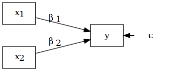
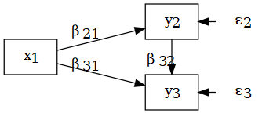
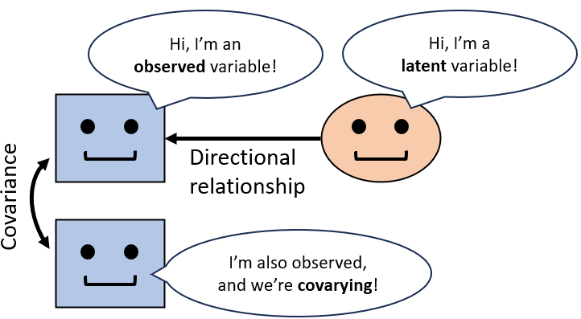
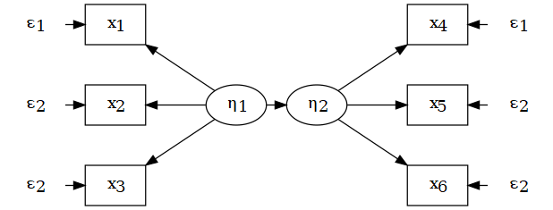

## Outline of Part 2

\fontsize{8pt}{12}\selectfont
- **`sem()` intro**: Gentle introduction to the world of structural equation modeling (SEM)

- **Path analysis**: Introduction to path analysis (aka SEM with observed variables) and focus on *mediation models*

- **Data structure**: How to approach a multivariate data structure, how to manipulate and pre-process multivariate data `r fontawesome::fa(name = "r-project", height = "1em")`

- **Model fit & evaluation**: How to fit a path analysis in R, to evaluate model fit, compare multiple models, and interpret model results `r fontawesome::fa(name = "r-project", height = "1em")`

- **`cfa()`**: How to conduct a confirmatory factor analysis (CFA) and to interpret its results `r fontawesome::fa(name = "r-project", height = "1em")`

- \color{blue} **Related topics**: In-depth topics related to multivariate modeling (e.g., cross-lagged panel models, multilevel and Bayesian SEM) `r fontawesome::fa(name = "microscope", fill = "blue", height = "1em")`

___ \newline \fontsize{5pt}{12}\selectfont \color{blue}
`r fontawesome::fa(name = "microscope", fill = "blue", height = "1em")` = not for the exam \color{black} \newline `r fontawesome::fa(name = "r-project", height = "1em")` = exercises with R (bring your laptop!)

# sem() intro

## Structural equation models: systems of equations

\fontsize{8pt}{12}\selectfont
Structural equation modeling (SEM) is widely used to analyze data by accounting for the multivariate reality of psychosocial phenomena: multiple variables interacting at the same time (e.g., multiple outcomes, mediations).

\fontsize{7pt}{12}\selectfont
_Why "structural equations"?_ \newline Because they involve ...

## The SEM family

\fontsize{7pt}{12}\selectfont
SEM is a broad family of statistical models ...

```{r , echo = FALSE, out.width = "250px",fig.align='center'}
knitr::include_graphics("img/SEMfamily.PNG")
```

## From linear models to SEM

\begincols
  \begincol{.5\textwidth}

\fontsize{7pt}{12}\selectfont
**Linear regression**: determining the link between a dependent and an independent variables through linear functions like: $y = \beta_1x_{1} + \beta_2X_{2} + \epsilon$ \newline
```{r echo=FALSE,warning=FALSE,message=FALSE}
library(DiagrammeR); library(DiagrammeRsvg); library(rsvg)

tmp <- grViz(
'digraph boxes_and_circles {
  graph [layout = neato]
  node [shape = box]
  x1 [label = <x<SUB>1</SUB>> pos="-2,0.5!"]
  x2 [label = <x<SUB>2</SUB>> pos="-2,-0.5!"]
  y [pos="0,0!"]
  node [shape = plaintext]
  e [label = <&epsilon;> pos="1,0!"]
  # edges
  x1->y [label = <&beta;<SUB>1</SUB>>]
  x2->y [label = <&beta;<SUB>2</SUB>>]
  e->y}')

# Convert to SVG, then save as png
tmp = export_svg(tmp)
tmp = charToRaw(tmp) # flatten
rsvg_png(tmp, "img/lm.png") # saved graph as png in current working directory
```
```{r , echo = FALSE, out.width = "130px",fig.align="center"}

```

As a limitation, linear models can only predict **one dependent variable at time** with a single equation. They can be *univariate* (without predictors) or *bivariate* (with predictors).

  \endcol
\begincol{.5\textwidth}

\fontsize{7pt}{12}\selectfont
**Structural equation models** (SEM) \newline are *multivariate* models that allow simultaneously modeling multiple ~~dependent~~ *endogenous* variables \newline with a **system of equations**:

$$ \begin{cases} y_2 = \beta_{21}x_{1} + \epsilon_2 \\\\ y_3 = \beta_{31}x_{1} + \beta_{32}Y_2 + \epsilon_3 \end{cases} $$ \newline

```{r echo=FALSE}
tmp <- grViz(
'digraph boxes_and_circles {
  graph [layout = neato]
  node [shape = box]
  x1 [label = <x<SUB>1</SUB>> pos="-2,0!"]
  y2 [label = <y<SUB>2</SUB>> pos="0,0.5!"]
  y3 [label = <y<SUB>3</SUB>> pos="0,-0.5!"]
  node [shape = plaintext]
  e2 [label = <&epsilon;<SUB>2</SUB>> pos="1,0.5!"]
  e3 [label = <&epsilon;<SUB>3</SUB>>pos="1,-0.5!"]
  # edges
  x1->y2 [label = <&beta;<SUB>21</SUB>>]
  x1->y3 [label = <&beta;<SUB>31</SUB>>]
  y2->y3 [label = <&beta;<SUB>32</SUB>>]
  e2->y2
  e3->y3}')

# Convert to SVG, then save as png
tmp = export_svg(tmp)
tmp = charToRaw(tmp) # flatten
rsvg_png(tmp, "img/sem.png") # saved graph as png in current working directory
```
```{r , echo = FALSE, out.width = "130px",fig.align="center"}

```

  \endcol
\endcols

## Observed vs. latent variables

\fontsize{7pt}{12}\selectfont
A further advantage of SEM is to distinguish between observed vs. latent variables

\begincols
  \begincol{.5\textwidth}

```{r , echo = FALSE, out.width = "130px"}

```

\fontsize{6.5pt}{12}\selectfont
**Observed variables**: directly observable and measurable (e.g., heart rate), represented by *squares* and the *lowercase letters* \color{red}$x$ \color{black}(exogenous) and \color{red}$y$ \color{black}(endogenous) \newline

**Latent variables**: hypothetical and not directly measurable but **indexed** by one or multiple observed variables (e.g., happiness), represented by *circles* and the *greek letters* \color{red}$\xi$ \color{black}(exogenous) and \color{red}$\eta$ \color{black}(endogenous)

  \endcol
\begincol{.5\textwidth}

\fontsize{6.5pt}{12}\selectfont
When including **observed variables only**, SEM are called \color{red}**path analysis**\color{black}, which is widely used to model complex multivariate relationships (e.g., *mediation models*):
```{r , echo = FALSE, out.width = "130px",fig.align="center"}

```

When **both observed and latent** variables are included, we can talk of 'full SEM':
```{r echo=FALSE}
tmp <- grViz(
'digraph boxes_and_circles {
  graph [layout = neato]
  node [shape = oval]
  E1 [label = <&xi;> pos="-0.5,0!"]
  E2 [label = <&eta;> pos="0.5,0!"]
  node [shape = box]
  x1 [label = <x<SUB>1</SUB>> pos="-2,1!"]
  x2 [label = <x<SUB>2</SUB>> pos="-2,0!"]
  x3 [label = <x<SUB>3</SUB>> pos="-2,-1!"]
  x4 [label = <x<SUB>4</SUB>> pos="2,1!"]
  x5 [label = <x<SUB>5</SUB>> pos="2,0!"]
  x6 [label = <x<SUB>6</SUB>> pos="2,-1!"]
  node [shape = plaintext]
  e1 [label = <&epsilon;<SUB>1</SUB>> pos="-3,1!"]
  e2 [label = <&epsilon;<SUB>2</SUB>>pos="-3,0!"]
  e3 [label = <&epsilon;<SUB>2</SUB>>pos="-3,-1!"]
  e4 [label = <&epsilon;<SUB>1</SUB>> pos="3,1!"]
  e5 [label = <&epsilon;<SUB>2</SUB>>pos="3,0!"]
  e6 [label = <&epsilon;<SUB>2</SUB>>pos="3,-1!"]
  # edges
  E1->x1 
  E1->x2 
  E1->x3 
  E2->x4 
  E2->x5 
  E2->x6 
  E1->E2 
  e1->x1
  e2->x2
  e3->x3
  e4->x4
  e5->x5
  e6->x6}')
# Convert to SVG, then save as png
tmp = export_svg(tmp)
tmp = charToRaw(tmp) # flatten
rsvg_png(tmp, "img/seml.png") # saved graph as png in current working directory
```
```{r , echo = FALSE, out.width = "150px",fig.align="center"}

```

  \endcol
\endcols

## Two subtypes of SEM: Path analysis & CFA

## From (in)dependent to exo/endogenous variables

## From dataset columns to covariance matrices

\fontsize{7pt}{12}\selectfont
Whereas the starting point of LM(ER) is a vector of variable values (usually, one or more columns from a dataset), SEM starts from the **covariance matrix** of the observed variables.

# Path analysis

## Path models: SEM with observed variables

\fontsize{8pt}{12}\selectfont
A path model is a pictorial representation (i.e., diagram) of a theory of variable relationships.

## SEM graphical notation

## Exogenous vs. Endogenous variables

## Unstandardized vs. Standardized models

## From covariance to numerical values (forse la tolgo)

## Partial regression & path coefficients

# Model fit

## Recap: SEM and path analysis

## Case study:

## Hands on `r fontawesome::fa(name = "r-project", fill="#3333B2",height = "1em")`

## Data structure in multivariate analyses

## Fitting a path model with R

## Interpreting model outputs

## Mediation analysis

## Hands on `r fontawesome::fa(name = "r-project", fill="#3333B2",height = "1em")`

# cfa()

## Factor analysis: rationale

Reflective vs. formative indicators

## Exploratory vs. Confirmatory factor analysis

## Exploratory factor analysis `r fontawesome::fa(name = "microscope", fill = "blue", height = "1em")`

Principal component analysis vs. Common factor analysis(?)

## Confirmatory factor analysis

## Case study: Validation of AMMSA Scale in Mexican University Students

https://osf.io/pkm4f/

## Model identification

## The scale of the latent variable

## Fitting a CFA in R

## Hands on `r fontawesome::fa(name = "r-project", fill="#3333B2",height = "1em")`

# Model evaluation

## Recap: SEM, path analysis, and CFA

## Model evaluation (diagnostics?)

## Fit indices and model comparison

## Case study:

## Hands on `r fontawesome::fa(name = "r-project", fill="#3333B2",height = "1em")`

# Related topics

## Some in-depth topics related to multivariate modeling

\fontsize{8pt}{12}\selectfont
- Multiple groups and *psychometric isomorphism*

- *Power analysis* of SEM

- SEM with *dichotomous indicator variables*

- *Bayesian* SEM (BSEM)

# Resources

## Credits

\fontsize{8pt}{12}\selectfont
The present slides are partially based on: \fontsize{6pt}{12}\selectfont

- Altoè, G. (2023) Corso Modelli lineari generalizzati ad effetti misti - 2023. \color{blue} https://osf.io/b7tkp/ \color{black}

- Beaujean, A. A. (2014) Latent Variable Modeling Using R. A Step-by-Step Guide. New York: Routledge

- Finch, W. H., Bolin, J. E., Kelley, K. (2014). Multilevel Modeling Using R (2nd edition). Boca Raton: CRC Press

- Pastore, M. (2015). Analisi dei dati in psicologie (e applicazioni in R). Il Mulino.

## Useful resources

\fontsize{6pt}{12}\selectfont
- Baayen, R. H., Davidson, D. J., & Bates, D. M. (2008). Mixed-effects modeling with crossed random effects for subjects and items. *Journal of memory and language, 59*(4), 390-412.

- Bliese, P. (2022). Multilevel modeling in R (2.7). \color{blue}https://cran.r-project.org/doc/contrib/Bliese_Multilevel.pdf \color{black}

- McElreath, R. (2020). Statistical rethinking: A Bayesian course with examples in R and Stan. Chapman and Hall/CRC.

- Pinheiro, J., & Bates, D. (2006). Mixed-effects models in S and S-PLUS. Springer science & business media. \newline see also Bates, D. (2022). lme4: Mixed-effects modeling with R. \color{blue} https://stat.ethz.ch/~maechler/MEMo-pages/lMMwR.pdf \color{black}