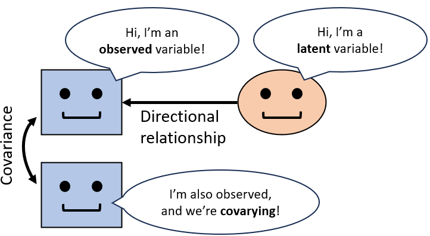

## Outline of Part 2

\fontsize{8pt}{12}\selectfont
- **`sem()` intro**: Gentle introduction to the world of structural equation modeling (SEM)

- **Path analysis**: Introduction to path analysis (aka SEM with observed variables) and focus on *mediation models*

- **Data structure**: How to approach a multivariate data structure, how to manipulate and pre-process multivariate data `r fontawesome::fa(name = "r-project", height = "1em")`

- **Model fit & evaluation**: How to fit a path analysis in R, to evaluate model fit, compare multiple models, and interpret model results `r fontawesome::fa(name = "r-project", height = "1em")`

- **`cfa()`**: How to conduct a confirmatory factor analysis (CFA) and to interpret its results `r fontawesome::fa(name = "r-project", height = "1em")`

- \color{blue} **Related topics**: In-depth topics related to multivariate modeling (e.g., cross-lagged panel models, multilevel and Bayesian SEM) `r fontawesome::fa(name = "microscope", fill = "blue", height = "1em")`

___ \newline \fontsize{5pt}{12}\selectfont \color{blue}
`r fontawesome::fa(name = "microscope", fill = "blue", height = "1em")` = not for the exam \color{black} \newline `r fontawesome::fa(name = "r-project", height = "1em")` = exercises with R (bring your laptop!)

# sem() intro

## Multivariate analyses for a multivariate reality

```{r , echo = FALSE, fig.width=12,fig.height=3, warning=FALSE,message=FALSE}
library(ggplot2);library(gridExtra); library(plotly) # loading packages
y <- rnorm(n=50) # y = 50 random values from standard normal distribution
df <- data.frame(y=y, # dataframe to be used in the plot
                 x=y + rnorm(n=50,sd=0.8),
                 z=y - rnorm(n=50,sd=1.2)) # x = y + some random value
grid.arrange(ggplot(df,aes(y)) + geom_histogram() + theme(axis.text=element_blank(),title=element_text(size=18)) +
               ggtitle("Univariate"),
             ggplot(df,aes(x,y)) + geom_point() + theme(axis.text=element_blank(),title=element_text(size=18)) +
               ggtitle("Bivariate"),
             ggplot(df,aes(z,y)) + geom_point() + theme(axis.text=element_blank(),title=element_text(size=18)) +
               ggtitle("Still bivariate"),
             ggplot(df,aes(x,y,color=z)) + geom_point() + 
               theme(axis.text=element_blank(),legend.text = element_blank(),title=element_text(size=18)) +
               scale_color_gradient2(low="white",high="purple") +
               ggtitle("Multivariate"),
             nrow=1)
```

\fontsize{7.5pt}{12}\selectfont

- In psychology, we mainly inspect empirical data focusing on **univariate** (*y*) \newline or **bivariate** relationships (either *y* by *x* or *y* by *z*)

- But reality (particularly psychosocial reality) is complex, it is **multivariate** \newline i.e., more than two variables covarying at the same time

- It is *reductionist* to separately analyze our variables without considering their overall interactions &rightarrow; **biased effect estimates**

- **Structural equation modeling (SEM)** allow to analyze the relationships of interest by accounting for the multivariate reality of psychosocial phenomena (e.g., *y* by *x* covarying with *z*; *x* affects *y* through *z*)

## Observed indicators & latent variables

```{r , echo = FALSE,fig.width=12,fig.height=3,out.width="280px",fig.align='center'}
knitr::include_graphics("img/latentvars.PNG")
```

\fontsize{7.5pt}{12}\selectfont

- In psychology, we are mainly interested in **latent variables** = phenomena that we cannot directly observe, but we can estimate from 1+ **observed indicators** (e.g., 10-item scale measuring anxiety)

- Are we allowed to do that? Yes (let's say yes), provided that we trust the indicator **construct validity** = their relationship with the latent variable they claim to measure

- **SEM** allow to evaluate that by ***quantifying*** **the latent variables** and their relationships with observed indicators

## Structural what!?

\fontsize{8.5pt}{12}\selectfont \color{violet}
Structural equation modeling (SEM) \newline = multivariate *linear* models formalized by **systems of equations** \newline \color{black}

\begincols
  \begincol{.5\textwidth}

\fontsize{7pt}{12}\selectfont
**Linear models** (LM): determining the link between a dependent and 1+ independent variables through a **single equation** like: \color{violet} $PERF = \beta_1IQ + \beta_2ANX + \epsilon$ \color{black}
```{r echo=FALSE,warning=FALSE,message=FALSE}
library(DiagrammeR); library(DiagrammeRsvg); library(rsvg)

tmp <- grViz(
'digraph boxes_and_circles {
  graph [layout = neato]
  node [shape = box]
  x1 [label = <IQ> pos="-2,0.5!"]
  x2 [label = <ANX> pos="-2,-0.5!"]
  y [label = <PERF> pos="0,0!"]
  node [shape = plaintext]
  e [label = <&epsilon;> pos="1,0!"]
  # edges
  x1->y [label = <&beta;<SUB>1</SUB>>]
  x2->y [label = <&beta;<SUB>2</SUB>>]
  e->y}')

# Convert to SVG, then save as png
tmp = export_svg(tmp)
tmp = charToRaw(tmp) # flatten
rsvg_png(tmp, "img/lm.png") # saved graph as png in current working directory
```
```{r , echo = FALSE, out.width = "130px",fig.align="center"}
knitr::include_graphics("img/lm.png")
```

LM can only predict **one dependent variable at a time**, being either *univariate* (without predictors, i.e., intercept-only) or *bivariate* (with predictors).

  \endcol
\begincol{.5\textwidth}

\fontsize{7pt}{12}\selectfont
**SEM** allow to simultaneously model multiple ~~dependent~~ *endogenous* variables \newline with a **system of equations** like: \color{violet}

$$ \begin{cases} ANX = \beta_{1}SEFF + \epsilon_2 \\\\ PERF = \beta_{2}SEFF + \beta_{3}ANX + \epsilon_3 \end{cases} $$

```{r echo=FALSE}
library(DiagrammeR); library(DiagrammeRsvg); library(rsvg)

tmp <- grViz(
'digraph boxes_and_circles {
  graph [layout = neato]
  node [shape = box]
  x1 [label = <SEFF> pos="-2,0!"]
  y2 [label = <ANX> pos="0,0.5!"]
  y3 [label = <PERF> pos="0,-0.5!"]
  node [shape = plaintext]
  e2 [label = <&epsilon;<SUB>2</SUB>> pos="1,0.5!"]
  e3 [label = <&epsilon;<SUB>3</SUB>>pos="1,-0.5!"]
  # edges
  x1->y2 [label = <&beta;<SUB>1</SUB>>]
  x1->y3 [label = <&beta;<SUB>2</SUB>>]
  y2->y3 [label = <&beta;<SUB>3</SUB>>]
  e2->y2
  e3->y3}')

# Convert to SVG, then save as png
tmp = export_svg(tmp)
tmp = charToRaw(tmp) # flatten
rsvg_png(tmp, "img/sem1.png") # saved graph as png in current working directory
```
```{r , echo = FALSE, out.width = "130px",fig.align="center"}
knitr::include_graphics("img/sem1.png")
```

  \endcol
\endcols

## The SEM family

\fontsize{8pt}{12}\selectfont
SEM = broad family of statistical models within which LM, ANOVA, and even correlation can be included.

Particularly, 2 main sub-families can be distinguished based on whether \newline __latent variables__ are included in the model or not: \fontsize{7pt}{12}\selectfont

- __Path analysis__: multivariate linear models with observed variables only

- __Confirmatory factor analysis (CFA)__: multivariate linear models with both observed and latent variables

```{r , echo = FALSE, out.width = "270px",fig.align='center'}
knitr::include_graphics("img/SEMfamily.PNG")
```

\fontsize{5pt}{12}\selectfont Source: Beaujean (2014)

## Path models & path analysis

\fontsize{8pt}{12}\selectfont
**Path models/diagrams** = multivariate models with observed variables only \newline = pictorial representations (*diagrams*) of a theory of variable relationships

```{r , echo = FALSE, out.width = "160px",fig.align="center"}
knitr::include_graphics("img/sem1.png")
```

**Paths** = arrows (*edges*) linking the variables (*nodes*) in a model

**Path analysis** = analysis of multivariate relationships between observed variables ('*quantification of the paths accounting for all other paths and errors*')

## Latent factors & CFA

\begincols
  \begincol{.67\textwidth}
  
\fontsize{7pt}{12}\selectfont

- \color{blue} __Observed/Manifest variable (OV)__ \color{black} \newline variable that is directly observable (e.g., height, heart rate, item responses)

- \color{magenta} __Latent variable/factor (LV)__ \color{black} \newline variable that is *not* directly observable (e.g., anxiety, intelligence), but can be indexed by \newline one or more observed variables

- In SEM, \color{blue}**OV**s \color{black} are represented by \color{blue}squares/rectangles \color{black} and indexed with \color{blue}lower case letters (e.g., *x*)\color{black}, whereas \color{magenta}**LV**s \color{black} are represented by \color{magenta}circles/ellipses \color{black} \newline and indexed by the \color{magenta}Greek letter $\eta$ \color{black}

```{r , echo = FALSE, out.width = "130px"}

```
  
  \endcol
\begincol{.4\textwidth}

Confirmatory factor analysis (CFA)

\fontsize{7pt}{12}\selectfont
= analysis of the relationships (*factor loadings*) between a set of OVs and one or more LVs \newline

CFA uses **latent variable models** to *form* or *quantify* LVs \newline and their relationships with OVs \newline (evaluation of **construct validity**) \newline

```{r echo=FALSE,message=FALSE,warning=FALSE, out.width = "100px"}
library(DiagrammeR); library(DiagrammeRsvg); library(rsvg)
tmp <- grViz(
'digraph boxes_and_circles {
  graph [layout = neato]
  node [shape = oval]
  E1 [label = <&eta;<SUB>1</SUB>> pos="0.5,0!", style=filled, fillcolor="#ED028C"]
  node [shape = box]
  x1 [label = <x<SUB>1</SUB>> pos="2,1!", style=filled, fillcolor="#00AEEF"]
  x2 [label = <x<SUB>2</SUB>> pos="2,0!", style=filled, fillcolor="#00AEEF"]
  x3 [label = <x<SUB>3</SUB>> pos="2,-1!", style=filled, fillcolor="#00AEEF"]
  node [shape = plaintext]
  e1 [label = <&epsilon;<SUB>1</SUB>> pos="3,1!"]
  e2 [label = <&epsilon;<SUB>2</SUB>>pos="3,0!"]
  e3 [label = <&epsilon;<SUB>3</SUB>>pos="3,-1!"]
  # edges
  E1->x1 
  E1->x2 
  E1->x3 
  e1->x1
  e2->x2
  e3->x3}')
# Convert to SVG, then save as png
tmp = export_svg(tmp)
tmp = charToRaw(tmp) # flatten
rsvg_png(tmp, "img/sem2.png") # saved graph as png in current working directory
knitr::include_graphics("img/sem2.png")
```

  \endcol
\endcols

## SEM: Measurement & Structural model

\fontsize{7pt}{12}\selectfont
To properly talk about 'full SEM' (or just SEM), we need both OVs and LVs

```{r echo=FALSE,message=FALSE,warning=FALSE}
library(DiagrammeR); library(DiagrammeRsvg); library(rsvg)
tmp <- grViz(
'digraph boxes_and_circles {
  graph [layout = neato]
  node [shape = oval]
  E1 [label = <&eta;<SUB>1</SUB>> pos="-0.5,0!"]
  E2 [label = <&eta;<SUB>2</SUB>> pos="0.5,0!"]
  node [shape = box]
  x1 [label = <x<SUB>1</SUB>> pos="-2,1!"]
  x2 [label = <x<SUB>2</SUB>> pos="-2,0!"]
  x3 [label = <x<SUB>3</SUB>> pos="-2,-1!"]
  x4 [label = <x<SUB>4</SUB>> pos="2,1!"]
  x5 [label = <x<SUB>5</SUB>> pos="2,0!"]
  x6 [label = <x<SUB>6</SUB>> pos="2,-1!"]
  node [shape = plaintext]
  e1 [label = <&epsilon;<SUB>1</SUB>> pos="-3,1!"]
  e2 [label = <&epsilon;<SUB>2</SUB>>pos="-3,0!"]
  e3 [label = <&epsilon;<SUB>2</SUB>>pos="-3,-1!"]
  e4 [label = <&epsilon;<SUB>1</SUB>> pos="3,1!"]
  e5 [label = <&epsilon;<SUB>2</SUB>>pos="3,0!"]
  e6 [label = <&epsilon;<SUB>2</SUB>>pos="3,-1!"]
  z2 [label = <&zeta;<SUB>2</SUB>>pos="0.5,0.8!"]
  # edges
  E1->x1 [color="#ED028C"]
  E1->x2 [color="#ED028C"] 
  E1->x3 [color="#ED028C"]
  E2->x4 [color="#ED028C"]
  E2->x5 [color="#ED028C"] 
  E2->x6 [color="#ED028C"] 
  E1->E2 [color="blue"] 
  
  e1->x1
  e2->x2
  e3->x3
  e4->x4
  e5->x5
  e6->x6
  z2->E2}')
# Convert to SVG, then save as png
tmp = export_svg(tmp)
tmp = charToRaw(tmp) # flatten
rsvg_png(tmp, "img/sem3.png") # saved graph as png in current working directory
```
```{r , echo = FALSE, out.width = "180px",fig.align="center"}
knitr::include_graphics("img/sem3.png")
```

A SEM consists of two parts:

1. \color{blue}**Structural model**\color{black}: Regression-like relationships among the variables, working similar to *path analysis*

2. \color{magenta}**Measurement model** (or latent variable model)\color{black}: Relationships between OVs and LVs, working a little differently

\fontsize{5pt}{12}\selectfont
Notes: \newline
In this sense, we may say that a CFA model is a 'full SEM' whereas a path model is not \newline
A CFA is a SEM with just the measurement part (without the structural model)

## A new classification: From in/dependent to exo/endogenous variables

\fontsize{7pt}{12}\selectfont
In both SEM (e.g., CFA) and path models, the classic independent vs. dependent classification is replaced with a more meaningful one:

```{r echo=FALSE,message=FALSE,warning=FALSE}
library(DiagrammeR); library(DiagrammeRsvg); library(rsvg)
tmp <- grViz(
'digraph boxes_and_circles {
  graph [layout = neato]
  node [shape = oval]
  E1 [label = <&eta;<SUB>1</SUB>> pos="-0.5,0!" color="blue"]
  E2 [label = <&eta;<SUB>2</SUB>> pos="0.5,0!" color="#ED028C"]
  node [shape = box]
  x1 [label = <x<SUB>1</SUB>> pos="-2,1!" color="#ED028C"]
  x2 [label = <x<SUB>2</SUB>> pos="-2,0!" color="#ED028C"]
  x3 [label = <x<SUB>3</SUB>> pos="-2,-1!" color="#ED028C"]
  x4 [label = <x<SUB>4</SUB>> pos="2,1!" color="#ED028C"]
  x5 [label = <x<SUB>5</SUB>> pos="2,0!" color="#ED028C"]
  x6 [label = <x<SUB>6</SUB>> pos="2,-1!" color="#ED028C"]
  node [shape = plaintext]
  e1 [label = <&epsilon;<SUB>1</SUB>> pos="-3,1!"]
  e2 [label = <&epsilon;<SUB>2</SUB>>pos="-3,0!"]
  e3 [label = <&epsilon;<SUB>2</SUB>>pos="-3,-1!"]
  e4 [label = <&epsilon;<SUB>1</SUB>> pos="3,1!"]
  e5 [label = <&epsilon;<SUB>2</SUB>>pos="3,0!"]
  e6 [label = <&epsilon;<SUB>2</SUB>>pos="3,-1!"]
  z2 [label = <&zeta;<SUB>2</SUB>>pos="0.5,0.8!"]
  # edges
  E1->x1 
  E1->x2 
  E1->x3
  E2->x4
  E2->x5
  E2->x6
  E1->E2
  e1->x1
  e2->x2
  e3->x3
  e4->x4
  e5->x5
  e6->x6
  z2->E2}')
# Convert to SVG, then save as png
tmp = export_svg(tmp)
tmp = charToRaw(tmp) # flatten
rsvg_png(tmp, "img/sem4.png") # saved graph as png in current working directory
```
```{r , echo = FALSE, out.width = "180px",fig.align="center"}
knitr::include_graphics("img/sem4.png")
```

\fontsize{7.5pt}{12}\selectfont

- \color{blue}**Exogenous variables**\color{black}: variables (both OVs and LVs) without a direct 'cause' from inside the model (predictors), without error estimate \newline

- \color{magenta}**Endogenous variables**\color{black}: variables (both OVs and LVs) directly 'caused' from inside the model (predictors & outcomes), with error estimate $\epsilon$ (OV) or $\zeta$ (LV)

## A new starting point: From dataset columns to covariance matrices

\begincols
  \begincol{.5\textwidth}

\fontsize{7pt}{12}\selectfont
The starting point of LM(ER) is a vector (or a set of vectors) of variable values, usually corresponding to one or more columns from a dataset.
```{r , echo = FALSE}
data( earlymath, package = "ADati" )
rownames(earlymath) <- 1:nrow(earlymath)
df <- earlymath[,2:5]
```
```{r comment=NA}
head(df,4)
```

  \endcol
\begincol{.5\textwidth}

\fontsize{7pt}{12}\selectfont
The starting point of SEM and path models is the **covariance matrix of the observed variables**. \newline \color{blue} `r fontawesome::fa(name = "microscope", fill = "blue", height = "1em")` $cov(x,y) =\sum(x_i - \overline{x})(y_i-\overline{y})/N$ \color{black}
```{r eval=FALSE}
cov(df[,c("MAT","QI","WM","STM")])
```
```{r echo=FALSE,comment=NA}
round(cov(df[,c("MAT","QI","WM","STM")]),2)
```

  \endcol
\endcols

\color{white}_ \newline \color{black}

\fontsize{7.5pt}{12}\selectfont
SEM estimate a number of parameters $\theta$ so that the **implied covariance matrix** $\hat\sum(\theta)$ (i.e., the covariance matrix predicted by the model based on the parameter estimates) is as close as possible to the **sample covariance matrix** $S$ \newline

\fontsize{6pt}{12}\selectfont \color{blue}

`r fontawesome::fa(name = "microscope", fill = "blue", height = "1em")` Note: even the model parameters are estimated within **matrices of parameters** `r fontawesome::fa(name = "face-flushed", height = "1em")`

## Covariance & correlation

\fontsize{7.5pt}{12}\selectfont

- __Variance__ = Expected value of the **squared deviation from the mean** of a random variable, or degree to which it deviates from its expected value \newline \color{blue}
`r fontawesome::fa(name = "microscope", fill = "blue", height = "1em")` $var(x) = \sigma^2_x =\frac{\sum(x_i -\overline{x})^2}{N}$ \color{black}

- __Covariance__ = Measure of the **joint variability** of two random variables, or Degree to which they tend to deviate from their expected values in similar ways, either directly (positive cov) or inversely (negative cov), whose value depends on the variable scales of measurement (from $-\infty$ to $+\infty$) \newline \color{blue}
`r fontawesome::fa(name = "microscope", fill = "blue", height = "1em")` $cov(x_1,x_2) =\frac{\sum(x_{1i} - \overline{x_1})(x_{2i}-\overline{x_2})}{N}$ \color{black}

- __Correlation__ = standardized covariance of two random variables \newline Correlation ranges from -1 (perfectly negative) to +1 (perfectly positive) \newline \color{blue} `r fontawesome::fa(name = "microscope", fill = "blue", height = "1em")` $cor(x_1,x_2) = \frac{cov(x_1,x_2)}{\sigma^2_{x_1}\sigma^2_{x_2}}$

```{r echo=FALSE,fig.width=9,fig.height=2,out.width="300px"}
par(mfrow=c(1,5))
x <- rnorm(mean=100,n=50,sd=1)
hist(x,main=paste("var =",round(var(x))),breaks=30,xlim=c(80,120))
x <- rnorm(mean=100,n=50,sd=10)
hist(x,main=paste("var =",round(var(x))),breaks=30,xlim=c(80,120))
x1 <- x
x2 <- x + rnorm(n=50,sd=10)
plot(x1~x2,
     main=paste("cov =",round(cov(x1,x2),2),"\ncor =",
                           round(cor(x1,x2),2)))
abline(lm(x1~x2),col="red")
x2 <- -x + rnorm(n=50,sd=10)
plot(x1~x2,
     main=paste("cov =",round(cov(x1,x2),2),"\ncor =",
                           round(cor(x1,x2),2)))
abline(lm(x1~x2),col="red")
x2 <- x + rnorm(n=50,sd=1000)
plot(x1~x2,
     main=paste("cov =",round(cov(x1,x2),2),"\ncor =",
                           round(cor(x1,x2),2)))
abline(lm(x1~x2),col="red")
```

\fontsize{5pt}{12}\selectfont
Important notes: \color{blue} $cov(x_1,x_1) = var(x_1)$ ; $cor(x_1,x_1)=1$

## Covariance matrix (*S*)

\begincols
  \begincol{.45\textwidth}

\fontsize{7.5pt}{12}\selectfont
Given a set of *p* variables, we can define the covariance matrix:

$$S = \begin{bmatrix} s_{11}~~...,~~s_{1j}~~...~~s_{1p} \\ ...~~...~~...~~...~~... \\ s_{i1}~~...~~s_{ij}~~...~~s_{ip} \\ ...~~...~~...~~...~~... \\ s_{p1}~~...~~s_{pj}~~...~~s_{pp}\end{bmatrix}$$

```{r eval=FALSE}
cov(df[,c("MAT","QI","WM","STM")])
```

\fontsize{10.5pt}{12}\selectfont

```{r echo=FALSE,comment=NA}
round(cov(df[,c("MAT","QI","WM","STM")]),2)
```

  \endcol
\begincol{.6\textwidth}

\fontsize{10.5pt}{12}\selectfont

Properties of the covariance matrix:

1. __Symmetrical__: $s_{ij} = s_{ji}$

2. The **main diagonal** shows the **variances** (= covariance between each variable and itself)

  \endcol
\endcols

\color{white}_\color{black} \newline

\fontsize{7.5pt}{12}\selectfont
SEM estimate a number of parameters $\theta$ so that the **implied covariance matrix** $\hat\sum(\theta)$ (i.e., the covariance matrix predicted by the model based on the parameter estimates) is as close as possible to the **sample covariance matrix** $S$ 

## That's all for now!

\fontsize{8pt}{12}\selectfont 
__Questions?__ \newline

__Homework__ (optional):

- read the slides presented today \newline and write in the Moodle forum if you have any doubts

- **exe`r fontawesome::fa(name = "r-project", fill="#3333B2",height = "1em")`cises 12-13** from `exeRcises.pdf` \newline \newline

\fontsize{6pt}{12}\selectfont ____ \newline 
For each exercise, the solution (or one of the possible solutions) can be found in dedicated chunk of commented code within the `exeRcises.Rmd` file

# Path analysis

## In the last episode...

\begincols
  \begincol{.4\textwidth}
  
\fontsize{8.5pt}{12}\selectfont 
__The problem__ \fontsize{7pt}{12}\selectfont  \newline
Psychosocial reality is complex: it's **multivariate** (3+ variables interacting at the same time) and involves **latent variables** (not directly measurable) \newline

\fontsize{8.5pt}{12}\selectfont 
__The solution__ \fontsize{7pt}{12}\selectfont  \newline
SEM allows to analyze the multivariate relationships among observed and latent variables through **systems of equations**:

$$ \begin{cases} ANX = \beta_{21}SEFF + \epsilon_2 \\\\ PERF = \beta_{31}SEFF + \beta_{32}ANX + \epsilon_3 \end{cases} $$

  \endcol
\begincol{.6\textwidth}

\fontsize{8.5pt}{12}\selectfont 
__SEM basics__ \fontsize{7pt}{12}\selectfont \newline
__- Observed__ ($x$) __vs latent variables__ ($\eta$) depending on whether can be directly measured or not \newline
__- Exogenous vs endogenous variables__ depending on whether directly caused inside the model or not \newline
__- Structural vs measurement model__ depending on whether focusing on structural relationships or construct validity of the observed indicators \newline \color{violet}
__- Path model__: SEM with observed variables only \color{black} \newline
__- CFA__ = SEM with measurement model only \newline
- Starting point of any SEM = **covariance matrix**

```{r echo=FALSE,message=FALSE,warning=FALSE}
library(DiagrammeR); library(DiagrammeRsvg); library(rsvg)
tmp <- grViz(
'digraph boxes_and_circles {
  graph [layout = neato]
  node [shape = oval]
  E1 [label = <&eta;<SUB>1</SUB>> pos="-0.5,0!"]
  E2 [label = <&eta;<SUB>2</SUB>> pos="0.5,0!"]
  node [shape = box]
  x1 [label = <x<SUB>1</SUB>> pos="-2,1!"]
  x2 [label = <x<SUB>2</SUB>> pos="-2,0!"]
  x3 [label = <x<SUB>3</SUB>> pos="-2,-1!"]
  x4 [label = <x<SUB>4</SUB>> pos="2,1!"]
  x5 [label = <x<SUB>5</SUB>> pos="2,0!"]
  x6 [label = <x<SUB>6</SUB>> pos="2,-1!"]
  node [shape = plaintext]
  e1 [label = <&epsilon;<SUB>1</SUB>> pos="-3,1!"]
  e2 [label = <&epsilon;<SUB>2</SUB>>pos="-3,0!"]
  e3 [label = <&epsilon;<SUB>2</SUB>>pos="-3,-1!"]
  e4 [label = <&epsilon;<SUB>1</SUB>> pos="3,1!"]
  e5 [label = <&epsilon;<SUB>2</SUB>>pos="3,0!"]
  e6 [label = <&epsilon;<SUB>2</SUB>>pos="3,-1!"]
  z2 [label = <&zeta;<SUB>2</SUB>>pos="0.5,0.8!"]
  # edges
  E1->x1 
  E1->x2 
  E1->x3
  E2->x4
  E2->x5
  E2->x6
  E1->E2
  e1->x1
  e2->x2
  e3->x3
  e4->x4
  e5->x5
  e6->x6
  z2->E2}')
# Convert to SVG, then save as png
tmp = export_svg(tmp)
tmp = charToRaw(tmp) # flatten
rsvg_png(tmp, "img/sem5.png") # saved graph as png in current working directory
```
```{r , echo = FALSE, out.width = "170px",fig.align="center"}
knitr::include_graphics("img/sem5.png")
```

  \endcol
\endcols

## Path models: SEM with observed variables

\fontsize{8pt}{12}\selectfont
A path model is a pictorial representation (*diagram*) of a theory of variable relationships. Path analysis is widely used to model complex multivariate relationships (e.g., *mediation models*).

- Path analysis tests models of ***causal*** **relationships** among observed variables

- All variables in path analysis are **observed**

- Path analysis uses **systems of regression equations**

## Case study: Early mathematical abilities `r fontawesome::fa(name = "calculator",fill="#3333B2", height = "0.8em")`

\begincols
  \begincol{.45\textwidth}

\fontsize{6.5pt}{12}\selectfont \color{white} _ \newline \newline \color{blue}

A sample of 120 first-grade children (58 females; mean age: 6 years, 3 months) was assessed over the following variables: \newline

  \endcol
\begincol{.6\textwidth}

```{r , echo = FALSE, out.width = "150px"}
knitr::include_graphics("img/earlyMath.png")
```

  \endcol
\endcols

\fontsize{6.5pt}{12}\selectfont  \color{blue}

- \color{blue}`MAT`: early mathematical abilities (e.g., comparison, classification) measured with the Early Numeracy Test

- \color{blue}`QI`: intelligence level measured with the Wechsler Intelligence Scale for Children (WISC-III)

- \color{blue}`WM`: working memory capacity measured with the Backward word recall task

- \color{blue}`STM`: short-term memory capacity measured with the Forward word recall task

- \color{blue}`ANS`: approximate number system = innate system for approximate quantity manipulation (e.g., approximate computations, comparing 2+ sets of elements \newline without counting), measured with several tasks

\fontsize{7pt}{12}\selectfont
RQ: **How much can MAT abilities be attributed to memory & ANS?** \newline

\fontsize{5pt}{12}\selectfont \color{black} Source: Pastore (2021). Analisi dei dati in ambito di comunità  

## Data exploration

\fontsize{7pt}{12}\selectfont
First, let's explore the data: \fontsize{5.5pt}{12}\selectfont
```{r , echo = FALSE}
rm(list=ls())
```
```{r , eval = FALSE}
library(devtools); install_github("https://github.com/masspastore/ADati") # install ADati pkg
```
```{r ,comment=NA}
data( earlymath, package = "ADati" ) # loading earlymath dataset from ADati pkg
head(earlymath,3) # showing first 3 rows

summary(earlymath) # summarizing variables

round( cor(earlymath[,2:ncol(earlymath)]), 2) # correlations
```

## Linear model as a path diagram

\fontsize{7pt}{12}\selectfont
Let's fit a multiple linear model: \color{blue} $MAT = \beta_0 + \beta_1WM + \beta_2STM + \beta_3ASN + \epsilon$ \color{black}
```{r }
lm.fit <- lm(MAT ~ WM + STM + ANS, data = earlymath) # fitting LM
```

\begincols
  \begincol{.7\textwidth}

\fontsize{6.5pt}{12}\selectfont
```{r eval=FALSE}
summary(lm.fit)$coefficients # LM regression table
```
```{r echo=FALSE,comment=NA}
round(summary(lm.fit)$coefficients,2) # LM regression table
```

  \endcol
\begincol{.3\textwidth}

Residual variance $\sigma^2$:
```{r comment=NA}
summary(lm.fit)$sigma^2
```

\color{white}_ \newline

  \endcol
\endcols

This model can be graphically represented as a path diagram and further simplified by removing the \color{red} intercept $\beta_0$ \color{black} (note: **triangles represent constants**)
```{r , echo = FALSE, out.width = "250px"}
knitr::include_graphics("img/lm2path.png")
```

\color{blue} How many parameters?

## Linear model as a path diagram

\fontsize{7pt}{12}\selectfont
Let's fit a multiple linear model: \color{blue} $MAT = \beta_0 + \beta_1WM + \beta_2STM + \beta_3ASN + \epsilon$ \color{black}
```{r }
lm.fit <- lm(MAT ~ WM + STM + ANS, data = earlymath) # fitting LM
```

\begincols
  \begincol{.7\textwidth}

\fontsize{6.5pt}{12}\selectfont
```{r eval=FALSE}
summary(lm.fit)$coefficients # LM regression table
```
```{r echo=FALSE,comment=NA}
round(summary(lm.fit)$coefficients,2) # LM regression table
```

  \endcol
\begincol{.3\textwidth}

Residual variance $\sigma^2$:
```{r comment=NA}
summary(lm.fit)$sigma^2
```

\color{white}_ \newline

  \endcol
\endcols

This model can be graphically represented as a path diagram and further simplified by removing the \color{red} intercept $\beta_0$ \color{black} (note: **triangles represent constants**)
```{r , echo = FALSE, out.width = "250px"}
knitr::include_graphics("img/lm2path.png")
```

\color{blue} How many parameters? **Five**: Intercept, 3 slopes, residual variance

## Multivariate path models

\fontsize{7pt}{12}\selectfont
In the previous example, we only considered **bivariate relationships** (i.e., 2 variables at a time, controlling for other variables). But what if we include `IQ` as a common predictor of both `WM` and `MAT`? We would have 3 variables interacting at the same time.

\begincols
  \begincol{.5\textwidth}

```{r , echo = FALSE, out.width = "160px"}
knitr::include_graphics("img/sem6_colvar.png")
```

  \endcol
\begincol{.5\textwidth}

Both \color{magenta} `MAT` and `WM` are **endogenous variables** \color{black} because they receive 1+ arrow(s) and have error variance \color{red} $\sigma^2$\color{black}. 

In contrast, \color{cyan} `STM`, `ANS`, and `QI` are **exogenous variables** \color{black} because they do not receive any arrow and have no errors. \newline

A single LM equation is insufficient to describe this model. We need 2 separated equations: one for each variable that depends upon another variable \newline

  \endcol
\endcols

Path analysis (and SEM) uses **one equation per endogenous variable**: \color{blue}
$$ \begin{cases} MAT_1 = \beta_{12}WM_2 + \beta_{13}STM_3 + \beta_{14}ANS_4 + \beta_{15}QI_5 + \epsilon_1 \\ WM_2 = \beta_{25}QI_5 + \epsilon_2 \end{cases} $$

## Graphical notation (1/3): Error terms

\fontsize{7pt}{12}\selectfont \color{blue}
$$ \begin{cases} MAT_1 = \beta_{12}WM_2 + \beta_{13}STM_3 + \beta_{14}ANS_4 + \beta_{15}QI_5 + \color{red}{\epsilon_1} \\ WM_2 = \beta_{25}QI_5 + \color{red}{\epsilon_2} \end{cases} $$ \color{black}

__Errors__ = *residuals* or *disturbances* = discrepancy between observed and predicted values (as in LM!), they represent something *unexplained* = **exogenous** \newline and *not directly observable* = **latent**

\begincols
  \begincol{.5\textwidth}

```{r , echo = FALSE, out.width = "160px"}
knitr::include_graphics("img/sem6_colerror.png")
```

\fontsize{6.5pt}{12}\selectfont $\sigma^2$ = variance of a variable error (residual var.)

  \endcol
\begincol{.5\textwidth}

\fontsize{6.5pt}{12}\selectfont \color{blue}
`r fontawesome::fa(name = "microscope", fill = "blue", height = "1em")` Alternative ways to represent errors: some highlight their latent nature (#1 and #2), some highlight their variance (#1 and #4), and some highlight both (#1). 
```{r , echo = FALSE, out.width = "120px"}
knitr::include_graphics("img/sem_errors.png")
```

\color{blue} \fontsize{5pt}{12}\selectfont 
In this course, we use notation #4.

  \endcol
\endcols

## Graphical notation (2/3): Arrows & coefficients

\fontsize{7pt}{12}\selectfont \color{blue}
$$ \begin{cases} MAT_1 = \color{red}\beta_{12}\color{black}WM_2 + \color{red}\beta_{13}\color{black}STM_3 + \color{red}\beta_{14}\color{black}ANS_4 + \color{red}\beta_{15}\color{black}QI_5 + \epsilon_1 \\ WM_2 = \color{red}\beta_{25}\color{black}QI_5 + \epsilon_2 \end{cases} $$ \color{black}

__Arrows__ = *relationships* between 2 variables (*paths* or *slopes*) or between a variable and itself (*residual variance*), such that we do not include an arrow when a relationship is not expected (e.g., between `QI` and `ASN`) &rightarrow; path models are *complete*


\begincols
  \begincol{.5\textwidth}

```{r , echo = FALSE, out.width = "160px"}
knitr::include_graphics("img/sem6_colpath.png")
```

  \endcol
\begincol{.5\textwidth}

\fontsize{6.5pt}{12}\selectfont 
__How to index variables and paths:__

- __Variables__ are indexed from the one receiving most arrows ($MAT_1$) to the last exogenous variable ($QI_5$)

>- __Path coefficients $\beta$__ are indexed by firstly reporting the index of the endogenous variable and then that of the exogenous variable \newline

  \endcol
\endcols

\fontsize{7pt}{12}\selectfont
__From plot to equations__: endogenous v. **~** sum of all linked exogenous v. + error 

## Graphical notation (3/3): Covariances

\fontsize{7pt}{12}\selectfont \color{blue}
$$ \begin{cases} MAT_1 = \beta_{12}WM_2 + \beta_{13}STM_3 + \beta_{14}ANS_4 + \beta_{15}QI_5 + \epsilon_1 \\ WM_2 = \beta_{25}QI_5 + \epsilon_2 \\ \color{red}{Cov(ANS_4,QI_5)=\gamma_{ANS_4,QI_5}} \end{cases} $$ \color{black}

__Covariances__ = *non-directional (symmetric)* relationships between 2 ***exogenous*** v.

\begincols
  \begincol{.5\textwidth}

```{r , echo = FALSE, out.width = "160px"}
knitr::include_graphics("img/sem6_colcov.png")
```

  \endcol
\begincol{.5\textwidth}

\fontsize{6.5pt}{12}\selectfont 

- Covariances are usually *not* reported in the system of equations, but they are graphically represented with (rounded) **double-headed arrows**

- __Endogenous variables cannot covary but their errors $\epsilon$ can__

```{r , echo = FALSE, out.width = "120px", fig.align='center'}
knitr::include_graphics("img/covariances.png")
```

  \endcol
\endcols

## Regression, partial correlation, and path coefficients

\fontsize{7pt}{12}\selectfont
**Path coefficients** (single-headed arrows) are **partial regression coefficients** (*slopes*): as in LM, they index the *effect* of *x* on *y* by controlling for (i.e., after removing the effect of) other predictors, which are fixed to zero

**Covariances** between two exogenous variables (double-headed arrows), or between the errors of two endogenous variables, are **partial correlation coefficients**: they express the relationship between two variables by controlling for (i.e., after removing the effect of) all other correlated variables, which are fixed to zero \newline

\fontsize{6pt}{12}\selectfont \color{blue}
For instance, the figure below (source: Beaujeau, 2014) shows a path model of a partial correlation. Variables $y_1$ and $y_2$ are not allowed to covary since they are endogenous, but their errors are allowed to do so. Thus, the $c$ coefficient is the relationship between $y_1$ and $y_2$ after removing the effect of $x_1$ from both variables.

```{r , echo = FALSE, out.width = "130px", fig.align='center'}
knitr::include_graphics("img/partcorr.png")
```

## Graphical notation: Recap

```{r , echo = FALSE, out.width = "200px",fig.align='center'}
knitr::include_graphics("img/graphNotation.PNG")
```

## `r fontawesome::fa(name = "microscope", fill = "blue", height = "1em")` Tracing rules & path coefficients

\begincols
  \begincol{.25\textwidth}

```{r , echo = FALSE, out.width = "80px"}
knitr::include_graphics("img/tracingRules.png")
```

  \endcol
\begincol{.75\textwidth}

\fontsize{6pt}{12}\selectfont \color{blue}
Sewall Wright (1889–1988): US geneticist that firstly developed rules for how to estimate values for a path
model’s coefficients by tracing the paths within it (i.e., path analysis). \newline

\color{black}
\fontsize{7pt}{12}\selectfont __Tracing rules__ = rules to estimate the covariance between 2 variables by *summing* the appropriate connecting paths: \fontsize{6.5pt}{12}\selectfont

1. Trace all paths between 2 variables multiplying all coefficients

2. Start by going backwards along single-headed arrows, no loops

3. Once you start going forward, you cannot no longer go back

4. Each path can only include one double-headed arrow

\fontsize{7pt}{12}\selectfont
Starting from *observed covariances* (or correlations), we can compute the value of path coefficients. For instance, to compute path \color{blue} *a* \color{black} starting from the observed correlations between \color{blue} $X_1$ \color{black} and \color{blue} $Y$ \color{black} (e.g., \color{blue}*r* = .70\color{black}), between \color{blue} $X_1$ \color{black} and \color{blue} $X_2$ \color{black} (e.g., \color{blue}*d* = .24\color{black}), and between \color{blue} $X_1$ \color{black} and \color{blue} $X_3$ \color{black} (e.g., \color{blue}*e* = .20\color{black}): \newline

  \endcol
\endcols

\fontsize{7pt}{12}\selectfont \color{blue}
$r_{X_1,Y}$ = a + db + ec \color{black}&rightarrow; \color{blue}.70 = a + .24c + .20b \color{black}&rightarrow; \color{blue}a = .70 - .24c - .20b

## Standardized vs. *un*standardized solution

\fontsize{7.5pt}{12}\selectfont 
Path coefficients are **partial regression coefficients** (relationship between an exogenous *x* and an endogenous variable *y*, controlling for all other exogenous variable affecting *y*). Similar to LM, they can be either *un*standardized or standardized:

- __Unstandardized coefficients__ are obtained when the model is fitted on the variables expressed in their *natural metrics* (raw score units of measurement) \newline &rightarrow; useful when raw score units are meaningful (e.g., age, meters, bpm) and when comparing the same variable relationship across samples

- __Standardized coefficients (ranging from -1 to 1)__ are obtained when the model is fitted on standardized variables (i.e., variables transformed into \color{blue} ***z-scores***: $z_{x_i} = (x_i - \overline{x})/s_x$\color{black}) &rightarrow; useful to compare coefficients within the same model and/or the same sample \newline 

\color{blue}

`r fontawesome::fa(name = "microscope", fill = "blue", height = "1em")` To standardize an unstandardized coefficient: $b^* = b \times(s_Y / s_X)$

`r fontawesome::fa(name = "microscope", fill = "blue", height = "1em")` To unstandardize a standardized coefficient: $b = b^* \times(s_X / s_Y)$

## That's all for now!

\fontsize{8pt}{12}\selectfont 
__Questions?__ \newline

__Homework__ (optional):

- read the slides presented today \newline and write in the Moodle forum if you have any doubts

- **exe`r fontawesome::fa(name = "r-project", fill="#3333B2",height = "1em")`cises 14-15** from `exeRcises.pdf` \newline \newline

\fontsize{6pt}{12}\selectfont ____ \newline 
For each exercise, the solution (or one of the possible solutions) can be found in dedicated chunk of commented code within the `exeRcises.Rmd` file

# Model fit

## Recap: SEM and path analysis

## Case study:

## Hands on `r fontawesome::fa(name = "r-project", fill="#3333B2",height = "1em")`

## Data structure in multivariate analyses

## Fitting a path model with R

## Interpreting model outputs

## Mediation analysis

## Hands on `r fontawesome::fa(name = "r-project", fill="#3333B2",height = "1em")`

# cfa()

## Factor analysis: rationale

Reflective vs. formative indicators

## Exploratory vs. Confirmatory factor analysis

## Exploratory factor analysis `r fontawesome::fa(name = "microscope", fill = "blue", height = "1em")`

Principal component analysis vs. Common factor analysis(?)

## Confirmatory factor analysis

## Case study: Validation of AMMSA Scale in Mexican University Students

https://osf.io/pkm4f/

## Model identification

## The scale of the latent variable

## Fitting a CFA in R

## Hands on `r fontawesome::fa(name = "r-project", fill="#3333B2",height = "1em")`

# Model evaluation

## Recap: SEM, path analysis, and CFA

## Model evaluation (diagnostics?)

## Fit indices and model comparison

## Case study:

## Hands on `r fontawesome::fa(name = "r-project", fill="#3333B2",height = "1em")`

# Related topics

## Some in-depth topics related to multivariate modeling

\fontsize{8pt}{12}\selectfont
- Multiple groups and *psychometric isomorphism*

- *Power analysis* of SEM

- SEM with *dichotomous indicator variables*

- *Bayesian* SEM (BSEM)

# Resources

## Credits

\fontsize{8pt}{12}\selectfont
The present slides are partially based on: \fontsize{6pt}{12}\selectfont

- Altoè, G. (2023) Corso Modelli lineari generalizzati ad effetti misti - 2023. \color{blue} https://osf.io/b7tkp/ \color{black}

- Beaujean, A. A. (2014) Latent Variable Modeling Using R. A Step-by-Step Guide. New York: Routledge

- Finch, W. H., Bolin, J. E., Kelley, K. (2014). Multilevel Modeling Using R (2nd edition). Boca Raton: CRC Press

- Pastore, M. (2015). Analisi dei dati in psicologie (e applicazioni in R). Il Mulino.

## Useful resources

\fontsize{6pt}{12}\selectfont
- Baayen, R. H., Davidson, D. J., & Bates, D. M. (2008). Mixed-effects modeling with crossed random effects for subjects and items. *Journal of memory and language, 59*(4), 390-412.

- Bliese, P. (2022). Multilevel modeling in R (2.7). \color{blue}https://cran.r-project.org/doc/contrib/Bliese_Multilevel.pdf \color{black}

- McElreath, R. (2020). Statistical rethinking: A Bayesian course with examples in R and Stan. Chapman and Hall/CRC.

- Pinheiro, J., & Bates, D. (2006). Mixed-effects models in S and S-PLUS. Springer science & business media. \newline see also Bates, D. (2022). lme4: Mixed-effects modeling with R. \color{blue} https://stat.ethz.ch/~maechler/MEMo-pages/lMMwR.pdf \color{black}