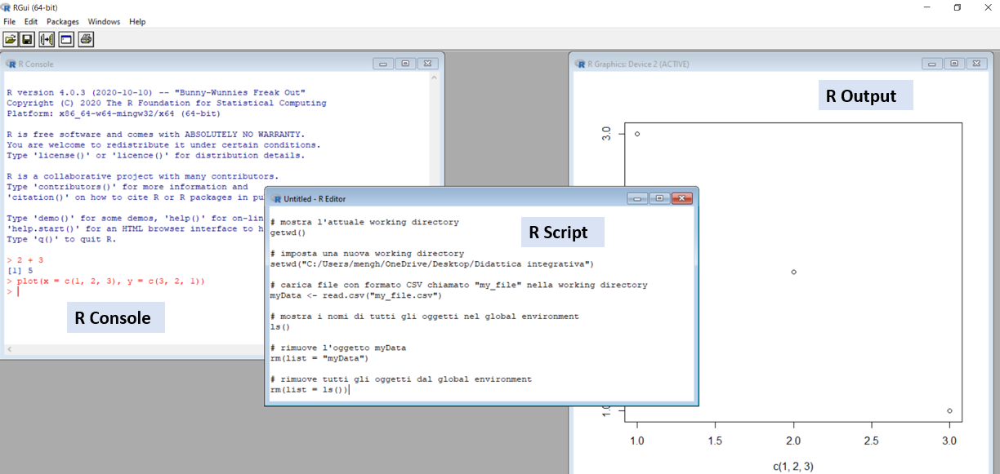

```{r setup, include=FALSE}

knitr::opts_chunk$set(echo = TRUE,tidy.opts = list(width.cutoff=80))
knitr::opts_chunk$set(
  collapse = TRUE,
  comment = NA
)
library(Cairo)

```

# Get started

## How to download and install `r fontawesome::fa(name = "r-project", fill="#3333B2", height = "1em")`

\fontsize{7.5pt}{12}\selectfont

1. Download `R` from \color{blue}https://www.r-project.org/ \color{black} \newline CRAN (*Comprehensive R Archive Network*): network of servers that provide upated software versions and related documentation

2. Select \color{blue}[CRAN](https://cran.r-project.org/mirrors.html) \color{black} from the *Download* menu on the left, then select a mirror mirror (e.g., \color{blue}[the first](https://cloud.r-project.org/) \color{black} or \color{blue}[the uniPD' one](https://cran.stat.unipd.it/)\color{black}), then select your OS (Linux, MacOS, or Windows)

3. Install `R` by opening the downloaded `.exe` (Windows) or `.pkg` (MacOS) or by following the commands required by your Linux version

## The basic `r fontawesome::fa(name = "r-project", fill="#3333B2", height = "1em")` interfance

```{r , echo = FALSE, out.width = "300px"}

```

\fontsize{6pt}{12}\selectfont

- **Console**: to rapidly write (`>`) and execute (`Enter` key) the commands

- **Script** (`File` menu > `New R Script`): to write, modify, and save sequences of commands (saved with the `.R` format)

- **Outputs** (e.g., plot): graphical windows that opens when you run the command

## RStudio

\begincols
  \begincol{.5\textwidth}

\fontsize{7.5pt}{12}\selectfont
`RStudio` is a development environment for `R` using an **optimized graphical interface** to make it more simple (e.g., accessing files, objects, plots, datasets, etc.).

It was founded in 2009 by J. J. Allaire (written in Java and C++) and is managed and developed by an international research group. Like `R`, it is **free and open-source** (GNU General Public Licence) + paid premium versions.

  \endcol
\begincol{.5\textwidth}

\fontsize{7.5pt}{12}\selectfont

**How to install `RStudio`** \newline (note: *after* installing `R`)

1. Download `RStudio` from \color{blue}https://rstudio.com \color{black}

2. Select \color{blue}[Download](https://www.rstudio.com/products/rstudio/download/) \color{black} in the top menu, then select the "free" version of **RStudio Desktop**, then select your OS

3. Install RStudio by opening the downloaded file

  \endcol
\endcols

## The RStudio interface

```{r , echo = FALSE, out.width = "300px"}
knitr::include_graphics("img/RStudio2.PNG")
```

\fontsize{6pt}{12}\selectfont

- **Source**: R Scripts (`.R`), documents and presentations (`.Rmd`), applications (`.app`), etc. To run one or multiple commands, select them and tap on `Ctrl + Enter` or click on the `Run` button on the top-right of the window

- **Environment**: objects included in the workspace and **History** (history of executed commands)

## Some elementary commands

\begincols
  \begincol{.5\textwidth}
  
  \fontsize{6pt}{12}\selectfont
  
Comments (`#`)
```{r, eval=FALSE}
# this is a comment
```

Simple mathematical operations
```{r }
2 + 2 # sum
2 * 2 # multiplication
log(3) # natural logarithm
exp(1) # exponential function
```

Longer expressions (with **round brackets**)
```{r}
sqrt(5) * ( (4 - 1/2)^2 - pi/2^(1/3) )
```
  
  \endcol
\begincol{.5\textwidth}

  \fontsize{6pt}{12}\selectfont
  
Assigning values to **objects** (`<-`)
```{r }
x <- 3 # creates the 'x' object with value 3
x # pint the value of x
```

Objects' names can include letters, numbers, underscores, and, dots (e.g. `tony`, `tony32`, `tony.32`, `tony_32`)
```{r }
tony_32 <- x / 3 # assign a value to the object
tony_32 # print the object's value
```

**R is key-sensitive**! \newline But it is not sensitive to spaces
```{r }
3+2
3     +  2
```

  \endcol
\endcols

## Hands on `r fontawesome::fa(name = "r-project", fill="#3333B2",height = "1em")`: Arithmetic operations

\fontsize{7pt}{12}\selectfont
Perform the following operations using R. (\color{blue}[solutions](https://github.com/psicostat/Introduction2R/blob/master/exercises/chapter-03-first-comands.R)\color{black}): \newline \fontsize{6pt}{12}\selectfont Source: \color{blue} [Psicostat intro to R](https://psicostat.github.io/Introduction2R/first-comands.html#esercizi) \newline \color{black} \fontsize{7pt}{12}\selectfont

1. $\frac{(45+21)^3+\frac{3}{4}}{\sqrt{32-\frac{12}{17}}}$

2. $\frac{\sqrt{7-\pi}}{3\ (45-34)}$

3. $\sqrt[3]{12-e^2}+\ln(10\pi)$

4. $\frac{\sin(\frac{3}{4}\pi)^2+\cos(\frac{3}{2}\pi)}{\log_7{e^{\frac{3}{2}}}}$

5. $\frac{\sum_{n=1}^{10} n}{10}$

Extra: Assign the result of operation #4 to the object `x`, then assign the result of operation #3 to the object `y`, and sum `x` and `y`. The result should be 5.76.

## Hands on `r fontawesome::fa(name = "r-project", fill="#3333B2",height = "1em")`: Relational & logical operators

\begincols
  \begincol{.5\textwidth}
  
  \fontsize{6pt}{12}\selectfont
  
Relational operators
```{r }
3 == 3 # equal to
3 != 3 # different from
x >= 3 # higher than or equal to
5 %in% c(3, 5, 8) # included in
```

Logical operators
```{r }
x <- TRUE
y <- !x # negation of
y
x & (5 < 2) # joined condition
x | (5 < 2) # inclusive disjoint
```
  
  \endcol
\begincol{.5\textwidth}

  \fontsize{7pt}{12}\selectfont
  
Exercises on relational & logical operators:\newline \fontsize{6pt}{12}\selectfont Source: \color{blue}[Psicostat intro to R](https://psicostat.github.io/Introduction2R/first-comands.html#esercizi)
  
1. Define a proposition to test the following condition: "*x is a number included between -4 and -2 or a number included between 2 and 4*”

2. Define two `TRUE` relationships and two `FALSE` relationship that let you test the results of all possible combinations using the logical operators `&` and `|`

3. Run the following operations: `4 ^ 3 %in% c(2,3,4)` and `4 * 3 %in% c(2,3,4)`. What do you note in the execution order of the operators?

  \endcol
\endcols

## Objects & functions

\fontsize{7pt}{12}\selectfont
- **Objects**: identifying the values that have been *saved* in the workspace (`Environment`). Values are *assigned* to objects by using the `<-` symbol (minor and minus). To call an object, just write its name.
```{r }
tony_32 <- 2 # assign a value to an object
tony_32 # print object
tony_32 <- tony_32 + 1 # update object
tony_32 # print again
```

\fontsize{7pt}{12}\selectfont
- **Functions**: labels associated to sequences of commands that were programmed to return a specific output (called `value`) based on 1+ input values (called `argument`). The function name is always *followed by rounded brakes* that include the arguments. If no arguments are specified, default values are used.
```{r }
sqrt(x = 9) # root square of the value assigned to the argument x
seq(from = 1, to = 5) # numerical sequence between the 'from' and 'to'
```

# R objects

## Types (classes) of objects

\begincols
  \begincol{.5\textwidth}
  
  \fontsize{6pt}{12}\selectfont
  
**Logical**
```{r }
x <- TRUE
x <- T # writing "TRUE" or "T" is the same
class(x)
```

**Numeric**
```{r }
x <- 1.4
class(x)
```

**Integer**
```{r }
as.integer(x)
```

**Character**
```{r }
x <- "I    like R"
x # within "" the space matters!
``` 
  
  \endcol
\begincol{.5\textwidth}

  \fontsize{7pt}{12}\selectfont
  
**Vector**: series of values with the same class (e.g., all numeric) combined with the function `c()` (*combine*)
```{r }
x <- c(1, 10.5, 3, 2)
x + 1
sqrt(x)
y <- c("I","like", "R")
```

**Matrix**: table with `nrow * ncol`
```{r }
x <- matrix(1:12, nrow = 3, ncol = 4)
rownames(x) <- y # row names
x
```

  \endcol
\endcols

## Classes of objects: vector

\fontsize{7pt}{12}\selectfont
An object of class *vector* is a sequence of values with the same class. It can be created with the combine function `c()` or with other functions.
```{r }
x <- c(1, 10.5, 3, 2) # create a numeric vector
y <- 1:10 # create another numeric vector
(z <- rep(c(TRUE, FALSE), each = 2)) # create a logical vector
as.character(x) # convert the vector class from numeric to character
as.numeric(z) # from logical to numeric (FALSE = 0, TRUE = 1)
```

If we use a function on a vector, it applies to all the vectors' values.
```{r }
y*2 # multiply all y values by 2
round(sqrt(y), 2) # root squared of y values, rounded at 2 digits
```

## Classes of objects: vector

\fontsize{7pt}{12}\selectfont
Some functions return a single value from a vector of values.
```{r }
length(y) # return the number of vector elements
```
For instance, those functions computing **descriptive statistics**:
```{r }
sum(y) # sum the elements of y
max(y) # maximum value
mean(y) # mean value
median(y) # median value
var(y) # variance
sd(y) # standard deviation
```

## Classes of objects: vector

\fontsize{7pt}{12}\selectfont
**Squared brakes** `[ ]` allow to **select 1+ elements** of the vector
```{r }
tony32 <- c("one", "two", "three", "four", "five") # vector of characters
tony32[3] # select the third element
tony32[3:5] # select from the third to the fifth element
tony32[c(4, 2)] # fourth and second (not "tony32[4,2]"!)
```
For instance, we can **select those elements meeting certain conditions** by using logical and relational operators:
```{r }
y[y <= 3 | y > 8] # y values lower/equal to 3 or higher than 8
tony32[tony32 != "two"] # all values different from "two"
tony32[substr(tony32, 2, 2) == "w"] # values with the letter "w" in the 2nd position
```

## Classes of objects: vector

\fontsize{7pt}{12}\selectfont
The `which()` function returns the **position** of the values meeting the condition
```{r }
substr(tony32, 2, 2) == "w" # test equivalence for each value
which(substr(tony32, 2, 2) == "w") # position of values meeting the cond.
tony32[substr(tony32,2,2)=="w"] == tony32[which(substr(tony32,2,2)=="w")]
```
To **replace** 1+ values of a vector, use the symbol `<-`
```{r }
tony32[1] <- "three"
```

To **remove** 1+ values from a vector, use the symbol `-`
```{r }
tony32[-c(2, 4)]
```

## Classes of objects: factor

\fontsize{7pt}{12}\selectfont
An object of class *factor* is a special type of vector used in R to work with *categorical variables* (nominal and ordinal). The possible values of a factor are called *levels*, which are ordered increasingly by default (i.e., numeric or alphabetic order).

\begincols
  \begincol{.5\textwidth}
  
  \fontsize{6pt}{12}\selectfont
```{r }
as.factor(tony32) # from character to factor

# summmarize the values of a vector
summary(tony32) 

# with factors, it shows the freq. by level
summary(as.factor(tony32)) # equivalent to table()
``` 
  
  \endcol
\begincol{.5\textwidth}

  \fontsize{6pt}{12}\selectfont
```{r }
(y <- rep(c(2,4,6),3)) # numeric vector

as.factor(y) # from numeric to factor

summary(y) # summary of numeric vector

summary(as.factor(y)) # summary of factor
```

  \endcol
\endcols

## Classes of objects: factor

\begincols
  \begincol{.5\textwidth}
  
  \fontsize{6pt}{12}\selectfont
  
Create a factor with the function `factor()`:
```{r }
factor(x = c("C",rep("A",3),c("B","A","C")))
(x <- factor(x = c("C","A","B","A"), # vector
             levels = c("C","A","B"))) # levels

levels(x) # levels() print the levels
factor(x, levels=c("B","A","C")) # change order
levels(x) <- c("Uno","Due","Tre") # change names
x
```
  
  \endcol
\begincol{.5\textwidth}

  \fontsize{6pt}{12}\selectfont
  
Factor levels can be **ordered** by setting the argument `ordered = TRUE`, which returns an ordrdinal variable based on the order defined by the `levels` argument.
```{r }
# unordered factor (default)
vec <- c("Maria","Mauro","Teresa","Carlo")
factor(x = vec)

# ordered factor (default alphabetical order)
factor(x = vec, ordered = TRUE)
# ordered factor (setting a different order)
factor(x = vec, ordered = TRUE, 
       levels=c("Teresa","Mauro","Maria","Carlo"))
```

  \endcol
\endcols

## Classes of objects: matrix

\fontsize{7pt}{12}\selectfont
A *matrix* is a **bidimensional structure** (`nrow * ncol`) **of values with the same class**, which can be created with the function: \newline \color{blue} `matrix(data, nrow = , ncol = , byrow = FALSE)` \color{black}

\begincols
  \begincol{.5\textwidth}
  
  \fontsize{6pt}{12}\selectfont
```{r }
(x <- matrix(1:12, nrow = 3, ncol = 4))
matrix(1:12, nrow = 3, ncol = 4, byrow = TRUE)
matrix(c("Mar","Mau","Ter","Car"), nrow = 2)
``` 
  
  \endcol
\begincol{.5\textwidth}

  \fontsize{6pt}{12}\selectfont

To **select 1+ values** from a matrix, we use again **squred brakets**, but this time we use the sintax `matrix_name[row_number, col_number]`.
```{r }
x[1,2] # 1st row, 2nd column
x[2,1] # 2nd row, 1st column
x[1:3,2] # rows 1-3, second column
x[1,] # 1st row, all columns
x[,2] # 2nd column, all raws
```

  \endcol
\endcols

## Classes of objects: matrix

\begincols
  \begincol{.5\textwidth}
  
  \fontsize{6pt}{12}\selectfont
  
```{r }
x # print the matrix x
``` 
  
Join 1+ matrices with `cbind()` and `rbind()`
```{r }
cbind(x,matrix(rep(3,6),nrow=3)) # by column
rbind(x,matrix(rep(3,4),ncol=4)) # by row
``` 

  \endcol
\begincol{.5\textwidth}

  \fontsize{6pt}{12}\selectfont

Setting row and column names:
```{r }
rownames(x) <- c("a","b","c") # row names
colnames(x) <- 1:4 # column names
x
c(nrow(x),ncol(x)) # No. of rows and cols = dim(x)
t(x) # transpose matrix (inverting rows and cols)
``` 

  \endcol
\endcols

## Data structures: data.frame

\fontsize{7pt}{12}\selectfont
A *dataframe* is a **bidimensional structure of vectors that can have different classes** (e.g., numeric, character, and factor) that can be created with the function: \newline \color{blue} `data.frame(name_var1 = c(...), name_var2 = c(...), ...)` \color{black}

\begincols
  \begincol{.5\textwidth}
  
  \fontsize{6pt}{12}\selectfont
```{r }
(x <- data.frame(Num = 1:4,
                 Char = c("a","b","c","d"),
                 Logi = rep(c(TRUE,FALSE),2)))
str(x) # structure of the dataframe
``` 
  
  \endcol
\begincol{.5\textwidth}

  \fontsize{6pt}{12}\selectfont

While `str(df_name)` returns the structure of a dataframe, `summary(df_name)` returns a summary for each column.
```{r }
summary(x)
```

  \endcol
\endcols

## Data structures: data.frame

\fontsize{7pt}{12}\selectfont
**Manipulating a dataframe** is very similar to what we saw for matrices.

\begincols
  \begincol{.5\textwidth}
  
  \fontsize{6pt}{12}\selectfont
Selecting values and joining two dataframes:
```{r }
x[2, 2:3] # 2nd row, 2nd and 3rd column
cbind(x,data.frame(new=4:1)) # join by col
rbind(x[1:3,],data.frame(Num=10, # join by row
                         Char="z",Logi=FALSE))
``` 
  
  \endcol
\begincol{.5\textwidth}

  \fontsize{6pt}{12}\selectfont
  
Name and number of rows and columns:
```{r }
rownames(x) # default = 1:nrow(x)
colnames(x)[2] # 2nd column name
nrow(x) # no. of rows
ncol(x) # no. of cols
``` 

Transpose of a dataframe:
```{r }
t(x)
```

  \endcol
\endcols

## Data structures: dataframe

\begincols
  \begincol{.5\textwidth}
  
{ width=25% } 
  
\fontsize{6pt}{12}\selectfont
To select a column (vector) from a dataframe, we can use the `$` symbol with the syntax `df_name$column_name`:
```{r }
x$Char # selecting the Char column
x$Char[2] # second value from the Char column
x$Char[2] == x[2,2] # equivalent commands
x$Char <- NULL # removing the Char column
x[x$Num < 3,] # selecting cases with Num < 3
# same result with subset(x, Num < 3)
``` 
  
  \endcol
\begincol{.5\textwidth}

  \fontsize{6pt}{12}\selectfont
  
Alternative way to select the columns:
```{r }
x[,"Logi"] # write col names within ""
x[1:2,c("Num","Logi")]
``` 

"Head" and "tail" of a dataframe:
```{r }
head(x, n = 2) # first 2 rows
tail(x, 1) # last row
```

  \endcol
\endcols

## Data structures: list

\fontsize{7pt}{12}\selectfont
A *list* is a **collection of objects** that can have **different classes** (es. vector, matrix, and data.frame) e **different length** (contrarily to matrices and dataframes). It is the most complex and versatile structure in R, which can be created with the function \color{blue} `list(nome_oggetto1 = ..., nome_oggetto2 = ..., ...)` \color{black}

\begincols
  \begincol{.5\textwidth}
  
  \fontsize{6pt}{12}\selectfont
```{r }
x <- list(Num = 1:4,
          Matr = matrix(1:12, nrow=3),
          df = x,
          lst = list(1:3,2:3))
str(x) # structure of the list
``` 
  
  \endcol
\begincol{.5\textwidth}

  \fontsize{6pt}{12}\selectfont
  
To **select 1+ objects** from a list, we still use **squared brakets**
```{r }
x[1] # single = create a sub-list
class(x[1])
x[[1]] # double = extract the object
class(x[[1]])
x[[3]][2,1]
```

  \endcol
\endcols

# R workspace

## Functions & pakages

\fontsize{6pt}{12}\selectfont
Many things in R can be done by using **functions**, which always include the following elements: *function name*, *arguments* (`arg_name = arg_value` or without name, based on the default position), and returned *value*.
```{r }
sqrt(x = c(1,2,3))
sqrt(c(1,2,3))
```

**R Help system**: To know the details of any function (arguments, value, etc.), just add the `?` symbol before the function name
```{r eval=FALSE}
?sqrt
```

**R packages**: To get additional functions than those included in the base R packages, you need to install and open the related package
```{r eval=FALSE}
install.packages("pkg_name") # installing a package
library(pkg_name) # open a package
pkg_name::function_name() # using a function without loading the pkg
```

## Objects, functions, and workspace

\fontsize{7pt}{12}\selectfont
When we assign a value to an object, the latter is recorded in the **workspace**: the place that includes all objects and functions defined by the user (*Environment* tab in Rstudio).

The `ls()` function returns the name of any object and function included in the workspace, whereas the `rm()` function removes the object(s) selected:
```{r echo=FALSE}
rm(list=ls())
```
```{r }
x <- 1 # assign value to x
y <- 2 # assign value to y
ls() # show all objects in the workspace
rm(y) # remove object y
ls()
```

Combining the two functions, the command **`rm(list=ls())` empties the workspace**, removing all objects and functions (very **useful at the beginning of any script!**)
```{r }
rm(list = ls()) # remove all objects & functions
```

## Objects & functions from inside R: \newline Default packages

\fontsize{7pt}{12}\selectfont

Some packages are **installed in R by default**, they do not require to be opened, and they are not shown in the workspace.
```{r }
rm(list=ls()) # remove all objects & functions
head(sleep,4) # 'sleep' dataset from the 'datasets' pkg
mean(sleep$extra) # 'mean()' function from the 'base' pkg
letters[2] # constant values from the 'base' pkg
ls() # yet the workpace looks empty!
```

## Objects & functions from outside R: \newline The working directory

\fontsize{7pt}{12}\selectfont

To read a file from a specific folder, you should first get (and possibly set) the **working directory**, that is the folder where input files are searched and where output files are saved.
```{r }
getwd() # returns the current working directory
dir()[1:3] # names of the first 3 files in the WD
```
```{r eval=FALSE}
setwd("data") # moving WD to the 'data' subfolder
setwd("C:/Users/mengh/OneDrive/Desktop") # set new WD
```

**Trick with RStudio**: when you start a new project (e.g., data analysis for the thesis, report), create a new **R project** (`.Rproj`) from the menu `File > New R Project` by selecting an existing folder or by creating a new one, which will be the default WD for any file related to that project.

## Reading & saving a dataset (1/2)

\fontsize{7pt}{12}\selectfont
The first step in any data analysis with R is to read a dataset and save it in the workspace. To do so, we need to use a specific function based on the data format (e.g., CSV, xlsx, txt, svs). The default R data format is RData.
```{r eval=FALSE}
# file .RData
load(file = "data/studqs.RData") # import
save(qs, file = "data/studqs.RData") # export
```

R can read and export further data formats, some of which require to install additional packages.
```{r eval=FALSE}
# file .CSV (comma separated values)
qs <- read.csv(file = "data/studqs.csv") # import
write.csv(x = qs,"data/studqs.csv", row.names = FALSE) # export

# file .SAV (da SPSS)
library(foreign)
qs <- read.spss("data/studqs.sav", to.data.frame=TRUE) # import
```

## Reading & saving a dataset (2/2)

\fontsize{7pt}{12}\selectfont

A fast (but poorly reproducible!) way to read a file in R is by using the function `file.choose()` rather than the name of the file. This allows reading a file without setting the WD.
```{r eval=FALSE}
qs <- read.csv(file = file.choose())
```

If you have doubts on the function to be used for reading a file, you can use the Rstudio menu `File` > **`Import Dataset`** \newline

\color{blue} Hands on `r fontawesome::fa(name = "r-project", fill="blue",height = "1em")`: 

- Open or create a file `.xlsx` on your PC, save it in a `.csv` (comma separated values) format and read it in R
- Now try to directly read the `.xlsx` file (if you have doubts, just Google "*how to read xlsx file with R*" `r fontawesome::fa(name = "face-smile", fill="#3333B2",height = "1em")`)
- In both cases, note the class and the structure of the imported object

## Hands on `r fontawesome::fa(name = "r-project", fill="#3333B2",height = "1em")`: Student questionnaire

\fontsize{6.5pt}{12}\selectfont

1. Download the files `questionarioStudenti.RData` and `questionarioStudenti.csv` from \color{blue} [Github](https://github.com/Luca-Menghini/advancedDataAnalysis-course) \color{black} (`data` folder; select `File` > `Raw` > `Download` or right click > `Save as`) or \color{blue} [Moodle](https://psico.elearning.unipd.it/enrol/index.php?id=4700#section-0) \color{black} (data folder), save the file in a folder and set that folder as the working directory.

3. Read both files with R: what are their class? What is the class of the included variables?

4. Use the `describe()` function from the `psych` package to compute the descriptive statistics of the variable `numVar` and use the function `hist()` to visualize its histogram plot (try changing the argument `breaks`).

5. Use the function `table()` to create a frequency table of the variable `Q02`

6. Repeat point #5 but only consider the students that replied "Sì" (yes) to the item `Q01`

7. Cross the frequency of the variables `Q02` and `Q03` using `table()`

## Descriptive statistics (univariate)

\fontsize{6pt}{12}\selectfont

\begincols
  \begincol{.5\textwidth}
```{r }
x <- c(1,1,1,2,8,9) # create numeric vector
```
```{r }
c(mean(x),median(x)) # mean & median
as.numeric(which.max(table(x))) # mode
c(var(x),sd(x)) # variance & standard dev.
quantile(x,probs=0.90) # 90° percentile
quantile(x,probs=c(0.25,0.50,0.75,1)) # quartiles
round(rank(x)/length(x),2) # sample rank
``` 
  
  \endcol
\begincol{.5\textwidth}

  \fontsize{6pt}{12}\selectfont
  
```{r }
table(x) # absolute frequencies
round(table(x)/length(x),2) # relative freq
cumsum(x) # cumulative sum
cumsum(table(x)) # absolute cumulative sums
round(cumsum(table(x)/ # relative cumulative freq
               length(x)),2) 
``` 

  \endcol
\endcols

## Descriptive statistics (bivariate)

\fontsize{6pt}{12}\selectfont

\begincols
  \begincol{.55\textwidth}
```{r }
y <- -x - 1 # values inversely proport. to x
z <- round(rnorm(n=length(x)),1) # random values
(df <- data.frame(x,y,z)) # new data frame
```

Correlation & covariance
```{r }
cov(x,y) # covariance btw x & y
cor(x,y) # correlation
``` 
  \endcol
\begincol{.45\textwidth}

\fontsize{6pt}{12}\selectfont`

With more than 2 variables
```{r }
cov(df) # covariance matrix

cor(df) # correlation matrix
```

  \endcol
\endcols

# R graphics

## Graphics in R: Main functions

\begincols
  \begincol{.55\textwidth}

\fontsize{8pt}{12}\selectfont  

High-level functions (stand alone)

\fontsize{6pt}{12}\selectfont  
```{r eval=FALSE}
# basic function (plot depends on object class)
plot() # scatter plot

# distributions
boxplot() # boxplot
qqnorm() # quantile-quantile plot

# frequencies
barplot() # barplot (categorical variables)
hist() # histogram (continuous variables)
pie() # pie chart

# interactions
interaction.plot()
``` 
  \endcol
\begincol{.45\textwidth}

\fontsize{8pt}{12}\selectfont  

Lower-level functions \newline (add ellements to the former)

\fontsize{6pt}{12}\selectfont  
```{r eval=FALSE}
points() # add dots
lines() # add lines
text() # add text

# linear regression line
abline(a = ..., b = ...)

# more complex elements
rect() # add rectangles
polygon() # add polygons

# other graphical featurs
axis() # change the plot axes
legend() # add a legend
```

  \endcol
\endcols

## Graphical parameters

\fontsize{7pt}{12}\selectfont  

Run the command `?par` to see all graphical parameters that can be changed.

\begincols
  \begincol{.55\textwidth}

\fontsize{7pt}{12}\selectfont
Some of them can be set by using the arguments of graphical functions:

\fontsize{6pt}{12}\selectfont  
```{r eval=FALSE}
# dimension
cex = 2 # text & simbol dimension (multiplier)
lwd = 0.5 # line width

# color & shape
col = "red" # (see ?colors)
lty = 2 # type of line (1=solid, 2=dashed, ...)
pch = 19 # shape of dots (see ?points)

# titles
main = "Plot title"
xlab = "x-axis title"
``` 
  \endcol
\begincol{.45\textwidth}

\fontsize{7pt}{12}\selectfont  

Other parameters should be set within the `par()` function, which should be executed before generating the plot:

\fontsize{6pt}{12}\selectfont  
```{r eval=FALSE}
# margins (bottom,left,top,right)
mai # in inches
mar # in text lines

# multiple panels
mfrow=c(nrow, ncol) 
# e.g. two plots next to each other
mfrow=c(2,1) 
# es. one above and one below
mfrow=c(1,2) 
```

  \endcol
\endcols

## Univariate distributions: Continuous variables

\fontsize{6pt}{12}\selectfont  
```{r fig.width=6,fig.height=2.8}
X <- rnorm(n=100, mean=0, sd=1) # generating random values from the stand. norm. distr.
par(mfrow = c(2,2), mai = c(0.3,0.5,0.2,0.5)) # plot 4 graphs in a single window
plot(X) # scatter plot (variability)
hist(X) # histogram: frequency distr. by class
boxplot(X) # box plot: (1st & 3rd quartile +/- 1.5 IQR
qqnorm(X) # Q-Q plot: cumulative distribution of X vs. normal cumulative distr.
``` 

## Univariate distributions: Categorical variables

\fontsize{6pt}{12}\selectfont  
```{r fig.width=6,fig.height=2.8}
Y <- factor(sample(x=c("A","B","C"),size=100,replace=TRUE)) # generating random factor
par(mfrow = c(2,2), mai = c(0.3,0.5,0.2,0.5)) # plot 4 graphs in a single window
barplot(table(Y), main="Absolute freq.") # bar plot: absolute frequencies
barplot(round(cumsum(table(Y)/length(Y)),2), main="Relative cumulative freq.")
barplot(table(Y)) # same graph but adding blue text
text(x=c(0.7,1.9,3.1),y=10,labels=c("group A","group B","group C"),col="blue",cex=0.7)
``` 

## Assessing the normality of a distribution (1/3)

\begincols
  \begincol{.5\textwidth}

\fontsize{6pt}{12}\selectfont  
```{r fig.width=2.5,fig.height=2.6}
X <- rnorm(n = 1000, mean = 60, sd = 20) # norm
par(mfrow=c(2,1),mai=rep(0.3,4),mar=rep(1.8,4))
hist(X,main="",xlab="",ylab="") # histogram
qqnorm(X,cex=0.5,main="",pch=20) # Q-Q plot
qqline(X,col="red") # adding normal line
``` 
  \endcol
\begincol{.5\textwidth}

\fontsize{7pt}{12}\selectfont  

\fontsize{6pt}{12}\selectfont  
```{r fig.width=2.5,fig.height=2.6}
Y <- runif(n=1000,min=min(X),max=max(X)) # unif
par(mfrow=c(2,1),mai=rep(0.3,4),mar=rep(1.8,4))
hist(Y,main="",xlab="",ylab="") # histogram
qqnorm(Y,cex=0.5,main="",pch=20) # Q-Q plot
qqline(Y,col="red") # adding normal line
```  

  \endcol
\endcols

## Assessing the normality of a distribution (2/3)

\begincols
  \begincol{.5\textwidth}

\fontsize{6pt}{12}\selectfont  
```{r }
# Empirical distribution
hist(X, freq = FALSE)
# Theoretical (expected) distribution
curve(dnorm(x, mean = 60, sd = 20),
      from = min(X), to = max(X),
      col = "red", lwd = 2,
      add = TRUE) 
``` 
  \endcol
\begincol{.5\textwidth}

\fontsize{6pt}{12}\selectfont  
```{r }
# Empirical distribution
hist(Y, freq = FALSE, ylim = c(0,0.02))
# Theoretical (expected) distribution
curve(dnorm(x, mean = 60, sd = 20),
      from = min(Y), to = max(Y),
      col = "red", lwd = 2,
      add = TRUE)
```  

  \endcol
\endcols

## Assessing the normality of a distribution (3/3)

\begincols
  \begincol{.5\textwidth}

\fontsize{6pt}{12}\selectfont  
```{r fig.width=2.5,fig.height=2.6}
library(moments) # skewness & kurtosis
c(skewness(X), kurtosis(X)) # (ok if ~ 0)
# Kolmogorov-Smirnov test (H0: X is normal)
ks.test(X, y="pnorm", mean=mean(X), sd=sd(X)) 
# Shapiro-Wilk test (H0: X is normal)
shapiro.test(X) 
``` 
  \endcol
\begincol{.5\textwidth}

\fontsize{6pt}{12}\selectfont  
```{r fig.width=2.5,fig.height=2.6}
 # skewness & kurtosis
c(skewness(Y), kurtosis(Y)) # (ok if ~ 0)
# Kolmogorov-Smirnov test (H0: X is normal)
ks.test(Y, y="pnorm", mean=mean(Y), sd=sd(Y)) 
# Shapiro-Wilk test (H0: X is normal)
shapiro.test(Y) 
```  

  \endcol
\endcols

## Bivariate distributions: Continuous variables

\begincols
  \begincol{.6\textwidth}

\fontsize{6pt}{12}\selectfont  
```{r fig.width=1.8,fig.height=1.8,fig.align='center'}
Y <- rnorm(1000, mean=20, sd=1) # Y (independent from X)
Z <- X + rnorm(1000, sd = 20) # Z (proportional to X)
# Scatter plot
par(mfrow=c(2,1),mai=rep(0.3,4),mar=rep(1.8,4),cex=.5)
plot(X, Y, main = paste("XY r =",round(cor(X, Y),2)))
abline(lm(Y~X),col="red") # linear regression line
plot(X, Z, main = paste("XZ r =",round(cor(X, Z),2)))
abline(lm(Z~X),col="red") # tilde (~) with Alt + 1-2-6
``` 

  \endcol
\begincol{.4\textwidth}

\fontsize{6pt}{12}\selectfont  
```{r message=FALSE,out.width='170px'}
df <- data.frame(X, Y, Z, P = -Z)

# Correlation plot (or heat plot)
library(corrplot)
corrplot(cor(df),method="color",
         tl.cex=2,cl.cex=1,
         mar = c(0,0,0,15))
```

  \endcol
\endcols

## Bivariate distributions: Categorical variables

\fontsize{6pt}{12}\selectfont  
```{r }
# create data.frame with sex (M/F) & education level (primary, middle, highsch, univ.)
df <- data.frame(sex = sample(x = rep(c("F","M"),50), size = 100),
                 edu = sample(x = rep(c("prim","mid","high","uni"),25), size = 100))
``` 

\begincols
  \begincol{.6\textwidth}

\fontsize{6pt}{12}\selectfont  
```{r fig.width=4.2,fig.height=2.8,out.width='70%',fig.align='center'}
table(df) # crossed frequencies
par(mai=rep(0.4,4))
barplot(table(df),legend.text = TRUE) # bar plot
``` 

  \endcol
\begincol{.4\textwidth}

\fontsize{6pt}{12}\selectfont  
```{r fig.width=5,fig.height=4}
# version with 'sided groups'
par(mai=rep(0.4,4))
barplot(table(df),legend.text = TRUE,
        beside = TRUE)
```

  \endcol
\endcols

## Bivariate distributions: Continuous & categorical

\fontsize{6pt}{12}\selectfont  
```{r fig.width=7,fig.height=3.5,out.width='80%',warning=FALSE,message=FALSE}
par(mfrow = c(2,2), mai = c(0.5,1,0.2,0.5)) # using the sleep dataset (included in R base)
barplot(tapply(sleep$extra, sleep$group, FUN=mean), # barplot for means (DON'T DO THAT!)
        main="DON'T DO THAT!",cex.main=1.5, ylab = "extra"); abline(a=0,b=1,col="red",lwd=2)
hist(sleep[sleep$group==1,"extra"], breaks=10, col = rgb(0,0,1,alpha=0.5),  
     xlim = c(min(sleep$extra), max(sleep$extra)), xlab="", main="") # hist by group
hist(sleep[sleep$group==2,"extra"], breaks=10, col = rgb(1,0,0,alpha=0.5), add = TRUE)
boxplot(extra ~ group, data = sleep) # box plot by group
library(vioplot); vioplot(extra ~ group, data = sleep) # violin plot: density by group
``` 

## Saving a plot

\begincols
  \begincol{.55\textwidth}

\fontsize{6pt}{12}\selectfont  
```{r }
# 1. open new file with PNG format
png(filename = "graFico.png", # file name
    width = 350, height = 350) # width & height

# 2. create the plot
plot(sleep$group, sleep$extra, 
     xlab = "group", ylab = "extra", col = "#2E9FDF")

# 3. close the file
dev.off() # this will save the plot in your WD
``` 

  \endcol
\begincol{.45\textwidth}

\fontsize{6pt}{12}\selectfont  

Alternative formats (see `?png`)
```{r eval=FALSE}
png() # Portable Network Graphics

bpm() # bitmap

jpeg() # Joint Photographic Experts Group

tiff() # Tagged Image File Format
```

  \endcol
\endcols

# Linear models

## Linear regression

\fontsize{7pt}{12}\selectfont
- **Regression** allows to determinate the asymmetrical and functional relation between two variables, to quantify whether one variable (**predictor**) predicts another variable (**dependent** or **response**) 

- **Linear regression** determines the link between two variables through a linear function:  \color{red} $y_i = \beta_0 + \beta_1 x_i + \epsilon_i$ \fontsize{7pt}{12}\selectfont \color{black} 

- Such a function can be graphically represented as a **straight line**, where \color{violet} $\beta_0$ \color{black} is the **intercept** (value assumed by `y` when `x` = 0) and $\beta_1$ \color{black} is the  **slope** (predicted change in `y` when `x` increases by 1 unit)

```{r echo=FALSE,fig.width=5,fig.height=2.5,out.width='80%'}
par(mar=c(5, 4, 0, 2) + 0.1)
x <- rnorm(n = 100)
y <- x + rnorm(n = 100)
plot(y~x,pch=19,col="gray",cex=0.8)
abline(lm(y~x),col="red",lwd=2)
abline(v=0,lty=2,col="gray")
abline(h=summary(lm(y~x))$coefficients[1,1],lty=2,col="gray")
text(x=0.5,y=summary(lm(y~x))$coefficients[1,1],labels=paste("B0 =",round(summary(lm(y~x))$coefficients[1,1],2)))
text(x=min(x)+0.5,y=min(y)+0.5,labels=paste("B1 =",round(summary(lm(y~x))$coefficients[2,1],2)))
```

## Fitting a linear regression model (1/3)

\fontsize{6.5pt}{12}\selectfont
Using the dataset `gambling` from the `ADati` pkg. We want to fit models that predict `frequency` of gamig behavior based on `gender` and `risk` (risk perception).
```{r }
data(gambling,package = "ADati")
```

R uses the `lm()` function with the arguments `formula` (syntax: `dependent ~ pred1 + pred2 + ...`, where the symbol "~" is the **tilde**, on Windows: `Alt + 126`) and `data` (dataframe that includes the variables in the formula)

- **Null model**: `frequency` scores are only predicted by the **intercept** $\beta_0$, that is the mean value of `frequency` in the sample.
```{r }
m0 <- lm(formula = frequency ~ 1, data = gambling)
```

\fontsize{5.5pt}{12}\selectfont
```{r }
coefficients(m0) # coefficient estimates (intercept)
mean(gambling$frequency) # mean of the frequency variable
```

## Fitting a linear regression model (2/3)

\fontsize{6.5pt}{12}\selectfont

- **Simple linear regression model**: `frequency` is predicted by the intercept $\beta_0$ (expected value of `frequency` when `gender` is `"f"`) and the slope coefficient $\beta_1$, expressing the 'mean' difference `m - f`.
```{r }
m1 <- lm(formula = frequency ~ gender, data = gambling)
```
\fontsize{6pt}{12}\selectfont
```{r }
coefficients(m1) 

tapply(gambling$frequency, gambling$gender, mean) # mean of frequency for f & m
```

## Fitting a linear regression model (3/3)

\fontsize{6.5pt}{12}\selectfont

- **Multiple linear regression model**: `frequency` is predicted by the intercept $\beta_0$ (expected `frequency` when `gender = f` and `risk = 0`) and the coefficients $\beta_1$ ('mean' gender difference when `risk = 0`) and $\beta_2$ (effect of `risk` net to gender differences)
```{r }
m2 <- lm(formula = frequency ~ risk + gender, data = gambling)
```
\fontsize{5.5pt}{12}\selectfont
```{r }
coefficients(m2)
```

\fontsize{6.5pt}{12}\selectfont

- **Interactive model**: `frequency` is predicted by the intercept $\beta_0$ and the coefficients $\beta_1$ ('media' gender difference when `risk = 0`) and $\beta_2$ (effect of `risk` when `gender = "f"`) and $\beta_3$ (effect of `risk` when `gender = "m"`)
```{r }
m3 <- lm(formula = frequency ~ risk * gender, data = gambling)
```

\fontsize{5.5pt}{12}\selectfont
```{r }
coefficients(m3)
```

## Assessing linear model assumptions (1/3)

\fontsize{6.5pt}{12}\selectfont
**1. Independence of observations**: all pairs of errors $\epsilon_i$ and $\epsilon_j$ are independent for any $i \neq j$. This assumption does not require particular procedures, just think: are my observations independent?

**2. Idependence of predictors and errors**: **residuals** (estimates of the error component $\epsilon_i$) should not be associated with the predictors `gender` and `risk`.

But what are residuals?
```{r fig.width=8,fig.height=3}
gambling$RESIDUALS <- residuals(m3) # model residuals with residuals()
gambling$PREDICTED <- fitted(m3) # predicted values with fitted()
head(gambling[,c("frequency","PREDICTED","RESIDUALS")],5) # RESIDUALS = OBSERVED - PREDICTED
```

## Assessing linear model assumptions (2/3)

\fontsize{6.5pt}{12}\selectfont
**2. Idependence of predictors and errors**: **residuals** (estimates of the error component $\epsilon_i$) should not be associated with the predictors `gender` and `risk`. Here, we do not see substantal gender differences or a substantial relationship with `risk`.

\fontsize{6.5pt}{12}\selectfont
**3. Constant variance (Homogeneity of variances)**: residual variance is constant for any value of $X$. Here, we see that residual variance is slightly (but not substantially) higher in males than in females.
```{r fig.width=8,fig.height=2.7}
par(mfrow=c(1,2),mar=c(5,4,0,2)+0.1)
plot(RESIDUALS ~ gender, data=gambling)
plot(RESIDUALS ~ risk, data=gambling, col="gray")
abline(lm(RESIDUALS ~ risk, data=gambling)) 
```

## Assessing linear model assumptions (3/3)

\fontsize{6.5pt}{12}\selectfont
**4. Linearity**: the expected value of residuals for a given $X$ value is zero. Practically, residuals should have mean zero (as in this case).

\fontsize{6.5pt}{12}\selectfont
**5. Normality**: residuals should be normally distributed. \newline Here, the fit is not very nice but we can accept it...
```{r fig.width=10,fig.height=3}
par(mfrow=c(1,3))
hist(gambling$frequency) # if residuals are normal, Y is normal as well
hist(residuals(m3),main=paste("Residuals mean =",round(mean(residuals(m3)),2),
                              "\nmedian =",round(median(residuals(m3)),2)))
qqnorm(residuals(m3), col="gray", pch=19)
qqline(residuals(m3), col="red") 
```

## Comparing multiple models

\begincols
  \begincol{.5\textwidth}

\fontsize{6.5pt}{12}\selectfont
**Likelihood ratio test**: testing the ratio of the loglikelihood (probability of data functional to the parameter estimates) 
```{r fig.width=8,fig.height=3.5}
library(lmtest)
lrtest(m0,m1,m2,m3)
```

  \endcol
\begincol{.5\textwidth}

\fontsize{6.5pt}{12}\selectfont
**Information criteria**: penalizing models based on specific criteria (e.g., low likelihood and parsimony)
```{r fig.width=5,fig.height=4}
# Akaike information criterion (AIC)
AIC(m0,m1,m2,m3)$AIC # the lower the better

# Akaike weights: from 0 (-) to 1 (+)
library(MuMIn)
Weights(AIC(m0,m1,m2,m3)) # Aw
```

  \endcol
\endcols

## Inference on regression coefficients

\fontsize{6.5pt}{12}\selectfont
Based on the NHST approach, we can test the statistical significance of the regression coefficients. In R, such tests are conducted by default when we fit the model.
```{r }
summary(m3)$coefficients # command summary() shows the model summary
```
Determination coefficient $R^2$:
```{r }
# the model explains the 29% of the variance in frequency
summary(m3)$r.squared 
```

## Visualizing the cofficient estimates

\fontsize{6.5pt}{12}\selectfont
To visualize the estimated "effects" (regression line + 95% confidence intervals), we can use the `effects` package.
```{r message=FALSE,warning=FALSE,fig.width=6,fig.height=2.5}
library(effects)
plot(allEffects(m2))
```

# Resources

## Other resources: First steps with R

\fontsize{6.5pt}{12}\selectfont
- R Core Team. *The R Manuals*. Manuals in pdf format: https://cran.r-project.org/manuals.html (particularly: "*An Introduction to R (with many examples)*"; "*R Data Import/Export*")

- UniGlasgow - PsyTheacR. Interactive and free course on data analysis with R: https://psyteachr.github.io/

- Dalgaard, P. (2008). *Introductory statistics with R*. New York: Springer.

- Murrell (2011) R Graphics (II edition). New York: Chapman and Hall/CRC. Examples with code from the website: \color{blue} https://www.stat.auckland.ac.nz/~paul/RGraphics/rgraphics.html